```{r setup, include=FALSE}
library(shiny)
library(tidyverse)
library(kableExtra)

knitr::opts_chunk$set(
  echo = FALSE, 
  fig.width = 8, 
  fig.height = 6, 
  fig.align = "center"
)
```

## Agenda

1. Intro to Clinical Trials and Drug Development
2. Clinical Trial Design: Basic Elements
3. Adaptive Designs
4. Roadmap for This Course


## Clinical Trials (1 of 3)

- Clinical trial$^*$ -- a research study conducted to assess the _**utility**_ of an _**intervention in volunteers**_

    + _**Utility**_: safety, tolerability, efficacy, risk/benefit ratio
    + _**Interventions**_ can be: drugs, biologics, medical devices, methods of screening, novel surgical procedures, novel therapies, etc.
    + _**Volunteers**_: Humans (healthy volunteers or patients with a disease of interest)
    
<br />
<br />
<br />
<br />

$^*$ Peace KE, Chen DG (2011) "_Clinical Trial Methodology_", CRC Press


## Clinical Trials (2 of 3)

Since clinical trials are experiments in humans, special considerations related to medical ethics and protection of study subjects apply:

- The Nuremberg Code (1949)

- The Declaration of Helsinki (1964 and beyond)

    + _**The well-being of subjects taking part in research should take precedence over the interest of science and society**_
    
- The Belmont Report (1979) 

    + _**A statement of basic ethical principles and guidelines: Respect for Persons, beneficence, and Justice**_
    
- Code of Federal Regulation (US FDA)

    + 21 CRF Part 50 -- Protection of Human Subjects, Informed Concent
    + 21 CRF Part 56 -- Standards for Institutional Review Boards
    + 45 CRF Part 46 -- Protection of human research subjects, including pregannt women, prisoners, and children
    
- International Conference on Harmonization on Good Clinical Practices (ICH GCP) (1990 and beyond)


## Clinical Trials (3 of 3)

Three important principles in clinical trial design methodology:

1. _**Randomization**_ -- generation of sequence of treatment assignments by means of some known random mechanism (e.g. by coin flip)

    + Helps mitigate various experimental biases; promote "comparability" of treatment groups; can form the basis for statistical inference
    
2. _**Blinding**_ -- a process that attempts to keep the treatment assignments not known or easily ascertained

    + Helps mitigate ascertainment bias (systematic distortions due to the knowledge of which intervention the patient is receiving)
    
3. _**Use of Control Group**_ -- a group of patients treated with a "standard of care", which serves as the reference for treatment comparisons

    + Allows discrimination of patient outcomes caused by the test treatment from outcomes caused by other factors (such as the natural progression of the disease, observer of patient expectations, or other treatment)
    
- An "ideal" design is _**randomized**_, _**double-blinded**_, placebo-and/or active-_**controlled**_ clinical trial.


## Clinical Development (1 of 3)

- The essence of rational drug development is _**to ask important questions**_ and _**to answer them with appropriate studies**_.

- Four types of clinical stuides (according to their objectives)$^*$:

    1. _**Human pharmacology**_ -- to assess safety and tolerability, define/describe PK and PD, explore drug metabolism and interactions, estimate activity
    2. _**Therapeutic exploratory**_ -- proof-of-concept studies to explore drug use in the targeted indication; calibrate dose regimens
    3. _**Therapeutic confirmatory**_ -- demonstrate/confirm efficacy, establish safety profile, assess benefit/risk and establish dose-response relationship
    4. _**Therapeutic use**_ -- refine understanding of benefit/risk, refine dosing, identify less common adverse reactions
    
<br />
<br />
<br />
<br />

$^*$ ICH E8 Guideline (1997) "_General Considerations for Clinical Trials_"


## Clinical Development (2 of 3)

- Clinical development is ideally a logical, step-wise procedure in which information from small early studies is used to support and plan later larger, more definitive studies$^*$

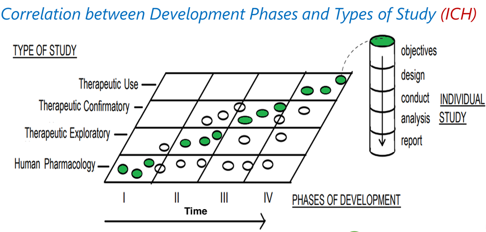

<br />
<br />
<br />
<br />

$^*$ ICH E8 Guideline (1997) "_General Considerations for Clinical Trials_"    


## Clinical Development (3 of 3)

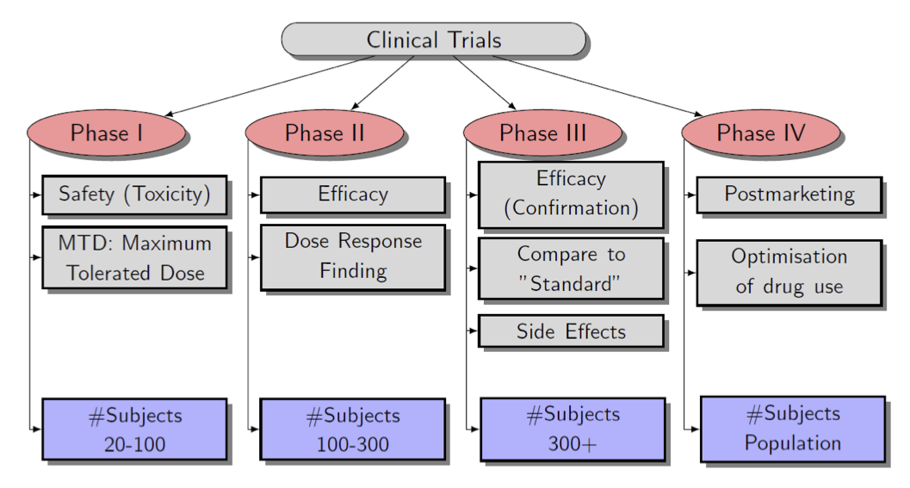


## Clinical Trial Design -- Basic Elements

Traditionally, a clinical trial process consists of 4 steps:

1. Design
2. Conduct
3. Analysis
4. Interpretation and dissemination of the results

In this course, we will primarily focus on the _**design**_ part.


## Clinical Trial Design -- Main Considerations

Clinical trial team (medical lead, biostatistician, PK scientist, etc.) develops _**clinical trial protocol**_ which contains the following important information:

1. _**Clear formulation of study objectives**_

    + E.g. to test that experimental drug results in greater reduction in total cholesterol level than standard of care
    
2. _**Type of a design**_

    + E.g. parallel group, crossover, factorial, dose escalation, enrichment, group sequential, or adaptive design
    
3. _**Primary research hypothesis (for confirmatory trials) **_

    + Test for equality, superiority, non-inferiority, or equivalence

4. _**Study endpoints (outcome variables)**_

    + Normal, binary, count, or time-to-event
    
5. _**Choice of control group**_

    + Placebo control, active control, or multiple controls
    
6. _**Study population**_

    + Normal healthy volunteers, patients, or special population (e.g. pediatric or geriartric patients)
    

## Clinical Trial Design -- Statistical Considerations

_**Biostatistician**_ is tasked with providing input on the following:

- Sample size
- Treatment allocation ratio
- Randomization procedure to implement the desired allocation
- Measures to protect study from bias (blinding, allocation concealment)
- Statistical methodology to analyze data


## Study Designs: Fixed vs. Adaptive

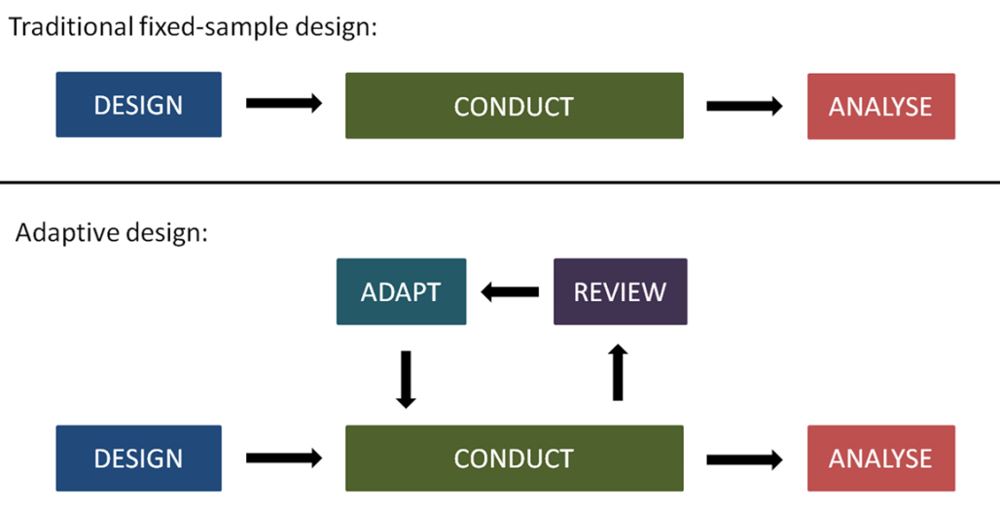

<br />
<br />
<br />
<br />

$^*$ Pallman P, et al. (2018) "_Adaptive designs in clinical trials: why use them, and how to run and report them_", _BMC Medicine_, 16:29


## Traditional (Fixed) Study Design -- Sample Size

- A parallel group trial comparing Experimental (E) vs. Control (C) treatment w.r.t. a primary endpoint which is assumed to be normally distributed (e.g. _**change from baseline to week 6 in total cholesterol level**_)

    + $\tau$ = mean treatment difference (E minus C)
    + To test $H_0: \tau = 0$ (no difference) vs. $H_1: \tau \ne 0$ (treatment effects are different)
    + 2-sample $t-$test: $t = \frac{\overline{Y}_E-\overline{Y}_C}{s_p\sqrt{\frac{1}{n_E}+\frac{1}{n_C}}}$, where $s^2_p = \frac{(n_E-1)s^2_E + (n_C-1)s^2_C}{n_E+n_C-2}$ -- pooled SD
    + $H_0$ is rejected in favor to $H_1$ (i.e. we conclude "_**there is a statistically significant difference between treatments E and C**_") at 5% significance level (2-sided), if $|t| > t_{n_E+n_C-2, 0.975}$, where $t_{n_E+n_C-2, 0.975}$  is a 97.5%-percentile of the $t$ distribution with $n_E+n_C-2$ degrees of freedom.
    

## Question: How Large Should be Our Study?

- _**Design parameters (to be determined by experimenter)**_:

    + $\alpha$ = probability of rejecting $H_0$, given that $H_0$ is true (the chance of false-positive result)
    + $\beta$ = probability of not rejecting $H_0$, given that $H_1$ is true (the chance of false-negative result)
    + $\Delta$ = "clinically relevant" treatment difference (under $H_1$)
    + $\sigma$ = presumed standard deviation of the primary outcome (assumed to be equal for E and C)
    
- Assuming equal ($1:1$) allocation, the sample size per treatment arm ($n$) is determined to satisfy two major conditions:
$$
\alpha = \text{Pr}\left(\text{Reject }H_0|\tau = 0\right)\text{  and  }1-\beta = \text{Pr}\left(\text{Reject }H_0|\tau = \Delta\right)
$$

- The sample size per arm is:
$$
n = \frac{2\sigma^2\left(z_{\frac{\alpha}{2}}+z_{\beta}\right)}{\Delta^2},  
$$
where $z_c$ is the $100\cdot(1-c)\%$-th percentile of the standard normal distribution


## Properties of $n$ as a function of $(\alpha, \beta, \Delta, \sigma)$ 

- $n$ is increasing in $\sigma$
- $n$ is inversly proportional to $\Delta^2$
- The smaller are the values of $\alpha$ and $\beta$, the larger is $n$ (this is because $z_{\frac{\alpha}{2}}$ and $z_{\beta}$ increase as $\alpha$ and $\beta$ decrease)

_**Note the following important limitations**_:

- The formula for $n$ was derived for a specific outcome (normal), specific test, assuming known variance $\sigma^2$
- In practice: the true value of $\sigma^2$ is unknown and one should rely on estimates of $\sigma^2$ from previous similar studies
- There is no agreed standard for choosing a clinically relevant difference $\Delta$
- There is no agreed standard for choosing $\alpha$ and $\beta$

_**Question: Can we be more flexible?**_


## Motivation for Adaptive Designs

- Uncertainty in trial assumptions (treatment effect, variance, dropout rate) increase risk of trial failure

    + The earlier the stage of development, the higher is uncertainty in these assumptions
    
- Having an option to modify trial based on interim results from the trial (_**adaptive design**_) is attractive

    + Reduced uncertainty, better decisions, reduced development time
    
## What is an Adaptive Design?

<div class="column-left">
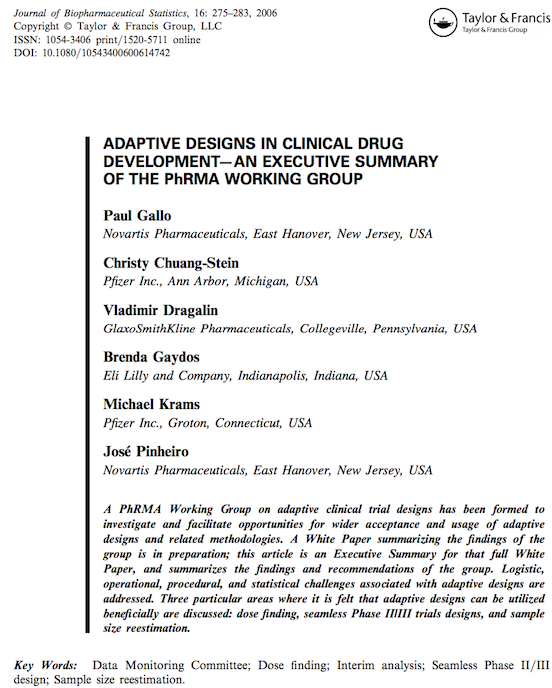
</div>

<div class="column-center">
</div>

<div class="column-right">
- _**Adaptive design**_ -- a clinical study design that uses accumulating data to decide how to modify aspects of the study as it continues, without undermining the validity and integrity of the trial
- _**Integrity**_ refers to the credibility of the results and _**validity**_ refers to being able to make scientifically sound inferences
- Adaptation is a _**design feature**_ aimed to enhance the trial, not a remedy for inadequate planning
</div>


## What are Potential Benefits of Adaptive Designs?

- ADs in exploratory trials:

    + _**Dose finding**_ $\rightarrow$ More accurate estimates of maximum tolerated dose (MTD) and other parameters of dose-toxicity curve
    + _**Dose ranging**_ $\rightarrow$ More accurate characterization of dose-response curve and higher chance of taking right dose(s) into confirmatory trials
    
- ADs in confirmatory trials:

    + _**Group sequential designs**_ $\rightarrow$ Early stopping for efficacy, futility, or safety
    + _**Sample size reassessment**_ $\rightarrow$ Alleviate incorrect assumptions on the outcome variance and /or on the treatment effect
    + _**Population-enrichment**_ $\rightarrow$ Eliminate nonperforming subgroup(s) at IA; focus on subpopulation that is more likely to benefit from treatment
  
- _**In addition**_: ADs facilitate a lot of upfront thinking and discussion with stakeholders


## What are Potential Challenges of Adaptive Designs?

- _**Statistical**_: 

    + Modifications in the AD introduce bias to the data accumulated from the trial; statistical inferences on the treatment effect (point estimates, confidence intervals and $p$-values) need to account for adaptation taken
    
- _**Operational**_:

    + More upfront planning is needed for ADs compared to traditional designs
    + Robust infrastructure to implement design adaptations must be in place
    + Unbliding of interim data can introduce operational bias
    + Speed of recruitment impacts feasibility of ADs: the faster subjects are recruited, the less opportunity there is for adaptation
    
- _**Regulatory**_:

    + Regulators review proposals with confirmatory ADs with higher scrutiny due to limited experience and concerns about control type I error rate
    

## What Regulatory Guidelines Are Available?

<div class="column-left33">
**FDA (2010)**
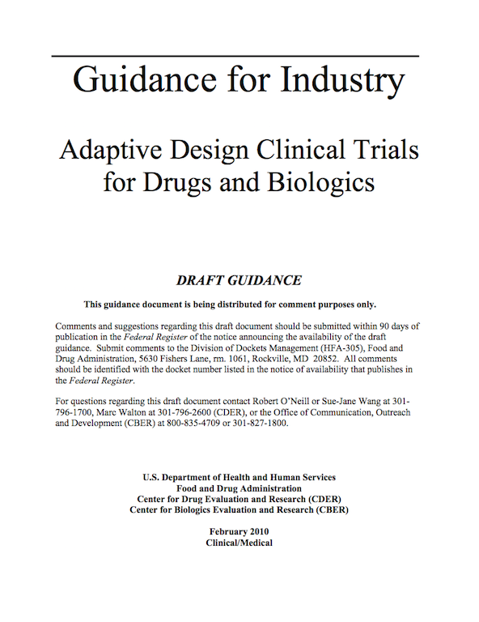
</div>

<div class="column-center33">
**FDA (2016)**
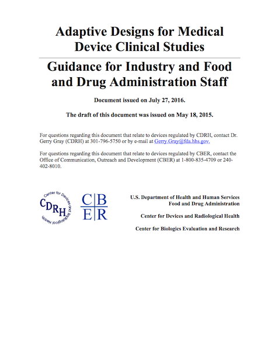
</div>

<div class="column-right33">
**EMA (2007)**
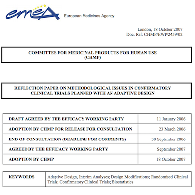
</div>


## Uptake of Adaptive Designs in Clinical Development

<div class="column-center33">
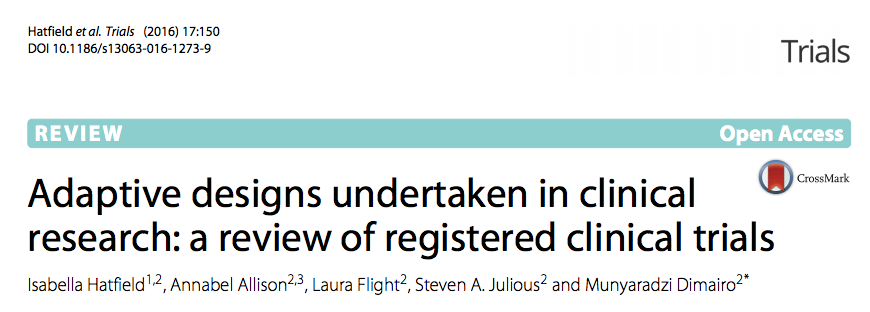
</div>

- Uptake of ADs is gaining traction and increasing
- _**Oncology**_ is the main TA of application; other areas include 

    + _**Mental health**_
    + _**Musculoskeletal**_
    + _**Oral and gastroenterology**_
    
- Phase I was excluded from the review; the majority of ADs are in _Phase II trials_ (which is reflective of regulatory guidance);
- Group Sequential Design (GSD) is most popular type of AD in Phase III


## Classification of Adaptive Designs


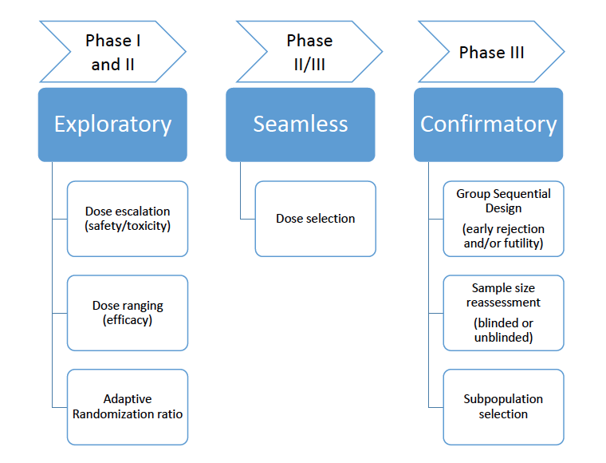


## Exploratory -- Dose Escalation

<div class="column-left85">

- Dose escalation trials are conducted in phase I

    + _**Primary goal**_: evaluate clinicaly safety and PK; in oncology -- evaluate dose-toxicity relation and establish MTD

- For _**safety/ethical**_ reasons, subjects are assigned to increased dose levels in a staggered manner

    + Only when the previous dose is deemed safe will the next cohort be assigned to the next dose-level
    + Next dose is determined based on previous data $\rightarrow$ dose escalation studies are naturally _**adaptive**_
    
- One famous example of an adaptive dose-escalation design:

    _**Continual Reassessment Method (CRM)**_ developed by O'Quigley et al. (1990)$^*$ and its numerous extensions

<br />
<br />
<br />
<br />

<sup>$*$</sup> O'Quigley J, Pepe M, Fisher L (1990)  "_Continual reassessment method: a practical design for phase I clinical studies in cancer_." _Biometrics_, **27**, 33–48

</div>

<div class="column-right15">
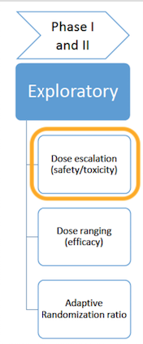

</div>


## Exploratory -- Dose Ranging

<div class="column-left85">
- Dose ranging trials are conducted in phase II

    + Randomized, placebo- and/or active-controlled, with several dose levels of an investigational drug, sample sizes up to several hundred patients
    + _**Usual goal**_ $\rightarrow$ investigate dose-response relationship with respect to some primary efficacy outcome and identify most promising dose(s) to be tested in subsequent confirmatory trials
    
- Types of dose ranging trials

    + _**"Traditional"**_ $\rightarrow$ fixed design comparing control arm vs. all active arms via contrast tests based on an ANOVA model
    + _**"Adaptive analysis" methods**_ $\rightarrow$ most appropriate dose-response model (from a pre-specified set) is chosen for data analysis $\rightarrow$ _**MCP-Mod**_
    + _**"Adaptive design" methods**_ $\rightarrow$ dose levels can be added/dropped; randomization ratio/sample size can be adjusted based on IA results
</div>

<div class="column-right15">
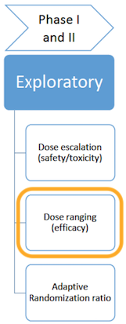
</div>


## MCM-Mod Methodology$^*$

<div class="column-left">
Combines multiple comparisons (MCP) with dose-response modeling (Mod)

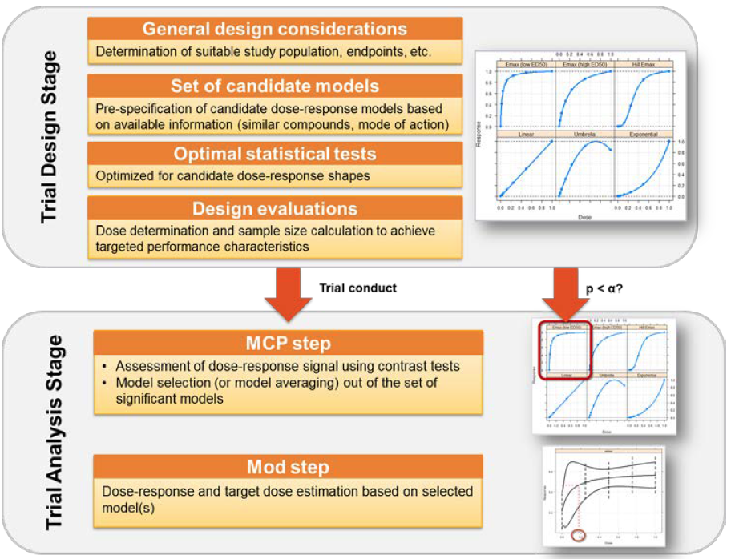{width=95%}

<br />
<br />

<sup>$*$</sup> Bretz F, Pinheiro JC, Branson M (2005)  "_Combining multiple comparisons and modelling techniques in dose-response studies_." _Biometrics_, **61**, 738–748

</div>

<div class="column-right">
CHMP-qualified methodology

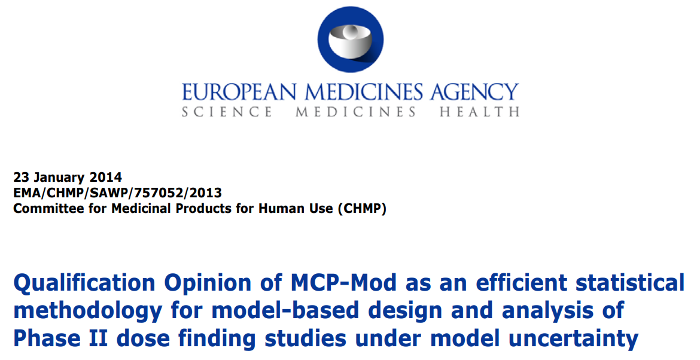{width=95%}

- _"... The MCP-Mod approach is efficient in the sence that it **uses the available data better** than the commonly applied pairwise comparisons ..."_

- _"... the methodological approach will promote **better trial designs** incorporating a wider dose range and increased number of dose levels..."_
</div>


## Adaptive Randomization (will be discussed in very much detail in this course)

<div class="column-left85">
- Treatment allocation sequence is generated dynamically, based on accumulating data in the trial _**to achieve specific experimental objectives**_ while maintaining validity and integrity of the trial results

```{r}
tab <- data.frame(
  col1 = c(
    "Allocation-adaptive",
    "Covariate-adaptive",
    "Response-adaptive",
    "Covariate-adjusted response-adaptive"
  ),
  col2 = c(
    "To achive desired treatment allocation ratio",
    "To balance treatment arms with respect to important prognostic covariates",
    "To increase allocation frequency to an empirically better treatment",
    "A combination of covariate adaptive and response-adaptive randomization"
  )
)

knitr::kable(tab, "html", booktabs = F, col.names = c(" ", " ")) %>%
  kable_styling(bootstrap_options = "striped", full_width = F) %>%
  #row_spec(0, bold = T, color = "white", background = "#6666ff") %>% 
  column_spec(1, bold = T, background = "#99cfe0") %>% 
  column_spec(2, background = "#c1e1ec")
```

</div>

<div class="column-right15">
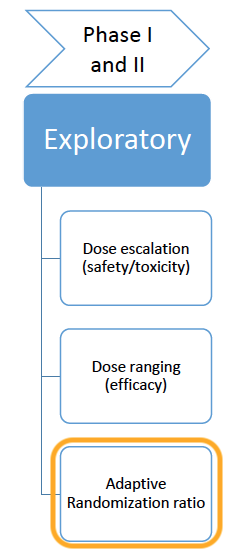{width=95%}
</div>

## Why Response-Adaptive Randomization?

- _**Ethical consideration**_ $\rightarrow$ to assign more trial patients to the empirically better treatment(s)

    + When disease is severe or life threatening, even modest reduction in treatment failures can be viewed as ethically significant
    + When disease is (very) rare $\rightarrow$ majority of patients with the disease will be treated within the trial
    
- _**Statistical considerations**_ $\rightarrow$ to increase allocation to treatment(s) that maximize information for the selected experimental objectives

    + Skewed allocation (favoring more variable arms) can lead to more accurate estimates or more powerfull tests
    + Phase II dose-ranging studies $\rightarrow$ to increase allocation frequency at doses located at the "interesting part" of dose-response curve
    

## Recent Example of RAR (1 of 3)

- Adaptive, dose-finding phase II trial evaluating the safety and efficacy of ABT-089 in patients with _**mild to moderate Alzheimer disease**_$^*$
- Primary objective:

    + Identify _**ED90**_ (lowest dose of ABT-089 that results in 90\% of the maximal effect compared to placebo) and _**the minimum effective dose (MED)**_ -- lowest dose of ABT-089 that results in $\geq$ 1.75-point ADAS-Cog improvement over placebo in mean change from baseline
    
- Primary outcome:

    + Change from day -1 to week 12 on the ADAS-Cog
    
    
<br />
<br />
<br />
<br />

<sup>$*$</sup> Lenz RA, Pritchett YL, Berry SM et al (2015)  "_Adaptive, dose-finding phase 2 trial evaluating the safety and efficacy of ABT-089 in mild to moderate Alzheimer disease_." _Alzheimer Disease and Associated Disorders_, **29**(3), 192–199


## Recent Example of RAR (2 of 3)

- Bayesian response-adaptive randomization design

    + 6 dose groups of ABT-089 and placebo; maximum sample size for the study was set to 400 patients
    + Initial patients were randomized in equal proportions until each group had at least 5 patients
    + Subsequently randomization probabilities to ABT-089 groups were calculated adaptively (updates made at 2-week intervals), based on accumulating ADAS-Cog data, to increase allocation to doses viewed empirically as MED and ED90
    + Randomization ratio for placebo was fixed at 0.20, subsequently adjusted to 0.35 based on the recommendation of DMC (due to higher than usual placebo response)
    + Stopping criteria for futility or success were pre-specified
    
    
## Recent Example of RAR (3 of 3)    

The study stopped for futility after randomization of 337 patients

<div class="column-left">

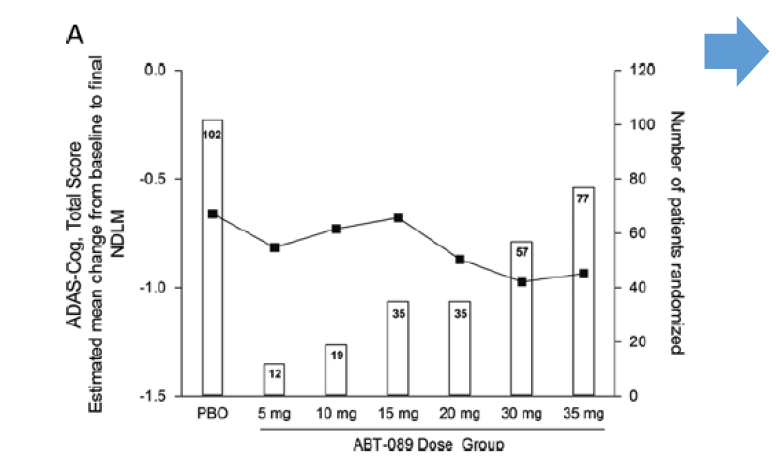{width=100%}

_**RAR design enabled examination of a broad dose range, rapid determination of futility, and limited patient exposure to non-efficacious doses**_

</div>

<div class="column-right">

- Unequal allocation of patients across ABT-089 doses -- larger numbers at higher doses

- Posterior mean change from baseline of ADAS-Cog for ABT-089 groups ranged from $-0.31$ to $-0.02$; _**all 95\% credible intervals included 0**_

- Bayesian posterior probabilities that AT-089 would result in $\geq$ 1.75-point ADAS-Cog improvement over PBO were _**$<1$\% for each ABT-089 dose**_
</div>
  

## Seamless Phase II/III Design

<div class="column-left85">

<div class="column-left">
- Combines "dose selection" (Phase II) and "confirmation" (Phase III) in a single protocol $\rightarrow$ _**"operationally seamless"**_

- If data collected in the Phase II part is used for testing the null hypothesis of the confirmatory part $\rightarrow$ _**"inferentially seamless"**_

</div>
<div class="column-right">
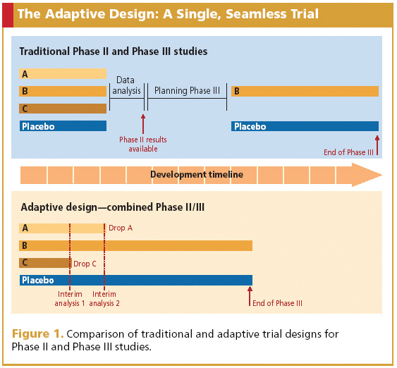{width=100%}

<br />
<br />

<sup>$*$</sup> Schematic taken from McEntegart D, Nicholls G, Byrom B (2007) "_Blinded by science with adaptive designs_." _Applied Clinical Trials_

</div>
</div>
<div class="column-right15">
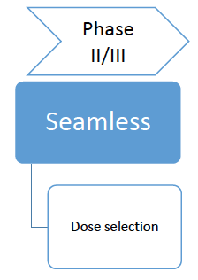{width=95%}
</div>


## Seamless Phase II/III Can Be Useful in Trials for Secondary Progressive Multiple Sclerosis

<div class="column-left">
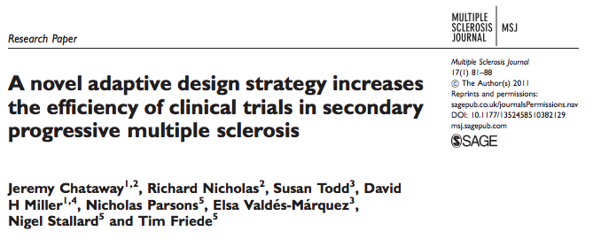{width=100%}
</div>

<div class="column-right">
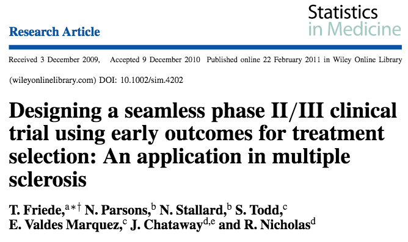{width=100%}
</div>


## Adaptive Designs for Confirmatory Studies

<div class="column-left">
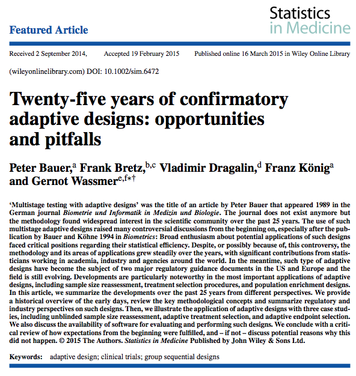{width=100%}
</div>

<div class="column-right">
  - An overview over historical developments of ADs
  - Main statistical principles and recent developments _**on confirmatory ADs**_
  - Perspectives from the pharma industry and regulatory agencies
  - Case studies on _**sample size reassessment**_, _**treatment selection**_, and, _**adaptations in pediatric studies**_
  - An overview of statistical software
</div>


## Confirmatory -- Group Sequential Designs (GSDs)

<div class="column-left85">

- GSDs allow interim decisions based on accumulating data while maintaining overall type I error rate

    + _**Stop early for efficacy**_ $\rightarrow$ bring efficacious treatments to market faster
    + _**Stop early for futility**_ $\rightarrow$ avoid unnecessary exposure of patients to futile treatments; reduce the overall study cost
    
- GSDs have _**well established statistical theory**_
- CSDs are _**well accepted by regulators**_

    + _"Adaptive Designs Whose Properties are Well Understood"_

</div>

<div class="column-right15">

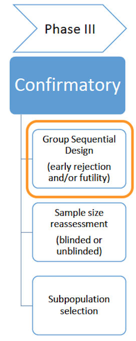{width=100%}
</div>


## Confirmatory -- Blinded Sample Size Reassessment

<div class="column-left85">

- Sample size calculation involves nuisance parameters:

    + _**Standard deviation**_ for continuous outcomes; _**underlying event rate**_ for binary outcomes; subject _**drop-out rate**_
    
- _**Blinded SSR**_ $\rightarrow$ interim blinded data are pooled across treatment arms to re-estimate nuisance parameters and update (increase) the trial sample size

    + _**Helps mitigate impact of incorrect assumptions on study power**_
    
- Statistical properties of blinded SSR methods are well established

- Blinded SSR methods are _**well accepted by regulators**_

</div>

<div class="column-right15">

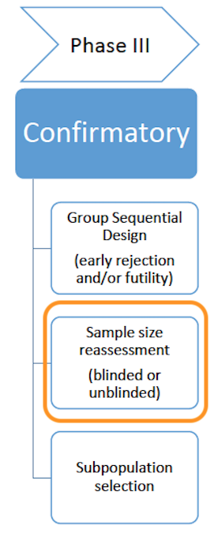{width=100%}
</div>


## Confirmatory -- Subpopulation Selection

<div class="column-left85">

- For some treatments (e.g. targeted agents), there is a biological rationale to consider an AD with interim population selection

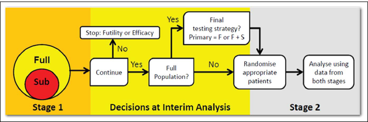{width=90%}

- If subpopulation is selected at IA $\rightarrow$ sample size for the subpopulation may need to be increased (to achieve good power)

- Simulations are necessary to calibrate timing of IA, sample size, power, subpopulation selection rule for the best design performance

<br />
<br />

<sup>$*$</sup> Schematic is taken from Maca J, Dragalin V, Gallo P(2014)  "_Adaptive clinical trials: overview of phase III designs and challenges_." _Therapeutic Innovation and Regulatory Science_, **48**(1), 31–40

</div>

<div class="column-right15">

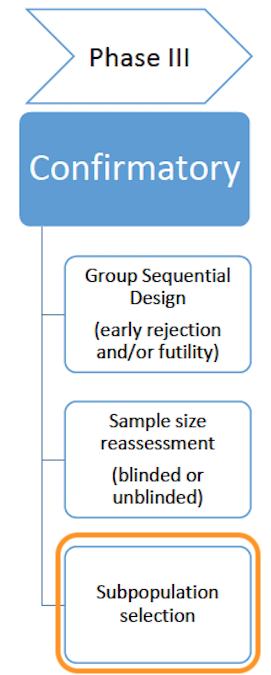{width=100%}
</div>


## Summary -- Benefits and Limitations of Adaptive Designs

```{r}
tribble(
  ~"Phase", ~"Adaptive Design", ~"Benefits", ~"Limitations",
  "I", "Dose escalation", "Flexible; can incorporate historical data via prior distributions (Bayesian); can identify MTD and other parameters of interest more precisely and with lower sample size that SAD/MAD dose escalation designs", "Sensitivity to the choice of prior distribution and model assumption; careful calibrations via simulation are required", 
  "II", "Adaptive dose ranging", "Promising when the initial design is not good and/or interim parameter estimates have low variability; can increase precision in estimating dose-response curve", "Outcome must be a short-term endpoint; collected data should be quickly available for interim analysis and design adaptations",
  "II", "Adaptive randomization", "Addresses ethical concerns (more patients allocated to the empirically better treatment); can increase statistical efficiency (precision/power)", "Cautioned by the FDA in the confirmatory setting",
  "II/III", "Seamless phase II/III", "Avoidance of administrative wait between phase II and III protocol activation; can help reduce the development time", "'Firewall charter' must be in place to maintain trial integrity; proper statistical adjustments are required to account for interim selection / combination of data from phase II and III",
  "III", "Group Sequential Designs", "Enables early stopping for efficacy, futility, or harm; viewed as 'well understood' by FDA", "Cannot alter maximum sample size or events in an unblinded manner; uses nonconventional parameter estimates and confidence intervals",
  "III", "Sample size reassessment", "Can help mitigate impact of incorrect assumptions on study power", "Unblinded SSR requires strict firewalls to prevent leakage of interim information; uses nonconventional parameter estimates and confidence intervals",
  "III", "Subpopulation selection", "Can eliminate nonperforming subgroup(s) at interim analysis and focus on subpopulation that is more likely to benefit from treatment", "Sample size for the subpopulation may need to be increased; requires careful calibration via simulation and special statistical analysis approaches"
) %>% 
  knitr::kable("html", escape = F) %>%
  kable_styling(bootstrap_options = "striped", full_width = F, font_size = 20) %>%
  row_spec(0, bold = T, color = "white", background = "#6666ff") %>% 
  row_spec(c(1, 3, 5, 7), background = "#99cfe0") %>% 
  row_spec(c(2, 4, 6), background = "#c1e1ec")
```


## Analogy Between Adaptive Designs and Swiss Army Knife$^*$

<div class="column-left33">

{width=100%}

_**Simple scissor**_

- Optimal tool for a special task

</div>
<div class="column-center33">

{width=100%}

_**Swiss Army knife**_

- Versatile tool that combines several individual functions in a single unit

</div>

<div class="column-right33">

{width=100%}

_**Giant Swiss Army knife**_

- Functions for every perceivable need
- Looks impressive
- Highly impractible
- Very expensive

</div>

<br />
<br />
<br />
<br />

<sup>$*$</sup> Bretz F, Gallo P, Maurer W (2017)  "_Adaptive designs: The Swiss Army knife among clinical trial designs?_." _Clinical Trials_, **14**(5), 417–424


## Adaptive Designs: Take-Home Messages

- Adaptive designs, when properly implemented, present advantages of improving the flexibility and efficiency of clinical trials

- The field of adaptive trials is expanding, particularly in early (exploratory) clinical development; faster Go/No-Go decisions is the top driver

- Adaptive designs require more upfront planning than conventional trials; yet such investment is often justified

- Adaptive design trial is always a collaborative effort (biostatistics, data management, clinical research, clinical operations, clinical drug supply)

- In the future, wider acceptance among stakeholders involved in clinical R\&D can be expected


## Roadmap for This Course

```{r}
tribble(
  ~"Lecture", ~"Description",
  1, "Introduction to Clinical Trials and Adaptive Designs", 
  2, "Choice of the Target Allocation Ratio in Clinical Trials",
  3, "Randomization Designs for Two-Arm Clinical Trials with Equal Allocation", 
  4, "Randomization Designs for Multi-Arm Clinical Trials with Equal or Unequal Allocation",
  5, "Stratified and Covariate-Adaptive Randomization",
  6, "Optimal Response-Adaptive Randomization",
  7, "Bayesian Adaptive Randomization", 
  8, "Optimal and Adaptive Designs for Quantal Dose-Response Problems",
  9, "Case Studies"
) %>% 
  mutate(
    Description = cell_spec(Description, "html", color = ifelse(Lecture == 1, "blue", "black"))
  ) %>% 
  knitr::kable("html", escape = F) %>%
  kable_styling(bootstrap_options = "striped", full_width = F) %>%
  row_spec(0, bold = T, color = "white", background = "#6666ff") %>% 
  row_spec(c(1, 3, 5, 7, 9), background = "#99cfe0") %>% 
  row_spec(c(2, 4, 6, 8), background = "#c1e1ec")
```


## Homework for Lecture \#1 (1 of 2)

_**True**_ or _**False**_?

- An adaptive design can help mitigate uncertainty in trial assumptions (treatment effect, variance, dropout rate)

- Adaptive designs are applied only in exploratory (phase I and II) clinical development

- All dose-escalation study designs are naturally adaptive

- The main drivers for response-adaptive randomization are ethical and statistical efficiency considerations

- Adaptive designs generally require more upfront planning than designs with a fixed sample size


## Homework for Lecture \#1 (2 of 2)


Read the paper 

- Lenz RA, Pritchett YL, Berry SM, et al (2015) "_Adaptive, dose-finding phase 2 trial evaluating the safety and efficacy of ABT-089 in mild to moderate Alzheimer disease._", _Alzheimer Disease and Associated Disorders_, **29**(3), 192-199.

1. What adaptive elements can you identify in this study?

2. Did the study meet its objective? Was the adaptive design useful?

