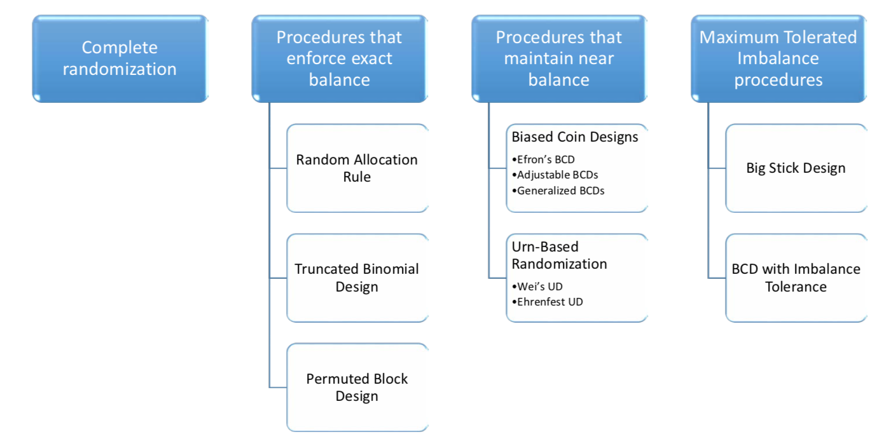

```{r setup, include=FALSE}
library(shiny)
library(tidyverse)
library(kableExtra)

source("./code/lecture02-code.R")
knitr::opts_chunk$set(
  echo = FALSE, 
  fig.width = 8, 
  fig.height = 6, 
  fig.align = "center"
)
```

## Randomized Controlled Trial

- _**The randomized controlled trial (RCT)**_ is recognized as _**the most credible**_ research design for clinical investigation
  + Other designs: Observational studies; Retrospective Studies
    
- _**Randomization**_ -- generation of a sequence of treatment assignments by means of some known random mechanism

- Key merits of randomization:
  1. Helps mitigate various _experimental biases_, such as:
    + _**Selection bias**_ due to the investigator's ability to selectively enroll patients in the study
    + _**Chronological bias**_ due to unobserved time trends
        
  2. Promotes "comparability" of treatment groups
    + _**On average**_, important prognostic factors are balanced across the groups
  3. Contributes to the validity of model-based statistical analysis
    
  4. Can form the basis for nonparametric (randomization-based) inference
    

## Randomization vs. Allocation

- _**Example**_: Clinical trial to compare 2 treatments: Experimental $(E)$ vs. Control $(C)$

- _**Alocation**_:
  + $n = n_E+n_C$ -- total sample size (fixed and pre-determined)
  + $1:1$ -- target allocation ratio (equal allocation)
  + $\left(\rho_E, \rho_C\right) = \left(\frac{1}{2}, \frac{1}{2}\right)$ -- target allocation proportions
  + $\frac{n}{2}$ subjects should be assigned to each group $E$ and $C$
    
- _**Randomization**_:
  + Subjects enter the trial sequentially and must be assigned immediately (at random) to either $E$ or $C$
  + It is desired that the group sizes are close to the desired allocation ratio ($1:1$), both in the end of the trial (i.e. $\frac{n}{2}+\frac{n}{2}$), and at intermediate steps throughout the trial
    
    
## Why Do We Focus on Equal Allocation?

- As we saw in Lecture \#2, equal allocation is optimal in the settings when outcome variance is constant across treatment groups
  + Maximizes estimation precision of treatment effects and treatment contrasts
  + Maximizes power of statistical test
    
- Also, in many cases equal allocation is _**nearly optimal**_ (has high efficiency relative to the true optimal allocation)
  + Binary outcome trials (see examples from Lecture \#2)


## This Lecture

- Randomization designs for 2-arm trials targeting equal ($1:1$) allocation

- Criteria to compare randomization designs: Balance and Randomness

- Introduction to randomization-based inference

- Generating randomization sequences in R


## I. Randomization for 2-arm trials targeting equal allocation

- Two treatment groups: $E$ and $C$; $n = n_E+n_C$ -- total sample size

- Patients enter the trial sequentially and must be randomized to $E$ or $C$

- _**Randomization sequence**_:

$$
\boldsymbol{\delta}_n = \left(\delta_1, \delta_2, \ldots, \delta_n\right),\text{ where }\delta_i = 1(0), \text{ if treatment assignment is }E (C)
$$

- Outcomes are assumed to follow statistical model:

$$
\mathbf{E}\left(Y_i\right) = \delta_i\mu_E+(1-\delta_i)\mu_C\text{ and }\mathbf{Var}\left(Y_i\right)=\sigma^2,\text{ }i = 1,2, \ldots, n  
$$

- The 1<sup>st</sup> patient is randomized between $E$ and $C$ with probability $\frac{1}{2}$

- The $(j+1)$<sup>st</sup> patient is assigned to $E$ with probability

$$
  P_{j+1} = \text{Pr}\left(\delta_{j+1}=1|\boldsymbol{\delta}_j\right), \text{ }j\geq 1
$$
(i.e. randomization probability is conditional on the past treatment assignments)


## Imbalance after $m$ allocations

- $\boldsymbol{\delta}_n = \left(\delta_1, \delta_2, \ldots, \delta_n\right)$ -- randomization sequence

- $N_E(m) = \sum_{j=1}^m{\delta_j}$ -- number of patients (out of $m$) assigned to $E$

- $N_C(m) = \sum_{j=1}^m{\left(1-\delta_j\right)}$ -- number of patients (out of $m$) assigned to $C$

- Treatment imbalance after $m$ allocations (where $1\leq m \leq n$): 
$$
D(m) = N_E(m)-N_C(m) = 2N_E(m)-m
$$
  * $D(m)$ is a random variable that can take values from $\left\{-m, \ldots, m\right\}$
  * The distribution of $D(m)$ is determined by $\boldsymbol{\delta}_m = \left(\delta_1, \delta_2, \ldots, \delta_m\right)$
  * Ideally, $D(m) = 0$ for $m = n$ (exact balance at the end of the study) and $D(m)\approx 0$ for $1\leq m \leq n$ (approximate balance at intermediate steps)
    
- Another useful measure of imbalance is difference in proportions:
$$
  d(m) = \frac{N_E(m)}{m}-\frac{N_C(m)}{m} = \frac{2N_E(m)}{m}-1
$$
  * $d(m)$ is a random variable taking values in $[-1, 1]$; ideally, $d(m) = 0$
    

## We Will Cover Four Types of Randomization Procedures:

1) Complete randomization

2) Procedures that enforce _**exact balance**_ at the end of the study

3) Procedures that maintain _**near-balance**_ throughout the study
  + Biased coin designs
  + Urn-based designs

4) Maximum Tolerated Imbalance (MTI) procedures


## 1) Complete Randomization

- Treatment assignments are made independently, by flip of a fair coin
  * Completely unpredictable procedure and has provides no potential for selection bias
  * Can result, with _**non-negligible probability**_, in treatment imbalances $\Rightarrow$ can lead to loss in statistical efficiency and power
    
- $\delta_1, \delta_2, \ldots, \delta_n \sim Bernoulli\left(\frac{1}{2}\right)\text{ }\left(\delta_j =1, \text{ if }E;\text{ }\delta_j = 0\text{ if }C\right)$

- $N_E(n) = \sum_{j=1}^n{\delta_j}\sim Binomial\left(n, \frac{1}{2}\right)$

- $D(n) = 2N_E(n)-n$ -- imbalance after n allocations

- $\text{Pr}(\left|D(n)\right| > r) = 1 - \text{Pr}(\left|D(n)\right| \leq r)$ -- probability of imbalance more extreme that $r$
  * Can be evaluated exactly, using binomial probabilities
  * Or, using normal approximations: $\text{Pr}(\left|D(n)\right| > r)\approx 2\left(1-\Phi\left(\frac{r}{\sqrt{n}}\right)\right)$
    

## Complete Randomization -- Evaluating Imbalance Probability

```{r}
tribble(
  ~"n", ~"Allocation $N_E:N_C$", ~"Prop. for $E$ ($N_E(n)/n$)", ~"Imbalance $r$", ~"Pr(|D<sub>n</sub>| &gt; r)", 
  "20", "(10:10)", "0.5", 0, "82.4%",
  " ", "(11:9) or (9:11)", "0.55 or 0.45", 2, "50.3%",
  " ", "(12:8) or (8:12)", "0.60 or 0.40", 4, 
"26.3%",
  " ", "(14:6) or (6:14)", "0.70 or 0.30", 8, 
"4.1%",
  " ", "(15:5) or (5:15)", "0.75 or 0.25", 10, 
"1.2%",
  "40", "(20:20)", "0.5", 0, "87,5%",
  " ", "(24:16) or (16:24)", "0.60 or 0.40", 8, 
"15.4%",
  " ", "(26:14) or (14:26)", "0.65 or 0.35", 12, 
"3.8%",
  "100", "(50:50)", "0.5", 0, "92%",
  " ", "(55:45) or (45:55)", "0.55 or 0.45", 10, 
"27.1%",
  " ", "(60:40) or (40:60)", "0.60 or 0.40", 20, 
"3.5%",
  "200", "(110:90) or (90:110)", "0.55 or 0.45", 20, 
"13.7%",
  " ", "(120:80) or (80:120)", "0.60 or 0.40", 40, 
"0.4%"
) %>% 
  knitr::kable("html", escape = F) %>%
  kable_styling(bootstrap_options = "striped", full_width = F) %>%
  row_spec(0, bold = T, color = "white", background = "#6666ff") %>% 
  row_spec(seq(1, 13, by = 2), background = "#99cfe0") %>% 
  row_spec(c(3, 7, 11, 13), color = "darkblue") %>% 
  row_spec(seq(2, 12, by = 2), background = "#c1e1ec")
```

***

- In small trials, deviations from the target allocation $(0.5, 0.5)$ are likely to occur:

    - If $n=20$ ($n=40$), there is **26\‰** (**15\%**) probability that the trial will result in a more unbalanced allocation that $(0.60, 0.40)$ or $(0.40, 0.60)$
    
- For $n=100$  and $n=200$, the chance to have a more extreme than $(0.60, 0.40)$ or $(0.40, 0.60)$ alloction is **3.5\%** and **0.4\%** respectively

## 2) Procedures that enforce _**exact balance**_

* Random Allocation Rule

* Truncated Binomial Design

* Permuted Block Design


## Random Allocation Rule (RAR)

* For a trial of size $n$, RAR forces exact balance $\left(\frac{n}{2}E\text{'s and }\frac{n}{2}C\text{'s}\right)$

* Consider an urn with $\frac{n}{2}$ white balls ($E$) and $\frac{n}{2}$ red balls ($C$)

* A treatment allocation sequence is generated sequentially by randomly selecting (without replacement) balls from the urn. The randomization probability for the $j$<sup>th</sup> patient is
$$
  P_j = \text{Pr}\left(\delta_j = 1|\boldsymbol{\delta}_{j-1}\right) = \left\{
    \begin{array}{rl}
      \frac{1}{2}, & j = 1 \\
      \frac{\frac{n}{2}-N_E(j-1)}{n-(j-1)}, & j = 2, 3, \ldots, n
    \end{array}
  \right.
$$

* This is equivalent to selecting a randomization sequence from a set of $\binom{n}{n/2}$ equiprobable sequences with exactly $\frac{n}{2}E\text{'s and }\frac{n}{2}C\text{'s}$
  + If $n = 4$ there are $\binom{4}{2} = 6$ different allocation sequences: $EECC$, $ECEC$, $ECCE$, $CECE$, $CEEC$, $CCEE$
    
* Although the final alocation is balanced (by design), at interim steps, imbalance may be substantial (e.g. if $n = 50$), in theory we can have first 25 $E$'s followed by 25 $C$'s


## Truncated Binomial Design (TBD)

* Patients are randomized with probability $\frac{1}{2}$ to $E$ or $C$ until one of the groups has $\frac{n}{2}$ patients. The remaining assignments are made (with probability 1) to the other group

* The randomization rule for the $j$<sup>th</sup> patient is
$$
  P_j = \text{Pr}\left(\delta_j = 1|\boldsymbol{\delta}_{j-1}\right) = \left\{
    \begin{array}{rl}
      \frac{1}{2}, & \text{if }\max\left(N_E(j-1), N_C(j-1)\right)<\frac{n}{2} \\
      0, & \text{if }N_E(j-1) = \frac{n}{2} \\
      1, & \text{if }N_C(j-1) = \frac{n}{2}
    \end{array}
  \right.
$$

* Similar to RAR, TBD forces exact balance $\left(\frac{n}{2}E\text{'s and }\frac{n}{2}C\text{'s at the end of the trial}\right)$

*  Unlike RAR, TBD has unequal probabilities of randomization sequences

* For instance:

```{r}
tribble(
  ~"Sequence (n = 4)", ~"EECC", ~"ECEC", ~"CECE", ~"ECCE", ~"CEEC", ~"CCEE",
  "Random Allocation Rule", "1/6", "1/6", "1/6", "1/6", "1/6", "1/6",
  "Truncated Binomial Design", "1/4", "1/8", "1/8", "1/8", "1/8", "1/4" 
) %>% 
  knitr::kable("html", escape = F) %>%
  kable_styling(bootstrap_options = "striped", full_width = F) %>%
  row_spec(0, bold = T, color = "white", background = "#6666ff") %>% 
  row_spec(c(1), background = "#99cfe0") %>% 
  row_spec(c(2), background = "#c1e1ec")
```


## Permuted Block Design (PBD)

* PBD is the most popular design in clinical practice

* PBD imposes balance at different stages of the trial
  + For a trial of size $n$, establish $M$ blocks, each of size $m = \frac{n}{M}$
  + Within a block, randomize $\frac{m}{2}$ patients to $E$, and $\frac{m}{2}$ patients to $C$ (using Random Alocation Rule)
  + Perfect balance throughout the trial except for possibly last (unfilled) block
  + Maximum imbalance at any stage of the trial is $\frac{m}{2}$
    
* How to choose the block size?
  + If $m = 2$, then every pair of subects is an equal allocation ($EC|CE|CE|EC|\ldots$). However, every _**even**_ allocation is deterministic $\Rightarrow$ can lead to selection bias.
  + In practice, blocks of size _**4 to 8**_ are common.
  + Variable block sizes are also possible (yet are less common)
    
    
## Quiz

* The trial aims at recruiting $n = 20$ patients

* Suppose 10 patients have been enrolled. 4 were randomized to $E$, and 6 were randomized to $C$

* What is the probability that the 11<sup>th</sup> subject is randomized to treatment $E$ for each of the following rules:

    + Complete Randomization
    + Random Allocation Rule
    + Truncated Binomial Design
    + Permuted Block Design with block size 4
    

## 3) Procedures that maintain _**near-balance**_

* The requirement of exact balance may be too restrictive

    + From a statistical perspective, slight deviations from equal allocation have minimal impact on statistical power
    
* A "good" procedure should produce _**near-balanced group sizes at each allocation step**_, while maintaining randomness (high level of "encryption") to minimize potential for selection bias

* In this section we shall focus on 

    a) Biased Coin Designs
    b) Urn-based randomized designs
    
    
## Biased Coin Designs (1 of 5)

_**Efron's BCD**_$^*$

* Let $p$ be a _**fixed and pre-determined**_ skewing probability ("coin bias") $\left(\frac{1}{2} < p\leq 1\right)$

* Let $D(j) = N_E(j)-N_C(j)$ -- imbalance after $j$ allocations. The randomization rule for the $(j+1)$<sup>st</sup> patient is:
$$
  P_{j+1} = \text{Pr}\left(\delta_{j+1} = 1|D(j)\right) = \left\{
    \begin{array}{rl}
      \frac{1}{2}, & D(j) = 0 \\
      p, & D(j) < 0 \\
      1-p, & D(j) > 0
    \end{array}
  \right.
$$ 
<br />
<br />
<br />
<br />

<sup>$*$</sup> Efron B (1971)  "_Forcing a sequential experiment to be balanced_." _Biometrika_, **58**(3), 403–417


## Biased Coin Designs (2 of 5)

_**Adjustable BCD**_$^*$

- Efron's BCD can be made more sensitive to imbalance by letting the coin bias probability depend on the magnitude of imbalance

- Let $F(x)$ be a decreasing function, $F(x)+F(-x) = 1$, where $F:\mathbb{Z}\rightarrow [0, 1]$ ($\mathbb{Z}$ is the set of integers). The randomization rule for the $(j+1)$<sup>th</sup> patient is:
$$
  P_{j+1} = \text{Pr}\left(\delta_{j+1}=1|\boldsymbol{\delta_j}\right) = F\left(N_E(j)-N_C(j)\right)
$$

- _**Efron's BCD**_ is a special case:
$$
  F(x) = \frac{1}{2}+\text{sign}(x)\left(\frac{1}{2}-p\right)
$$

- _**Adjustable BCD**_$^*$:
$$
F_a(x) = \left\{
\begin{array}{rl}
  \frac{|x|^a}{|x|^a + 1}, & x \leq -1 \\
  \frac{1}{2}, & x = 0 \\
  \frac{1}{|x|^a + 1}, & x \geq 1
\end{array}
\right.
$$
(parameter $a\geq 0$ controls the degree of randomness; $a = 0$ corresponds to complete randomization)

<br />
<br />
<br />
<br />

<sup>$*$</sup> Baldi Antognini A and Giovagnoli A (2004)  "_A new 'biased coin' design for the sequential alocation of two treaments_." _Appl. Stat._, **53**(4), 651–664


## Biased Coin Designs (3 of 5)

_**Efron's BCD vs. Adjustable BCD**_

```{r}
efron_bcd <- function(x, p) {
  1/2+sign(x)*(1/2-p)
}

adjustable_bcd <- function(x, a) {
  map_dbl(x, ~ {
    x_ <- .
    if (x_ <= -1) abs(x_)^a/(abs(x_)^a+1)
    else if (x_ == 0) 1/2
    else 1/(abs(x_)^a+1)
  })
}

shinyApp(
  ui = fluidPage(
    sidebarPanel(
      withMathJax(),
      sliderInput("efron_p", 
                  "$$\\text{Efron's BCD }p:$$", 
                  min = 0.5, 
                  max = 0.9,
                  step = 0.05,
                  value = 0.7),
      sliderInput("adjustable_a", 
                  "$$\\text{Adjustable BCD }a:$$", 
                  min = 0, 
                  max = 5,
                  step = 0.25,
                  value = 1)
    ),
    mainPanel(
      plotOutput("bcd_plot")
    )
  ),
  
  server = function(input, output) {
    output$bcd_plot <- renderPlot({
      bind_rows(
  tibble::tibble(
    x = seq(-10, 10),
    y = efron_bcd(x, input$efron_p),
    label = paste0("Efron's BCD with p = ", input$efron_p)
  ),
  tibble::tibble(
    x = seq(-10, 10),
    y = adjustable_bcd(x, input$adjustable_a),
    label = paste0("Adjustable BCD with a = ", input$adjustable_a)
  )
) %>% 
  ggplot(aes(x, y))+
    geom_point(size = 3, color = "darkblue")+
    ggtitle("Randomization probability as a function of imbalance")+
    xlab(expression(paste("Treatment imbalance (", N[E]-N[C], ")")))+
    ylab("Pr(E)")+
    scale_y_continuous(limits = c(0, 1))+
    facet_grid(. ~ label)+
    theme(
      axis.title = element_text(family = "Helvetica", face = "bold", size = 18),
      axis.text  = element_text(family = "Helvetica", face = "bold", size = 14),
      title  = element_text(family = "Helvetica", face = "bold", size = 20),
      strip.text = element_text(family = "Helvetica", face = "bold", size = 18)
    )
    })
  }
)
```

- For Efron's BCD the skewing probability is $p$ or $1-p$ (regardless of the value of imbalance)

- For adjustable BCD the skewing probability depens on the magnitude of treatment imbalance: greater imbalance leads to increased allocation probability to the underrepresented treatment


## Biased Coin Designs (4 of 5)

_**Generalized BCD**_$^*$

- Efron's BCD can be extended by letting randomization probabilities depend on treatment imbalance measured as _**difference in proportions**_

- Let $p(x)$ be decreasing, $p(x)+p(-x) = 1$, $p: [-1, 1]\rightarrow [0, 1]$. In particular:
$$
  p(x) = \frac{(1-x)^\rho}{(1-x)^\rho+(1+x)^\rho}\text{ (}\rho\geq 0\text{ is pre-determined})
$$

- The randomization rule for the $(j+1)$<sup>st</sup> patient is:
$$
  P_{j+1}=\text{Pr}\left(\delta_{j+1}=1|\boldsymbol{\delta_j}\right)=p\left(\frac{N_E(j)}{j}-\frac{N_C(j)}{j}\right)
$$

    + $\rho = 0 \Rightarrow P_{j+1}=\frac{1}{2}$
    + $\rho = 1 \Rightarrow P_{j+1}=\frac{N_C(j)}{j}$ -- D-optimal randomization (_**Wej, 1978**_)$^{**}$
    + $\rho = 2 \Rightarrow P_{j+1}=\frac{N^2_C(j)}{N^2_E(j)+N^2_C(j)}$ -- D<sub>A</sub>-optimal randomization (_**Atkinson, 1982**_)$^{***}$

<br />
<br />

<sup>$^*$</sup> Smith RL (1984)  "_Sequential treatment allocation using biased coin designs_." _J. Roy. Stat. Soc. B_, **46**(3), 519–543

<sup>$^{**}$</sup> Wei LJ (1978)  "_The adaptive biased coin design for sequential experiments_." _Ann. Stat._, **6**, 92–100

<sup>$^{***}$</sup> Atkinson AC (1982)  "_Optimum biased coin design for sequential clinical trials with prognostic factors._" _Biometrika_, **69**(1), 61–67


## Biased Coin Designs (5 of 5)

Generalized BCD -- the impact of $\rho$

<div class="column-left">
```{r, fig.width=6}
p_fcn <- function(x, rho) {(1-x)^rho/((1-x)^rho + (1+x)^rho)}

x <- seq(-1, 1, by = 0.01)
rho <- c(0, 1, 2, 5, 20) 
seq_along(rho) %>% map(~ tibble::tibble(design = ., rho = rho[design], x, y = p_fcn(x, rho))) %>% 
  bind_rows() %>% 
  mutate(design = factor(design)) %>% 
  ggplot(aes(x, y)) +
    geom_line(aes(group = design, color = design, linetype = design), size = 1.25)+
    xlab(expression(paste("Imbalance in treatment proportions (", italic(E)-italic(C), ")")))+
    ylab(expression(paste("Pr(", italic(E), ")")))+
    ggtitle(expression(paste("Allocation function (probability of assigning treatment ", italic(E), ")")))+
    scale_color_manual(
      values = c("red", "blue", "darkgreen", "darkorange", "purple"),
      labels = expression(
        paste(rho==0, " (Complete Randomization)"),
        paste(rho==1, " (Wei)"),
        paste(rho==2, " (Atkinson)"),
        paste(rho==5, " (Smith)"),
        rho == 20
      )
    )+
    scale_linetype_manual(
      values = c("solid", "longdash", "twodash", "dotdash", "dotted"),
      labels = expression(
        paste(rho==0, " (Complete Randomization)"),
        paste(rho==1, " (Wei)"),
        paste(rho==2, " (Atkinson)"),
        paste(rho==5, " (Smith)"),
        rho == 20
      )
    )+
    theme(
      axis.title = element_text(family = "Helvetica", face = "bold", size = 18),
      axis.text = element_text(family = "Helvetica", face = "bold", size = 14),
      legend.text.align = 0,
      legend.position = c(0.8, 0.9),
      legend.title = element_blank(),
      legend.text = element_text(family = "Helvetica", face = "bold", size = 14),
      legend.background = element_rect(fill = NA),
      legend.key=element_blank()
    )

```

</div>

<div class="column-right">
  
- For complete randomization ($\rho = 0$), the probability is 0.5

- For Wei's design ($\rho = 1$), the allocation function is a linear function of imbalance.

- As $\rho$ increases, the allocation function becomes more steep and sensitive to imbalance.

- For $\rho\rightarrow +\infty$, we have a Permuted Block Design with block size = 2: 
$$
  p(x) = \left\{
    \begin{array}{lr}
      1, & x < 0 \\
      \frac{1}{2}, & x = 0 \\
      0, & x > 0
    \end{array}
  \right.
$$
</div>


## Quiz

- The trial aims at recruting $n = 20$ patients

- Suppose 10 patients have been enrolled. 4 were randomized to $E$, and 6 were randomized to $C$

- What is the probability that the 11<sup>th</sup> patient is randomized to treatment $E$ for each of the following rules:

    * Efron's BCD with $p = 2/3$
    * Adjustable BCD with $a = 1$
    * Generalized BCD with $\rho = 1$
    * Generalized BCD with $\rho = 2$
    * Generalized BCD with $\rho = 5$


## Urn-Based Designs (1 of 4)

_**Wei's Urn Design**_$^*$

- An urn contains $\alpha > 0$ balls of each type $E$ and $C$. Let $\beta > 0$ be fixed and pre-determined.

- For each patient, a ball is drawn at random with replacement, and the corresponding treatment is assigned.

    + If type $E$ was drawn, $\beta$ balls of type $C$ are added into the urn
    + If type $C$ was drawn, $\beta$ balls of type $E$ are added into the urn
    
- The randomization rule for the $j$<sup>th</sup> patient is:
$$
P_j = \text{Pr}\left(\delta_j = 1|D(j-1)\right) = \left\{
  \begin{array}{lr}
    \frac{1}{2}, & j = 1 \\
    \frac{1}{2}-\frac{\beta D(j-1)}{2(2\alpha+\beta(j-1))}, & j \geq 2
  \end{array}
\right.
$$

- The allocation probability is skewed in favor of the treatment that has been assigned least often thus far.

    + The number of balls in the urn is increasing at each step.

<br />
<br />

<sup>$^*$</sup> Wei LJ (1978)  "_A class of designs for sequential clinical trials._, _JASA_, **72**, 382–386

    
## Urn-Based Designs (2 of 4)

_**Wei's Urn Design**_ with $\alpha = 0$ and $\beta = 1$

- UD($\alpha = 0$, $\beta = 1$) can be a good choice in practice$^*$

    + $P_{j+1} = \frac{N_C(j)}{j} = \frac{1}{2}-\frac{D(j)}{2j}$
    + $\frac{D(n)}{n}$ has asymptotically normal distribution with mean = 0, and asymptotic variance = 1/3 (which is 3 times smaller than for complete randomization)
    
```{r, fig.height=4}
ud01 <- function(j, D) {
  0.5*(1-D/j)
}

nsim <- 10000
nsbj <- 100

D_distr <- seq_len(nsim) %>% map(~ {
  trt_crd <- c(0, 0)
  trt_ud <- c(0, 0)
  for (j in seq_len(nsbj)) {
    crd <- sample(c(1, 2), 1, prob = c(0.5, 0.5))
    trt_crd[crd] <- trt_crd[crd] + 1
    
    p <- ud01(j, trt_ud[1]-trt_ud[2])
    ud <- sample(c(1, 2), 1, prob = c(p, 1-p))
    trt_ud[ud] <- trt_ud[ud] + 1
  }
  tibble::tibble(
    `CRD` = (trt_crd[1]-trt_crd[2])/nsbj,
    `UD (0, 1)` = (trt_ud[1]-trt_ud[2])/nsbj
  )
}) %>% 
  bind_rows() %>% 
  gather(key, value)

qq <- D_distr %>% 
  group_by(key) %>% 
  summarise(
    `2.5-th` = quantile(value, probs = 0.025),    
    `97.5-th` = quantile(value, probs = 0.975)
  )

ggplot()+
    geom_histogram(data = D_distr, aes(value, y =..density.., fill = key, color = key), alpha = .5, binwidth = 0.02)+
    geom_vline(data = qq, aes(xintercept=`2.5-th`))+
    geom_vline(data = qq, aes(xintercept=`97.5-th`))+
    annotate("text", label = "2.5th", x = qq$`2.5-th`[1], y = -0.2, size = 6, colour = "black")+
  annotate("text", label = "97.5th", x = qq$`97.5-th`[1], y = -0.2, size = 6, colour = "black")+
    facet_grid(. ~ key)+
    xlab(expression(frac(D(n), n)))+
    ylab("frequency")+
    theme(
      axis.title = element_text(family = "Helvetica", face = "bold", size = 18),
      axis.text = element_text(family = "Helvetica", face = "bold", size = 14),
      strip.text = element_text(family = "Helvetica", face = "bold", size = 18),
      legend.position = "None"
    )

```

<sup>$^*$</sup> Wei LJ (1978)  "_The adaptive biased coin design for sequential experiments_." _Ann. Stat_, **6**, 92–100


## Urn-Based Designs (3 of 4)

_**Ehrenfest Urn Design**_$^*$

- Initially, $w$ (even number) of balls are arranged in two urns, labeled $E$ and $C$, with $w/2$ balls in each urn

- The $w$ balls are equally likely to be drawn

- At each step, one ball is dawn of the $w$ balls at random

    + if the ball is from urn $E \Rightarrow$ assign $E$, replace it into urn $C$
    + if the ball is from urn $C \Rightarrow$ assign $C$, replace it into urn $E$
    
- The randomization rule is 
$$
  P_{j+1} = \left\{
    \begin{array}{lr}
      1, & D(j) < -\frac{w}{2} \\
      \frac{1}{2}-\frac{D(j)}{w}, & -\frac{w}{2} \leq D(j) \leq \frac{w}{2} \\
      0, & D(j) > \frac{w}{2}
    \end{array}
  \right.
$$

- Balance is achived because it is more likely to draw a ball from the urn that contains more balls

    + Unlike Wei's UD, Ehrenfest UD maintains a constant numbers of balls ($w$) at each step
    
<sup>$^*$</sup> Chen YP (2000)  "_Which design is better? Ehrenfest urn versus biased coin_." _Adv. Appl. Prob_, **32**, 738–749
    

## Urn-Based Designs (4 of 4)

_**Ehrenfest Urn Design with Different $w$**_

<div class="column-left">
```{r, fig.width=6.5}
ehrenfest <- function(D, w){
  if (D < -w/2) {1}
  else if (D > w/2) {0}
  else {1/2-D/w}
}

D <- seq(-10, 10)
w <- c(2, 4, 8, 16)
seq_along(w) %>% map(~{
  w_ <- w[.]
  tibble::tibble(
    D,
    Pr = map_dbl(D, ~ehrenfest(., w_)),
    label = paste0(., ". Ehrenfest UD with w = ", w_)
  )
}) %>% 
  bind_rows() %>% 
  ggplot(aes(x=D, y = Pr))+
    geom_point(size = 2)+
    xlab(expression(paste("Imbalance in treatment numbers (", italic(E)-italic(C), ")")))+
    ylab(expression(paste("Pr(", italic(E), ")")))+
    facet_wrap(~ label)+
    theme(
      axis.title = element_text(family = "Helvetica", face = "bold", size = 18),
      axis.text = element_text(family = "Helvetica", face = "bold", size = 14),
      strip.text = element_text(family = "Helvetica", face = "bold", size = 14),
      legend.position = "None"
    )
    
```

</div>

<div class="column-right">

- Smaller value of $w$ leads to a more balanced and more deterministic procedure
  
- Absolute imbalance cannot exceed $\frac{w}{2}$; i.e. $|D(j)|\leq\frac{w}{2}$ for any $j\geq 1$  

</div>


## Quiz

- The trial aims at recruting $n=20$ patients

- Suppose 10 patients have been enrolled. 4 were randomized to $E$, and 6 were randomized to $C$

- What is the probability that the 11<sup>th</sup> patient is randomized to tretament $E$ for each of the following rules:

    + Wei's UD with $\alpha=0$ and $\beta = 1$
    + Ehrenfest UD with $w=4$
    + Ehrenfest UD with $w=8$
    
## 4) Maximum Tolerated Imbalance (MTI) Procedures (1 of 2)

- _**MTI Procedure**_: Allocations are made randomly (i.e. $0 < P_{j+1} < 1$) as long as $|D(j)|< b$ (where $b>0$ is a pre-specified boundary for imbablnce). Once $|D(j)| = b$, an allocation is made deterministically (i.e. $P_{j+1} = 1$ or $0$) to restore balance within acceptable margins

- _**'Big stick' procedure**_$^{*}$:
$$
P_{j+1} = \left\{
  \begin{array}{rl}
      \frac{1}{2}, & |D(j)| < b \\
      0, & D(j) = b \\
      1, & D(j) = -b
    \end{array}
  \right.
$$

- _**Biased Coin Design ($p$) with Imbalance Tolerance**_$^{**}$
$$
P_{j+1} = \left\{
  \begin{array}{cc}
      1, & D(j) = -b \\
      p, & -b < D(j) < 0 \\
      \frac{1}{2}, & D(j) = 0 \\
      1-p, & 0 < D(j) < b \\
      0, & D(j) = b
    \end{array}
  \right.
$$

<sup>$^*$</sup> Soares JF, Wu CFJ (1983)  "_Some restricted randomization rules in sequential designs_." _Comm Stats_, **12**(17), 2017–2034

<sup>$^{**}$</sup> Chen YP (1998)  "_Biased coin design with imbalance tolerance_." _Comm. Stat. Stoch. Models_, **15**(5), 953–975


## 4) MTI Procedures (2 of 2)

_**Big Stick Design vs. BCD with Imbalance Tolerance**_

<div class="column-left">
```{r, fig.width=6.5}
# Big Stick Procedure
bsp <- function(D, b){
  if (D == b) {0}
  else if (D == -b) {1}
  else {1/2}
}
# Biased Coin Design
bcd <- function(D, b, p=2/3){
  if (D == -b) {1}
  else if (D == b) {0}
  else {
    if (-b < D & D < 0) {p}
    else if (0 < D & D < b) {1-p}
    else {1/2}
  }
}

b <- c(2, 4)
bind_rows(
  # Big Stick
  seq_along(b) %>% map(~{
    b_ <- b[.]
    D <- seq(-b_, b_)
    tibble::tibble(
      D,
      Pr = map_dbl(D, ~bsp(., b_)),
      label = paste0(., ". Big Stick Design (b = ", b_, ")")
    )
  }) %>% 
    bind_rows(),

  # BCD
  (seq_along(b)+2) %>% map(~{
    b_ <- b[.-2]
    D <- seq(-b_, b_)
    tibble::tibble(
      D,
      Pr = map_dbl(D, ~bcd(., b_)),
      label = paste0(., ". BCD (b = ", b_, ")")
    )
  }) %>% 
    bind_rows()  
) %>% 
  ggplot(aes(x=D, y = Pr))+
    geom_point(size = 2)+
    xlab(expression(paste("Imbalance in treatment numbers (", italic(E)-italic(C), ")")))+
    ylab(expression(paste("Pr(", italic(E), ")")))+
    facet_wrap(~ label, scales = "free_x")+
    theme(
      axis.title = element_text(family = "Helvetica", face = "bold", size = 18),
      axis.text = element_text(family = "Helvetica", face = "bold", size = 14),
      strip.text = element_text(family = "Helvetica", face = "bold", size = 14),
      legend.position = "None"
    )
    
```

</div>

<div class="column-right">

- Big Stick Design is a bit more random than BCD with Imbalance Tolerance (here BCD is used with $p = \frac{2}{3}$)
  
- Both designs enforce a deterministic allocation only if imbalance hits the pre-specified boundary

</div>

## Quiz

- The trial aims at recruting $n=20$ patients

- Suppose 10 patients have been enrolled. 4 were randomized to $E$, and 6 were randomized to $C$

- What is the probability that the 11<sup>th</sup> patient is randomized to tretament $E$ for each of the following rules:

    + Big Stick Design with $b=2$
    + BCD with $b=2$ and $p = \frac{2}{3}$
    + Big Stick Design with $b=4$
    + BCD with $b=4$ and $p = \frac{2}{3}$

## Summary of Discussed Randomization Procedures for $1:1$ Allocation

{width=100%}


## II. Criteria to compare randomization designs: Balance and Randomness

- _**Balance**_ and _**Randomness**_ are competing requirements

    + Most random procedure (complete randomization, _**CRD**_) is asymptotically balanced, but it can largely deviate from the target $1:1$ allocation in small samples $\Rightarrow$ potential loss in statistical efficiency and power
    + Most balanced procedure (PBD with block size 2, _**PBD(2)**_) is best in terms of balance, but 50\% of its allocations are deterministic $\Rightarrow$ potential for selection bias (in unmasked trials)
    + A "good" randomization procedure should be between these two extremes (_**CRD**_ and _**PBD(2)**_): it should balance tretament assignments throughout the study while maintaining high degree of randomness
    
- In what follows, we will assess performance of different randomization designs in terms of balance/randomness tradeoff

## Measures of Imbalance

- $|D_n|$ -- absolute imbalance at the $n$<sup>th</sup> step

- $\max\limits_{0\leq i\leq n}|D_i|$ -- maximum absolute imbalance in the entire sequence

- Another useful measure closely related to imbalance is _**Loss**_$^*$

    + Consider a normal linear model:
    $$
      \mathbf{E}\left(Y_i\right) = \delta_i\mu_E+(1-\delta_i)\mu_C\text{ and }\mathbf{Var}\left(Y_i\right)=\sigma^2,\quad i = 1, 2, \ldots, n
    $$
    
    + $\widehat{\boldsymbol{\mu}}_n = \left(\widehat{\mu}_E, \widehat{\mu}_C\right)$ -- least squares estimator of $\left(\mu_E, \mu_C\right)$
    + By Gauss-Markov theorem, variance-covariance of $\widehat{\boldsymbol{\mu}}_n$ is found as
    $$
      \mathbf{Var}\left(\widehat{\boldsymbol{\mu}}_n\right) = \sigma^2\left(\boldsymbol{X}^T\boldsymbol{X}\right)^{-1} = \begin{pmatrix}
      \pi^{-1}_n & 0 \\
      0 & (1-\pi_n)^{-1}
      \end{pmatrix},
    $$
    where $\pi_n = \frac{1}{n}\sum_{i=1}^{n}{\delta_i}$ -- proportion of assignments to treatment $E$
    
    + Hence, $\mathbf{Var}\left(\widehat{\mu}_E-\widehat{\mu}_C\right) = \frac{\sigma^2}{n\pi_n(1-\pi_n)} = \frac{n\sigma^2}{N_E(n)N_C(n)}$ = $\frac{4\sigma^2}{n-L_n}$, where
    $$
      L_n = \frac{\left(N_E(n)-N_C(n)\right)^2}{n}\text{ is referred to as ''Loss''}
    $$
    
    
<sup>$^{*}$</sup> Burman CF (1996)  "_On Sequential Treatment Allocations in Clinical Trials_." _PhD Thesis_, Dept. Mathematics, Göteborg


## Loss

- $\mathbf{Var}\left(\widehat{\mu}_E-\widehat{\mu}_C\right) = \frac{4\sigma^2}{n-L_n}$, where 
$$
  L_n = \frac{\left(N_E(n)-N_C(n)\right)^2}{n} \geq 0$$
  
    + Note that $\mathbf{Var}\left(\widehat{\mu}_E-\widehat{\mu}_C\right)$ is minimized if $L_n = 0$ (i.e. $N_E(n) = N_C(n)$, the balanced trial)
    
- $L_n$ can be thought of as the number of patients from whom information is lost due to imbalance induced by a randomization

    + $L_n$ is a random variable whose distribution is determined by randomization procedure implemented
    + Note that $\mathbf{E}\left(L_n\right) = \frac{\mathbf{E}\left(D_n^2\right)}{n}=\frac{\mathbf{Var}\left(D_n\right)}{n}$ (since $\mathbf{E}\left(D_n\right) = 0$ for any randomization procedure targeting $1:1$ allocation)
    + This shows that loss and variability are directly related: _**less variable randomization procedure has lower loss**_, and vise versa
    

## Lack of Randomness

- Heritier et al. (2005)$^*$ proposed a measure of lack of randomness referred to as _**Forcing Index**_ as follows
$$
  FI(n) = \frac{1}{n}\sum_{j=1}^n{\frac{|P_j-0.5|}{0.5}}
$$
(where $P_j$ is the conditional randomization probability for treatment $E$ for the $j$<sup>th</sup> patient)

- Clearly, $0 \leq FI \leq 0.5$ and lower values are desirable

    + For complete randomization, $FI(n) = 0$
    + For PBD(2) with even $n$ (for which 50\% of allocations are made with probability $\frac{1}{2}$ and other 50\% of allocations are deterministic), $FI(n) = 0.5$
    
<sup>$^{*}$</sup> Heritier S, Gebski V, Pillai A  (2005)  "_Dynamic balancing randomization in controlled clinical trials_." _Stat. Med_, **24**, 3729-3741


## Simulation Study (1 of 3)

- Seven randomization procedures are compared:

    1. Complete randomization (CRD)
    2. Efron's BCD with $p = \frac{2}{3}$
    3. Adjustable BCD with $a = 1$
    4. Wei's UD with $\alpha = 0$ and $\beta = 1$
    5. GBCD with $\rho = 2$
    6. GBCD with $\rho = 5$
    7. GBCD with $\rho = 20$

- Criteria for comparison: _**Loss**_ and _**Forcing Index**_

- A trial of $n = 200$ patients, using $10,000$ simulation runs in *R*

    + Average _**Loss**_ and _**Forcing Index**_ are computed for each allocation step $j = 1, \ldots, 200$
    

## Simulation Study (2 of 3)  

<div class="column-left">
```{r, fig.width=6}
load(file = "./data/lecture03-sim-study.Rda")
simulation_study %>% 
  ungroup() %>% 
  gather(key, value, -procedure, -subject) %>% 
  ggplot(aes(x = subject, y = value))+
  geom_line(aes(color = procedure), size = 1.25)+
  scale_color_manual(values = c("red", "darkblue", "darkgreen", "darkorange", "black", "purple", "burlywood4", "green"))+
  facet_wrap(~ key, scales = "free_y")+
  theme(
      axis.title = element_text(family = "Helvetica", face = "bold", size = 18),
      axis.text = element_text(family = "Helvetica", face = "bold", size = 14),
      strip.text = element_text(family = "Helvetica", face = "bold", size = 14),
      legend.position = c(0.25, 0.75),
      legend.background = element_rect(fill = NA),
      legend.title=element_blank(),
      legend.text = element_text(family = "Helvetica", face = "bold", size = 10)
    )
```
</div>

<div class="column-right">

- For complete randomization, average loss is 1 (worst among the designs), and average FI is 0 (best among the designs)

- For BCD and ABCD, loss $\rightarrow$ 0 and FI increases as $n\rightarrow +\infty$. ABCD is uniformly better than BCD both in terms of loss and FI

- For Wei's UD and GBCDs, average loss is constant, but average FI $\rightarrow$ 0 as $n\rightarrow +\infty$.

</div>

## Simulation Study (3 of 3)

```{r, fig.width=6}
load(file = "./data/lecture03-sim-study.Rda")
dist <- simulation_study %>% 
  ungroup() %>% 
  mutate(dist = sqrt(`1. Average Loss`^2+`2. Average FI`^2)) 
simulation_study %>% 
  ungroup() %>% 
  #filter(procedure == "7. Smith (rho = 20)") %>% 
  ggplot(aes(y = `1. Average Loss`, 
             x = `2. Average FI`))+
  geom_line(aes(group = procedure, color = procedure), size = 1.1)+
  scale_color_manual(values = c("red", "darkblue", "darkgreen", "darkorange", "black", "purple", "burlywood4", "green"))+
  theme(
      axis.title = element_text(family = "Helvetica", face = "bold", size = 18),
      axis.text = element_text(family = "Helvetica", face = "bold", size = 14),
      strip.text = element_text(family = "Helvetica", face = "bold", size = 14),
      legend.position = c(0.75, 0.75),
      legend.background = element_rect(fill = NA),
      legend.title=element_blank(),
      legend.text = element_text(family = "Helvetica", face = "bold", size = 10)
    )
```

***

<div class="column-left">

```{r}
dist %>% 
  filter(subject %in% c(50, 100, 200)) %>% 
  select(procedure, subject, dist) %>% 
  mutate(subject = paste0("n = ", subject),
         dist = round(dist, 2),
         dist = cell_spec(dist, "html", color = ifelse(dist < 0.20, "red", "black"))) %>% 
  spread(subject, dist) %>% 
  select(procedure, `n = 50`, `n = 100`, `n = 200`) %>% 
  knitr::kable("html", escape = F) %>%
  kable_styling(bootstrap_options = "striped", full_width = F) %>%
  add_header_above(c("Distance to the origin" = 4)) %>% 
  row_spec(0, bold = T, color = "white", background = "#6666ff") %>% 
  row_spec(c(1, 3, 5, 7), background = "#99cfe0") %>% 
  row_spec(c(2, 4, 6), background = "#c1e1ec") 
```
</div>

<div class="column-right">

- Average Loss vs. Average FI -- the origin $(0, 0)$ is the "most desirebale" point (which is impossible for any randomization procedure)

- The "goodness" of a procedure can be quantified by a distance to $(0, 0)$ (smaller distance indicates better procedure)

</div>


## III. Intro to Randomization-Based Inference$^*$

- There are several approaches to facilitate data analysis (statistical inference) folllowing a randomized clinical trial

1) _**Population Model approach**_

    + Population of patients on Treatment $E$ have responses $Y_E\sim G(y|\theta_E)\rightarrow$ sample at random $n_E$ patients $\rightarrow$ get responses $Y_{Ej}\sim G(y|\theta_E)$
    + Population of patients on Treatment $C$ have responses $Y_C\sim G(y|\theta_C)\rightarrow$ sample at random $n_C$ patients $\rightarrow$ get responses $Y_{Cj}\sim G(y|\theta_C)$
    + _**Issues with this approach**_: In practice, there is no random sampling of patients. The population does not even exist if one of the drugs is experimental
    
<sup>$^{*}$</sup> Chapter 7 of Rosenberger WF, Lachin J  (2015)  "_Randomization in Clinical Trials: Theory and Practice_." _2<sup>nd</sup> edition_  


## Statistical Inference$^*$

2) _**Invoked Population Model Approach**_

    + There is an undefined target population of patients $\rightarrow$ sample $n$ patients (using unspecified sampling procedure) $\rightarrow$ use randomization to assign $n_E$ patients to $E$ and $n_C$ patients to $C$
    + Observe responses (i.i.d.) $Y_{Ej}\sim G(y|\theta_E)$, $j = 1, 2, \ldots, n_E$, and $Y_{Cj}\sim G(y|\theta_C)$, $j = 1, 2, \ldots, n_C$
    + Although in practice the assumption of independenct and identically distributed (i.i.d.) is hard to verify, randomization _**adds to the validity of this model**_ as it introduces the real random element into the treatment allocation mechanism
    + This leads to model-based analysis (e.g. 2-sample t-test)
    
    
<sup>$^{*}$</sup> Chapter 7 of Rosenberger WF, Lachin J  (2015)  "_Randomization in Clinical Trials: Theory and Practice_." _2<sup>nd</sup> edition_  


## Statistical Inference$^*$

3) Randomization model (based on R. A. Fisher's ideas)

    + Select $n$ eligible, consenting patients from participating clinics $\rightarrow$ use randomization to assign $n_E$ patients to $E$ and $n_C$ patients to $C$
    + There is no population of patients and there is no i.i.d. sample
    + Experimental randomization itself forms the basis for statistical inference
    + _**Advantages**_: (1) Completely nonparametric approach -- no distributional assumptions are required; (2) Guarantees valid $p$-value for even very small sample sizes
    + _**Disadvantages**_: (1) Conclusions apply only to patients who participated in the study; inference on the broader population of similar patients will be non-statistical. (2) Inference is not based on ikelihood or sufficient statistics (criticism from Bayesians)
    + In practice, randomziation-based inference can be viewed as complementary to model-based inference
      
        * If the clinical trial was done properly, the results of the two approaches (model-based and randomization-based) should be consistent
    
<sup>$^{*}$</sup> Chapter 7 of Rosenberger WF, Lachin J  (2015)  "_Randomization in Clinical Trials: Theory and Practice_." _2<sup>nd</sup> edition_  


## Randomization-Based Inference: Basic Ideas

- $H_0$: average treatment effect ($E$ minus $C$) over all possible randomization realizations is 0
    
    + Patients' responses $Y_1, \ldots, Y_n$ are treated as deterministic
    + Treatment assignments $\delta_1, \ldots, \delta_n$ are treated as random (generated by a given randomization design)
    
- $\mathcal{R}$ = the "reference" set (all possible randomization sequences)

    + _**Unconditional**_ ($\Omega = \text{dim}(\mathcal{R})=2^n$ -- this includes sequences with a single treatment)
    + _**Conditional**_ ($\Omega = \text{dim}(\mathcal{R})=n\choose{n_E}$ sequences of $n_E$ $E$'s and $n_C = n-n_E$ $C$'s)
    
- $S$=test statistic measuring treatment difference; e.g. a _**linear rank test**_:
$$
  S = \sum_{j=1}^{n}(a_{jn}-\overline{a}_n)\delta_j
$$
($a_{jn}$=score of the $j$<sup>th</sup> patient out of $n$ patients (e.g. simple rank); $\overline{a}_n = \sum_{j=1}^{n}a_{jn}/n$; $\delta_j = 1(0)$, if patient is assigned to $E$($C$))

- Let $S_{obs}$=observed value of $S$ and $S_l$=the value of $S$ computed for the $l$<sup>th</sup> randomization sequence in the reference set

- Randomization $p$-value (1-sided)

    + _**Unconditional**_: $p_u = \sum_{l = 1}^{\Omega_u}1\{S_l \geq S_{obs}\}\text{Pr}(Sequence = l)$
    + _**Conditional**_: $p_c = \sum_{l = 1}^{\Omega_c}1\{S_l \geq S_{obs}\}\text{Pr}(Sequence = l|N_E(n) = n_E)$
    

## Example: _**Random Allocation Rule**_ and _**Truncated Binomial Design**_

- $n=4$ patients; the observed sequence is $ECCE$

    + $\delta_1 = 1$, $\delta_2 = 0$, $\delta_3 = 0$, $\delta_4 = 1$

- Observed responses (cholesterol levels):

    + $Y_1 = 195$, $Y_2 = 132$, $Y_3 = 228$, $Y_4 = 252$
    
- Ranks:

    + $a_{1n} = 2$, $a_{2n} = 1$, $a_{3n} = 3$, $a_{4n} = 4$
    + $\overline{a}=\frac{2+1+3+4}{4}=2.5$
    + Deviations from the mean rank: $\boldsymbol{a}=(a_{1n}-\overline{a}, a_{2n}-\overline{a}, a_{3n}-\overline{a}, a_{4n}-\overline{a}) = (-0.5, -1.5, 0.5, 1.5)$
    
***

```{r}
tribble(
  ~"Sequence", ~"$(\\delta_1, \\delta_2, \\delta_3, \\delta_4)$", ~"$S = \\boldsymbol{a}'\\boldsymbol{\\delta}$", ~"RAR (Pr(Sequence))", ~"TBD (Pr(Sequence))",
  "EECC", "(1, 1, 0, 0)", "-2", "1/6", "1/4",
  "EECC", "(1, 0, 0, 1)", "1", "1/6", "1/8",
  "EECC", "(0, 1, 1, 0)", "-1", "1/6", "1/8",
  "EECC", "(1, 0, 1, 0)", "0", "1/6", "1/8",
  "EECC", "(0, 1, 0, 1)", "0", "1/6", "1/8",
  "EECC", "(0, 0, 1, 1)", "2", "1/6", "1/4"
) %>% 
  knitr::kable("html", escape = F) %>%
  kable_styling(bootstrap_options = "striped", full_width = T) %>%
  row_spec(0, bold = T, color = "white", background = "#6666ff") %>% 
  row_spec(c(1, 3, 5), background = "#99cfe0") %>% 
  row_spec(c(2, 4, 6), background = "#c1e1ec") %>% 
  row_spec(c(2), color = "blue")
```

- For RAR: $p_c = \sum_{i=1}^6\mathbf{1}\{S_l\geq S_{obs}\}\text{Pr}(Sequence) = \frac{1}{6}+\frac{1}{6} = \frac{1}{3} = 0.333$

- For TBD: $p_c = \sum_{i=1}^6\mathbf{1}\{S_l\geq S_{obs}\}\text{Pr}(Sequence) = \frac{1}{8}+\frac{1}{4} = \frac{3}{8} = 0.375$

- Hence, _**the $p$-value on the randomization procedure employed in the design!**_

## Randomization-Based Inference: Large Sample Approximation

- In practice, $n$ is large and exact inference using $n\choose{n_E}$ randomization sequences may be computationally prohibitive

- For many randomization procedures normal approximation to the linear rank test $S=\sum_{j=1}^n{(a_{jn}-\overline{a}_n)\delta_j}$ is used
$$
  \frac{S}{\sqrt{\mathbf{Var}(S)}}\sim AN(0, 1)
$$

- Note that $S$ is a linear combination of _**dependent**_ random variable $\delta_j$'s and therefore classic Central Limit Theorem is not applicable

- Linderberg-Feller theorem is used to justify asymptotic normality. The major prerequisite is that ranks should satisfy the condition
$$
\frac{\max\limits_{1\leq j\leq n}(a_{jn}-\overline{a}_n)^2}{\sum_{j=1}^n(a_{jn}-\overline{a}_n)^2}\rightarrow 0\text{ as }n \rightarrow +\infty
$$

## IV. Generating Randomization Sequences in R

- For a two-arm trial, supppose for the $j$<sup>th</sup> patient the treatment assignment probailities are $P_{Ej}$ and $P_{Cj} = 1-P_{Ej}$. A uniform random number $U_j\in [0, 1]$ is generated and the following rule is applied:
$$
\text{If } U_j \leq P_{Ej}\text{, assign }E\text{;  otherwise assign }C
$$

- Note that randomization sequence is only as good as the random number generator

## Examples (1 of 4)

- _**Complete Randomization**_

```{r, echo=TRUE}
# CRD using for loop 
CRD1 <- function(n) {
  delta <- vector("integer", n)
  for (j in seq_along(delta)) {
    delta[j] <- as.integer(runif(1) <= 0.5)
  }
  return(delta)
}

# CRD using vectorization
CRD2 <- function(n) {
  delta <- as.integer(runif(n) <= 0.5)
  
  return(delta)
}

print(
  microbenchmark::microbenchmark(
  "CRD with for loop" = CRD1(n = 20),
  "CRD with vectorization" = CRD2(n = 20)
  )
)
```

## Examples (2 of 4)

- _**Random Allocation Rule**_

```{r, echo=TRUE}
RAR <- function(n){
  delta <- vector("integer", n)
  NE <- 0
  for (j in seq_along(delta)) {
    pr <- (n/2-NE)/(n-(j-1))
    delta[j] <- as.integer(runif(1) <= pr)
    NE <- NE + delta[j]
  }
  return(delta)
}

RAR(n = 20)
```

## Examples (3 of 4)

- _**Permuted Block Design**_

```{r, echo=TRUE}
# b -- block size
# nb -- number of blocks
PBD1 <- function(b, nb) {
  delta <- vector("integer", b*nb)
  for (i in seq_len(nb)) {
    NE <- 0 # number of treatment assignments within a block
    for (j in seq_len(b)) {
      pr <- (b/2-NE)/(b-(j-1))
      delta[(i-1)*b+j] <- as.integer(runif(1) <= pr)
      NE <- NE+delta[(i-1)*b+j]
    }
  }
  return(delta)
}

# b -- block size
# n -- sample size
PBD2 <- function(n, b) {
  delta <- vector("integer", n)
  # subjects' ids
  sbj <- seq_along(delta)
  # subjects' ids within a block
  sbj_ <- if_else(sbj %% b == 0, b, sbj %% b)
  for (j in sbj) {
    if (sbj_[j] == 1) NE <- 0
    pr <- (b/2-NE)/(b-(sbj_[j]-1))
    delta[j] <- as.integer(runif(1) <= pr)
    NE <- NE+delta[j]
  }
  return(delta)
}

# 3 blocks (nb), each of size 2 (b)
PBD1(b = 2, nb = 3)

# 6 subjects (n), in blocks of size 2 (b)
PBD2(n = 6, b = 2)

```

## Examples (4 of 4)

- _**Adjustable BCD**_

```{r, echo=TRUE}
# n -- total sample size
ABCD <- function(n, a) {
  delta <- vector("integer", n)
  D <- 0
  for (j in seq_along(delta)) {
    pr <- if_else(
      D == 0, 
      0.5, 
      if_else(
        D <= -1, 
        abs(D)^a, 
        1)/(abs(D)^a + 1))
    delta[j] <- as.integer(runif(1) <= pr)
    D <- sum(delta) - sum(1-delta)
  }
  return(delta)
}

ABCD(n = 20, a = 1)
```

## Homework for Lecture \#3 (1 of 4)

_**Problem 1**_: The following seuence of treatment assignments has been observed: _**ECCEEECCEC**_

a) Can this sequence come from each of the following randomization designs? Justify your answer.

    + Random allocation rule
    + Truncated binomial design
    + Permuted Block Design with block sizes 2, 4, 6, 8, 10
    + Efron's biased coin design with $p = \frac{2}{3}$
    
b) Suppose we have information that this sequence comes from Efron's biased coin design with $p = \frac{2}{3}$

    + What is the probability of occurence of this sequence?
    + What is the probability that the 11<sup>th</sup> treatment assignment is $E$?


## Homework for Lecture \#3 (2 of 4)

_**Problem 2**_:  Can the PBD with block size 2 be cast as one of the following designs? In each case when it can, what is the value of the design parameter?

  + Efron's biased coin design with coin bias $p$
  + Adjustable BCD with the parameter $a$
  + Generalized biased coin design with the parameter $\rho$
  + Ehrenfest urn design with the parameter $w$
  + Big stick design with the parameter $b$
  

## Homework for Lecture \#3 (3 of 4)

_**Problem 3**_:  Recall that the loss for a randomization procedure targeting $1:1$ allocation is $L_n = \frac{D_n^2}{n}$, where $D_n = N_E(n)-N_C(n)$ -- treatment imbalance after $n$ allocations.

a) Using the facts that $D_n/\sqrt{n}\rightarrow N(0, 1)$ for complete randomization, and $D_n/\sqrt{n}\rightarrow N(0, 1/3)$ for Wei's UD(0, 1), find the limiting distribution of $L_n$ for CRD and Wei's UD(0, 1)

b) Using the results from part 1, complete the following table

```{r}
tribble(
  ~" ", ~"CRD", ~"Wei's UD(0, 1)",
  "$\\mathbf{E}(L_n)$", " ", " ",
  "$\\mathbf{Var}(L_n)$", " ", " ",
  "Pr(L<sub>n</sub> &gt; 1)", " ", " ",
  "Pr(L<sub>n</sub> &gt; 2)", " ", " ",
  "Pr(L<sub>n</sub> &gt; 3)", " ", " "
) %>% 
  knitr::kable("html", escape = F) %>%
  kable_styling(bootstrap_options = "striped", full_width = T) %>%
  row_spec(0, bold = T, color = "white", background = "#6666ff") %>% 
  row_spec(c(1, 3, 5), background = "#99cfe0") %>% 
  row_spec(c(2, 4), background = "#c1e1ec")
```


## Homework for Lecture \#3 (4 of 4)

_**Problem 4**_: Run the simulation program to compare designs in terms of Loss and Forcing Index comparing the following 6 randomization procedures:

1. CRD
2. Adjustable BCD with $a = 1$
3. Ehrenfest UD with $w = 4$
4. Ehrenfest UD with $w = 8$
5. Big stick design with $b = 4$
6. Big stick design with $b = 4$

Which design provides the best tradeoff between loss and forcing index?