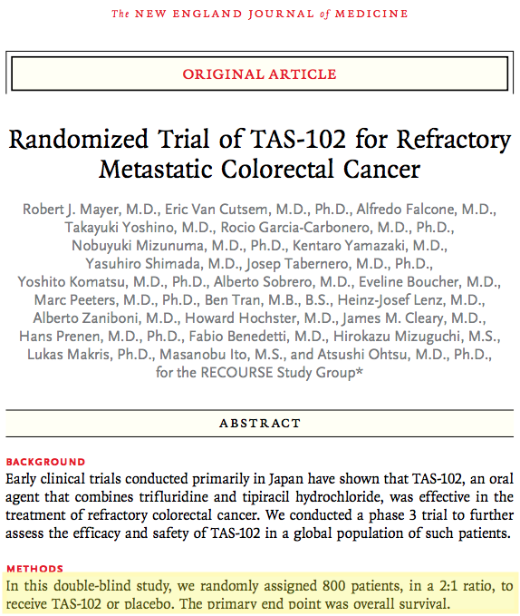
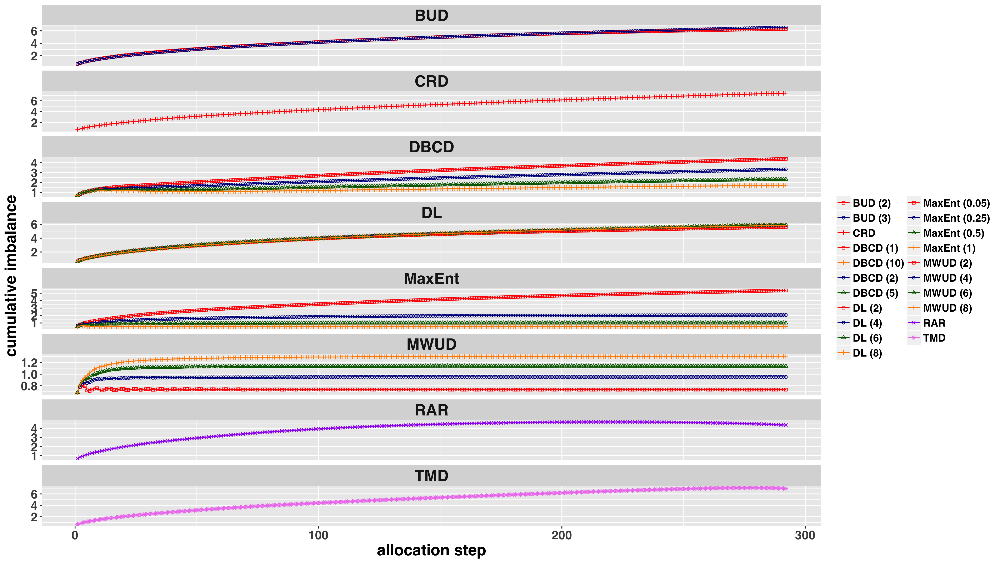
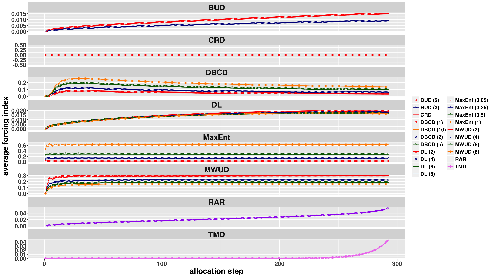
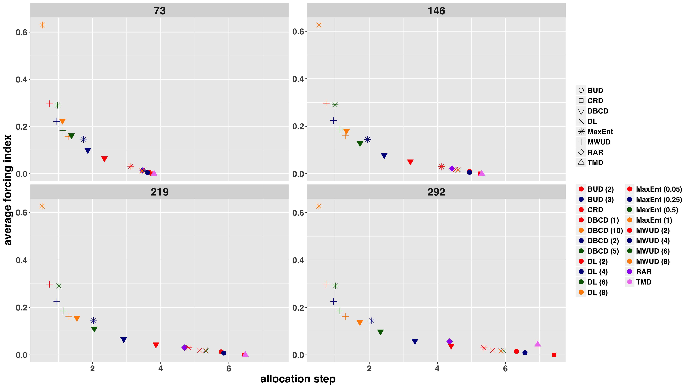
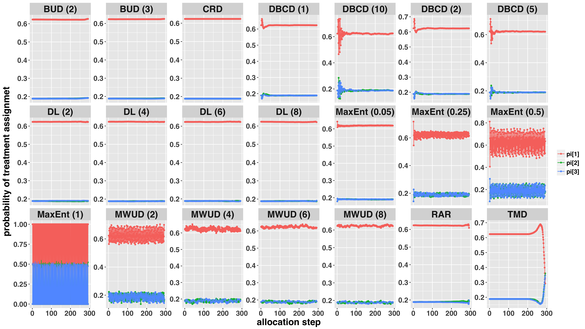

```{r setup, include=FALSE}
library(shiny)
library(tidyverse)
library(kableExtra)

knitr::opts_chunk$set(
  echo = FALSE, 
  fig.width = 8, 
  fig.height = 6, 
  fig.align = "center"
)
```


## Agenda for This Lecture

1. Trials with designed unequal allocation

2. Randomization procedures for multi-arm trials with (un)equal allocation ratios

3. Simulation study comparing randomization procedures

4. Allocation Ratio Preserving (ARP) property


## Background

- Most randomized comparative trials use equal allocation ($1:1$)

    + Consistent with the principle of "clinical equipose"
    + Maximizes power of statistical test when outcome variances are equal in two treatment groups
    + Simple to implement
    
- Randomization designs to implement _**equal allocation**_ for _**2-arm trials**_ were discussed in Lecture \#3

- This presentation (Lecture \#4) discusses randomization procedures for _**multi-arm trials**_ with fixed (pre-determined) _**equal**_ or _**unequal**_ treatment allocation ratios

    + The designs discussed in Lecture \#3 are included as special cases
    

## Some Examples of Trials Designed with Unequal Allocation

<div class="column-left33">
**1:4:4**

{width=100%}
</div>

<div class="column-center33">
**2:1**

{width=100%}

<ul align="left">

<li style="font-size:17px"> No clear rationale was given as to why **2:1** allocation (Active:Placebo) was chosen</li>

<li style="font-size:17px">Final results showed overall survival improvement from _**5.3mo with placebo**_ to _**7.1mo with Active**_ $\rightarrow$ **2:1** design assigned twice as many patients to the more efficacious treatment $\rightarrow$ justifiable from a medical ethics perspective</li>

</ul>

</div>

<div class="column-right33">
**2:2:1**

{width=100%}

<ul align="left">

<li style="font-size:17px">The trial planned to test 3 primary hypothesis: (Active 1 vs. Pbo; Active 2 vs. Pbo; Active 1 vs. Active 2)</li>

<li style="font-size:17px">The study was powered assuming 20\% difference between any of the Active and Pbo; and 15\% difference between Active 1 and Active 2</li>

</ul>

</div>

</div>

## Why Multi-Arm Trials?

- Some examples:

    + Phase II dose-response studies
    + Drug combination studies
    + Multi-arm multi-stage (MAMS) designs
    + Master protocols to study multiple therapies, multiple diseases, or both (_**Woodcock and LaVange, 2017**_)
    
- Major benefit of multi-arm trials:

    + Ability to test many new promising treatments and address multiple research objectives within a single protocol, thereby potentially speeding up research and development process
    
<sup>*</sup> Woodcock J, LaVange L (2017) "_Master protocols to study multiple therapies, multiple diseases, or both._", _The New England Journal of Medicine_ **377**, 62-70


## Why Unequal Allocation?$^*$

1. Studies with _**nonlinear dose-response estimation**_

    + "More informative" dose level should receive greater allocation proportions
    
2. When there is _**heterogeneity of the outcome variance**_ ($\sigma^2_i$) across treatment arms

    + In a ($K>2$)-arm trial comparing ($K-1$) experimental treatments vs. control (Dunnett's procedure), the optimal allocation ratio is 
    $$
      \sigma_1\sqrt{K-1}:\sigma_2:\ldots:\sigma_K
    $$

3. When there is an _**ethical imperative **_ to allocate greater proportion of subjects to superior treatment

4. When there is an _**unequal interest in specific treatment comparisons**_

5. When there is a _**differential treatment cost**_ and an investigator wants to get most power for the given budget


<sup>*</sup> Dumville JC, Hahn S, Miles JNV, Torgersson DJ (2006) "_The use of unequal randomization ratios in clinical trials: A review._", _Contemporary Clinical Trials_ **27**, 1-12

## Allocation Minimizing Total Study Cost (1 of 3)

- A randomized clinical trial to compare 3 treatments:

    + Standard of Care (SoC) (Trt 1)
    + Experimental Treatment ALone (Trt 2)
    + Experimental Treatment + SoC (Trt 3)
    
- _**Objective**_: To compare (Trt 2 vs Trt 1) and (Trt 3 vs Trt 1)

    + Primiry outcome in the $k$<sup>th</sup> group: $Y_k\sim Normal(\mu_k, \sigma^2)$, $k = 1, 2, 3$
    + $\delta = \frac{\mu_2-\mu_1}{\sigma}=\frac{\mu_3-\mu_1}{\sigma}=0.5$ -- standardized effect size of clinical interest
    + $\alpha = 0.05$, _**two-sided**_ -- significance level for each comparison
    + $1-\beta=0.90$ -- power for each comparison
    
- $C_k > 0$ -- cost of treatment of a single subject in the $k$<sup>th</sup> group

    + $C = n\left(\rho_1C_1+\rho_2C_2+\rho_3C_3\right)$ -- total cost


## Allocation Minimizing Total Study Cost (2 of 3)

- Optimization problem:
$$
\left\{
\begin{array}{c}
  n\left(\rho_1C_1+\rho_2C_2+\rho_3C_3\right) \rightarrow \min\limits_{(\rho_1, \rho_2, \rho_3)} \\
  \text{s. t. }\frac{\sigma^2}{n}\left(\frac{1}{\rho_1}+\frac{1}{\rho_2}\right)\leq L;\quad \frac{\sigma^2}{n}\left(\frac{1}{\rho_1}+\frac{1}{\rho_3}\right)\leq M \\
  \text{and } \rho_1+\rho_2+\rho_3 = 1\text{ }(0 \leq \rho_k \leq 1)
\end{array}
\right.
$$


where $L>0$, $M > 0$ -- some constants (optimal solution does not depend on $L$ and $M$)

- Optimal allocation ratio:
$$
\rho_1^*:\rho_2^*:\rho_3^* = \sqrt{\frac{C_2+C_3}{C_1}}:1:1
$$

- Note that when $C_1 = C_2 = C_3$, the optimal allocation ratio is $\sqrt{2}:1:1$


## Allocation Minimizing Total Study Cost (3 of 3)

_**Example**_:

```{r, warning=FALSE}
tribble(
  ~" ", ~"Treatment 1", ~"Treatment 2", ~"Treatment 3", ~"Total", ~"Power (2 vs. 1)", ~"Power (3 vs. 1)",
  "Cost", "$1,000", "$5,000", "$6,000", " ", " ", " ",
  "N", "85", "85", "85", "255", "90%", "90%",
  "Total cost", "$85,000", "$425,000", "$510,000", "$1,020,000", " ", " ",
  "Cost", "$1,000", "$5,000", "$6,000", " ", " ", " ",
  "N", "182", "55", "55", "292", "90%", "90%",
  "Total cost", "$182,000", "$275,000", "$330,000", "$787,000", " ", " "
) %>% 
  mutate(
    `Treatment 1` = cell_spec(`Treatment 1`, "html", color = ifelse(as.numeric(`Treatment 1`) %in% c(85, 182), "red", "black")),
    `Treatment 2` = cell_spec(`Treatment 2`, "html", color = ifelse(as.numeric(`Treatment 2`) %in% c(85, 55), "red", "black")),
    `Treatment 3` = cell_spec(`Treatment 3`, "html", color = ifelse(as.numeric(`Treatment 3`) %in% c(85, 55), "red", "black")),
    `Total` = cell_spec(`Total`, "html", color = ifelse(as.numeric(`Total`) %in% c(255, 292), "red", ifelse(`Total` %in% c("$1,020,000", "$787,000"), "blue", "black")))
  ) %>% 
  knitr::kable("html", escape = F) %>%
  kable_styling(bootstrap_options = "striped", full_width = T) %>%
  group_rows("Equal (1/3, 1/3, 1/3)", 1, 3, label_row_css = "background-color: #6006ff; color: #fff;") %>%
  group_rows("Minimizing cost (0.624, 0.188, 0.188)", 4, 6, label_row_css = "background-color: #6006ff; color: #fff;") %>% 
  row_spec(0, bold = T, color = "white", background = "#6666ff") %>% 
  row_spec(c(1, 3, 4, 6), background = "#99cfe0") %>% 
  row_spec(c(2, 5), background = "#c1e1ec")

```

_**<u>For the same level of power</u>, a trial with designed unequal allocation requires 292 subjects (15\% more than equal allocation design); yet its total cost is \$787K (vs. \$1,020K for the equal allocation design). Total cost savings due to unequal allocation design = \$1,020K – \$787K = \$233K.**_

## How to Implement Unequal Target Allocation?

- For the chosen allocation ratio ($\rho_1^*:\rho_2^*:\rho_3^* = 0.624:0.188:0.188$), and the chosen sample size ($n = 292$), a question is how to achieve it in practice

- The eligible subjects must be _**randomized**_ (sequentially) in the given proportions


## What are Requirements for a "Good" Randomization Procedure?

- _**Balance**_

    + Treatment group sizes should be very close to the desired target allocation ratio, _**throughout the course of the trial**_
    
- _**Randomness**_

    + The procedure should have low proportion of deterministic assignments to minimize chance of selection bias
    
- _**Known statistical properties**_

    + The procedure should have _**established statistical properties**_ and should lead to _**valid statistical inference**_ at the end of the trial
    
- _**Ease of Implementation**_

## What Randomization Procedures Are Available for Unequal Allocation?

Will be discussed momentarily, but first some notations ...

```{r}
tribble(
  ~"Col1", ~"Col2",
  "$K$", "Number of treatment arms ($K \\geq 2$)",
  "$W_1:W_2:\\ldots:W_K$", "Target allocation ratio",
  "$\\rho_k=\\frac{W_k}{\\sum_{k=1}^KW_k}$", "Target allocation proportions ($0 \\leq \\rho_k \\leq 1$, $\\sum_{k=1}^K\\rho_k = 1$)",
  "$n$", "Total sample size for the trial",
  "$N_1(j), N_2(j),\\ldots, N_K(j)$", "Treatment group sizes after $j$ subjects have been randomized $(N_1(j)+N_2(j)+\\ldots+N_K(j)=j)$",
  "$P_1(j), P_2(j),\\ldots, P_K(j)$", "Randomization probabilities to treatments $1, 2, \\ldots, K$ fotr the $j^\\text{th}$ subject $(0 \\leq P_k(j) \\leq 1 \\text{ and }P_1(j)+P_2(j)+\\ldots+P_K(j)=1)$"
) %>% 
  knitr::kable("html", escape = F) %>%
  kable_styling(bootstrap_options = "striped", full_width = T) %>%
  #row_spec(0, bold = T, color = "white", background = "#6666ff") %>% 
  row_spec(0, bold = T, color = "white") %>% 
  row_spec(c(1,3,5), background = "#99cfe0") %>% 
  row_spec(c(2, 4, 6), background = "#c1e1ec") 

```


## Our Example (Continued)

- $K = 3$ (a three-arm trial)

- $\rho_1 = 0.624$, $\rho_2 = 0.188$, $\rho_3 = 0.188$ $\rightarrow$ target allocation proportions for treatments 1, 2, 3

- $n = 292  \rightarrow$ total sample size

- It is desired to achieve final treatment numbers as follows: 182, 55, 55

- It is also desirable to have allocation proportions close to the target ratio throughout the trial: $j^{-1}N_k(j)\approx \rho_k$, $k = 1, 2, 3$, while maintaining randomized nature of the experiment


## Randomization Procedures for Unequal Allocation

1. Complete randomization

2. Procedures that enforce _**exact balance**_ at the end of the study

3. Procedures that maintain _**near-balance**_ throughout the study


## 1. Complete Randomization

- Every subject ($j = 1, 2, \ldots, n$) is randomized to treatment groups with probabilities equal to the target allocation proportions:
$$
P_k(j) = \rho_k,\quad k = 1, 2, 3
$$
    + In our example, $j$<sup>th</sup> subject is assigned to treatment $1/2/3$ with probability $0.624/0.188/0.188$
    
- _**Strength**_:

    + Completely unpredictable – no potential for selection bias; very simple to implement
    
- _**Limitation**_:

    + Can result, with non-negligible probability, in group sizes deviating far from the target allocation
    

## 2) Procedures that enforce _**exact balance**_

1. Random Allocation Rule

2. Truncated Multinomial Design

3. Permuted Block Design


## Random Allocation Rule

- An urn contains $n = W_1 + W_2 + W_3$ balls ($W_1$ of type 1, $W_2$ of type 2, $W_3$ of type 3)

    + In our example: $n = 292$; $W_1 = 182$; $W_2 = 55$; $W_3 = 55$
    
- When a subject enters the study, a ball is drawn from the urn (without replacement) and the treatment assignment is made according to the type of the ball drawn

- Treatment randomization probabilities for the $j$<sup>th</sup> subject:
$$
  P_k(1) = \frac{W_1}{W_1+W_2+W_3};\text{ }P_k(j) = \frac{W_k-N_k(j-1)}{W_1+W_2+W_3-(j-1)},\text{ }j=2, \ldots, n\text{ and }k = 1, 2, 3.
$$

- _**Strength**_:

    + Exact treatment balance at the end of the study
    
- _**Limitation**_:

    + Interim imbalance is possible; Last allocations can be correctly guessed


## Truncated Multinomial Design

- The allocation process starts with CRD (treatment $k$ is assigned with probability $\rho_k$) until any group receives the target number of subjects

    + _**Suppose group 2 was the first one that achieved its target number**_ ($W_2 = 55$). At this point, CRD switches to groups 1 and 3, until one of them receives the target number of subjects
    
        * _**Suppose group 1 was the first one that achieved its target number**_ ($W_1 = 182$). At this point, the remaining subjects are assigned deterministically (with probability 1) to the group that has remained (group 3)
        
- Mathematical formula for treatment randomization probability is quite complex as it involves target fulfilment instants$^*$

- _**Strength**_:

    + Exact treatment balance at the end of the study
    
- _**Limitation**_:

    + Interim imbalance is possible; Last allocations can be correctly guessed

<sup>*</sup> Rukhin A (2007) "_Normal order statistics and sums of geometric random variables in treatment allocation problems._", _Statistics \& Probability Letters_, **77**(12), 1312-1321


## Which Design is Better?

- Both Random Allocation Rule and Truncated Multinomial Design achieve _**exact final balance**_

- Which of these designs is “better” in terms of interim balance/randomness?

    + We will assess this through simulation
    
## Permuted Block Design

- Establish $M$ blocks, each of size $m = \frac{n}{M}$

- Within a block, compute target treatment numbers: $m\rho_k$, $k = 1, 2, 3$ (rounded to integer values, if necessary)

    + In our example, suppose $M = 4\rightarrow m = \frac{292}{4} = 73\rightarrow$ target numbers within a block are $m_1 = 73\times 0.624\approx 45$; $m_2 = m_3 = 73\times 0.188\approx 14$
    
- Within a block, achieve the target numbers using either Random Allocation Rule or Truncated Multinomial Design

- _**Strength**_:

    + Exact treatment balance at the end of the study; smaller deviations from the target allocation ratio at interim stages
    
- _**Limitation**_:

    + The final allocation may be slightly different from the desired one due to rounding


## 3) Procedures that maintain _**near-balance**_

(a) Block Urn Design (BUD)

(b) Mass Weighted Urn Design (MWUD)

(c) Drop-the-Loser Urn Design (DLUD)

(d) Doubly-Adaptive Biased Coin Design (DBCD)

(e) Maximum Entropy Constrained Balance Randomization (MaxEnt)


## Block Urn Design (BUD)$^*$

1. Two urns: Active urn (AU) with $\lambda(W_1+W_2+W_3)$ balls ($W_1$ of type 1, $W_2$ of type 2, $W_3$ of type 3, $\lambda$ is a small positive integer); Inactive urn (IU): empty

    + In our example: $n = 292$; $W_1 = 182$; $W_2 = 55$; $W_3 = 55$
    + If we set $\lambda = 1$, then we have random allocation rule; if $\lambda > 1$, then we have a more random procedure
    
2. A ball is drawn from AU $\rightarrow$ the treatment is assigned $\rightarrow$ the ball is placed into IU

3. Continue step 2 until $W = W_1+W_2+W_3$ balls are collected in IU, at which instant these $W$ balls are placed back into AU

4. Repeat steps 2-3 until $n$ subjects are assigned

- _**Strength**_:

    + Provides more randomness than PBD while controlling imbalance via parameter $\lambda$
    
- _**Limitation**_:

    + The "optimal" choice of the parameter $\lambda$ is unclear

<sup>*</sup>Zhao W, Weng Y (2011) "_Block urn design -- a new randomization algorithm for sequential trials with two or more treatments and balanced or unbalanced allocation._", _Contemporary Clinical Trials_, **32**, 953-961


## Mass Weighted Urn Design (MWUD)

Target allocation proportions ($\rho_k$) are pre-specified, e.g. $0.624:0.188:0.188$

1. An urn contains 3 balls; each ball has mass proportional to the target allocation: $m_{0,k} = \alpha\rho_k$, $k = 1, 2, 3$ ($\alpha > 0$ _**is pre-specified**_)

2. At any allocation step, among all balls with positive mass, a ball is drawn with probability proportional to its mass $\rightarrow$ corresponding treatment is assigned

3. One unit mass is taken from the selected ball $\rightarrow$ redistributed among 3 balls according to the ratio $\rho_1:\rho_2:\rho_3\rightarrow$ the ball is returned into the urn

4. Repeat steps 2-3 until $n$ subjects are assigned

- _**Strength**_:

    + Simple explicit formula for treatment randomization probabilities:
    $$
      P_k(j)=\frac{\max\left(\alpha\rho_k-N_k(j-1)+(j-1)\rho_k, 0\right)}{\sum_{k = 1}^3{\max\left(\alpha\rho_k-N_k(j-1)+(j-1)\rho_k, 0\right)}}
    $$
    
- _**Limitation**_:

    + The "optimal" choice of the parameter $\alpha$ is unclear

<sup>*</sup>Zhao W (2015) "_Mass weighted urn design -- a new randomization algorithm for unequal allocation._", _Contemporary Clinical Trials_, **43**, 209-216


## Drop-the-Loser Urn Design (DLUD)

1. An urn contains balls of 4 types: Type 1, 2, 3 $\rightarrow$ "treatments"; Type 0 $\rightarrow$ "immigration" ball.

    + initially: 1 immigration ball and $W_k$ treatment balls, $k = 1, 2, 3$
    + In our example: $W_1 = 182$;$W_2 = 55$;$W_3 = 55$
    
2. A ball is drawn at random:

    + If "treatment" ball $\rightarrow$ the corresponding treatment is assigned and _**the ball is not replaced**_
    + If "immigration" ball$\rightarrow$ it is replaced into urn with $aW_1+aW_2+aW_3$ "treatment" balls ($a\geq 0$ is user-defined)
    
3. Repeat step 2 until $n$ subjects are assigned

- _**Strength**_:

    + Fully randomized, "asymptotically best" procedure with established statistical properties

- _**Limitation**_:

    + The "optimal" choice of the parameter $a$ is unclear

<sup>*</sup>Ivanova A (2003) "_A play-the-winner-type urn design with reduced variability._", _Metrika_, **58**, 1-13


## Doubly-Adaptive Biased Coin Design (DBCD)

- Target allocation proportions ($\rho_k$) are pre-specified, e.g. $0.624:0.188:0.188$

- Initial assignments ($j = 1, 2, \ldots, m_0$) are made completely at random until each group has at least 1 subject

- Subsequently, the $(j+1)$<sup>st</sup> subject is randomized to a treatment group according to the probability rule:
$$
P_k(j+1) = \frac{\rho_k\left(\rho_k/\frac{N_k(j)}{j}\right)^\gamma}{\sum_{k=1}^K{\rho_k\left(\rho_k/\frac{N_k(j)}{j}\right)^\gamma}}, \quad k = 1, 2, 3
$$
$\gamma\geq 0$ is user-defined ($\gamma = 0$ most random, $\gamma\rightarrow +\infty$ almost deterministic)

- _**Strength**_:

    + DBCD has well established statistical properties

- _**Limitation**_:

    + The "optimal" choice of the parameter $\gamma$ is unclear

<sup>*</sup>Hu F, Zhang LX (2004) "_Asymptotic properties of doubly-adaptive biased coin design for multitreatment clinical trials._", _The Annals of Statistics_, **32**(1), 268-301


## Maximum Entropy Constrained Balance Randomization (MaxEnt)

- Target allocation proportions ($\rho_k$) are pre-specified, e.g. $0.624:0.188:0.188$

- For the $j$<sup>th</sup> subject, compute ($B_1, B_2, B_3$), the imbalances which would result from assigning the subject to treatment $k = 1, 2, 3$

- Randomization probabilities ($P_1, P_2, P_3$) are found as a solution to the optimization problem:
$$
\begin{array}{c}
\text{minimize distance from }(P_1, P_2, P_3)\text{ to target allocation }(\rho_1, \rho_2, \rho_3) \\
\text{subject to constraint on expected imbalance}: \\
\sum_{k=1}^3{B_kP_k}\leq \eta B_{(1)}+(1-\eta)\sum_{k=1}^3{B_kP_k}
\end{array}
$$

$0\leq \eta \leq 1$ is a user-defined tradeoff between randomness and balance ($\eta=0\rightarrow$ most random, $\eta=1\rightarrow$ almost deterministic)

- _**Strength**_:

    + Randomization probabilities are obtained as a solution to formal optimization problem

- _**Limitation**_:

    + Complex to explain to non-statisticians; the "optimal" choice of $\eta$ is unclear

<sup>*</sup>Klotz JH (1978) "_Maximum entropy constrained balance randomization in clinical trials._", _Biometrics_, **34**(2), 283-287


## Simulation Study: 8 Types of Randomization Designs

```{r}
tribble(
  ~" ", ~"Design", ~"Tuning Parameter Value", ~"# designs",
  "1", "Complete Randomization - CRD", " ", "1",
  "2", "Random Allocation Rule - RAR", " ", "1",
  "3", "Truncated Multinomial Design - TMD", " ", "1",
  "4", "Block Urn Design - BUD(<i>&lambda;</i>)", "<i>&lambda;</i>=2,3", "2",
  "5", "Mass Weighted Urn Design - MWUD(<i>&alpha;</i>)", "<i>&alpha;</i>=2, 4, 6, 8", "4",
  "6", "Drop-the-Loser Rule - DL(<i>a</i>)", "<i>a</i>=2, 4, 6, 8", "4",
  "7", "Doubly Adaptive Biased Coin Design - DBCD(<i>&gamma;</i>)", "<i>&gamma;</i>= 1, 2, 5, 10", "4",
  "8", "Maximum Entropy Constrained Balance Optimization - MaxEnt(<i>&eta;</i>)", "<i>&eta;</i>= 0.05, 0.25, 0.5, 1", "4",
  " ", " ", " ", "Total = 21"
) %>% 
  knitr::kable("html", escape = F) %>%
  kable_styling(bootstrap_options = "striped", full_width = T) %>%
  row_spec(0, bold = T, color = "white", background = "#6666ff") %>% 
  row_spec(c(1, 3, 5, 7, 9), background = "#99cfe0") %>% 
  row_spec(c(2, 4, 6, 8), background = "#c1e1ec")

```

## Simulation Study: Experimental Setup

- A total number of 21 designs (each simulated 10,000 times in R)

- Target allocation proportions: $0.624:0.188:0.188$

- Sample size $n=292$
  
    + Target treatment numbers: $W_1 = 182; W_2 = 55; W_3 = 55$
    
- Operating characteristics:

    + Imbalance at the $j$<sup>th</sup> step: $Imb(j) = \sqrt{\sum_{k = 1}^3(N_k(j)-j\rho_k)^2}$
    + Forcing Index (lack of randomness): $FI(j) = j^{-1}\sum_{m = 1}^j\sqrt{\sum_{k = 1}^3(P_k(m)-\rho_k)^2}$
    
_**Low values of both $Imb(j)$ and $FI(j)$ are desirable**_


## Results (1 of 4)

**cumulative imbalance vs. allocation step**

{width=100%}

## Results (2 of 4)

**average forcing index vs. allocation step**

{width=100%}

## Results (3 of 4)

**average forcing index vs. cumulative imbalance**

{width=100%}

## Results (4 of 4)

```{r}
load(file="./data/rank_df.Rda")

rank_df %>% 
  knitr::kable("html", escape = F) %>%
  kable_styling(bootstrap_options = "striped", full_width = T) %>%
  row_spec(0, bold = T, color = "white", background = "#6666ff") %>% 
  row_spec(seq(1, 21, by = 2), background = "#99cfe0") %>% 
  row_spec(seq(2, 20, by = 2), background = "#c1e1ec")
  
```


## Summary of the Simulations

- Three designs were found to have particularly good balance/randomness tradeoff:

    + TMD (1)
    + RAR (1)
    + MWUD (2)

## Allocation Ratio Preserving (ARP) Property

- A randomization procedure _**has an ARP property**_, if at every allocation the unconditional randomization probability is equal to the target allocation proportion
$$
\mathbf{E}\left(P_k(j)\right) = \rho_k
$$

- _**Complete Randomization**_, _**Permuted Block Design**_, _**Block Urn Design**_, and _**Drop-the-Loser Rule**_ have an ARP property

- _**DBCD($\gamma$)**_ may not preserve allocation ratio at initial allocations, but it stabilizes as the sample size increases


## Unconditional Randomization Probability

{width=100%}


## Summary

- In this lecture we studied randomization procedures that can be used in studies with designed unequal allocation

- These randomization procedures are:

    + _**allocation-adaptive**_ (treatment allocation sequence does not have to be pregenerated
in advance)
    + _**flexible**_ (have tuning parameters which can be calibrated to achieve desired tradeoff between treatment balance and allocation randomness, throughout the course of the trial)

- ARP property is important in studies with unequal allocation

    + Some procedures have ARP property, whereas others do not
    

## Homework for Lecture #4 (1 of 2)
    
_**Problem 1**_: Suppose your total budget is \$756,000. You want to design a 3-arm trial to compare (Trt 2 vs. Trt 1) and (Trt 3 vs. Trt 1). The costs of treatment of a single subject in groups 1, 2, and 3 are \$1,000, \$5,000, and \$6,000, respectively. The primary outcome is $Y_k\sim Normal(\mu_k, \sigma^2)$, $k = 1, 2, 3$. The standardized difference of interest is $\delta = \frac{\mu_2-\mu_1}{\sigma}=\frac{\mu_3-\mu_1}{\sigma}=0.5$. For each of the two comparisons, a 2-sample t-test with2-sided $\alpha=0.05$ will be carried out.

a) If you decide to use equal allocation design ($1:1:1$), how many subjects per arm do you afford for the given budget? What is power for each of the comparisons (Trt 2 vs. Trt 1) and (Trt 3 vs. Trt 1)? (_**Answer: 189 total; 63 per arm; power = 80\%**_)
    
b) If you decide to use optimal design for the given budget, how many subjects can you afford? How will they be split among treatment groups? What is power for each of two comparisons? (_**Answer: 280 total (174, 53, 53); power = 89%**_)
    
    
## Homework for Lecture #4 (2 of 2)

_**Problem 2**_: Run the simulation program to compare MWUD and DBCD designs in terms of balance and randomness for a trial with $n=292$ and $0.624:0.188:0.188$ allocation

- What is the impact of increasing the value of the parameters ($\alpha$ and $\gamma$) on the design characteristics?
    
- Overall, which design is more balanced: MWUD or DBCD?


    
    
    
    
    
    
    
    
    
    