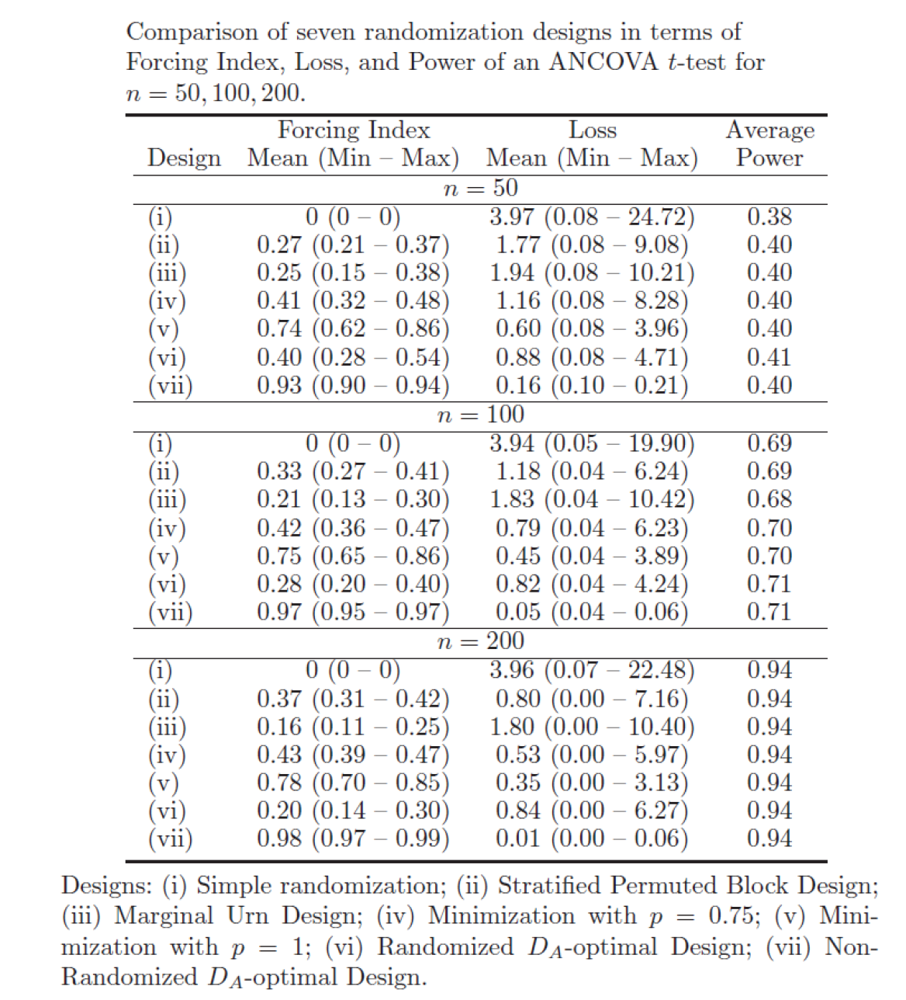

```{r setup, include=FALSE}
library(shiny)
library(tidyverse)
library(kableExtra)


knitr::opts_chunk$set(
  echo = FALSE, 
  fig.width = 8, 
  fig.height = 6, 
  fig.align = "center"
)
```


## Motivation

- In many clinical trials there are important covariates (prognostic factors) that are associated with the outcome of a patient

    + In trials of heart disease: _**cholesterol**_, _**blood pressure**_, _**age**_, _**gender**_
    + In multi-center trials: _**center**_ (clinics may differ with respect to demographics, adherence to the protocol and procedures)
    
- It is important to _**prospectively**_ balance treatment assignments across covariate profiles

    + To achieve treatment groups that are "comparable" and enhance credibility of trial results
    + To increase statistical power and efficiency of treatment comparisons
    + To facilitate subgroup analysis and interim analyses (which are typically not covariate-adjusted)
    

## What Does "Treatment Group Comparability" Mean?

<div class="column-left">

- Most of the papers reporting the results of randomized clinical trials have _**Table**_ 1to demonstrate that treatment groups are "comparable" at baseline (i.e. important prognostic factors are “evenly distributed” among the treatment groups)

- Covariate balance contributes to credibility of the trial results: _**The observed treatment difference can be attributed to the effect of treatment**_, not to the effect of any other important covariate(s)

</div>

<div class="column-right">
{width=100%}

<sup>*</sup> Goyal et al. (2015) "_Randomized assessment of rapid endovascular treatment of ischemic stroke._", _The New England Journal of Medicine_ **372**(11), 1019-1030

</div>

## Different Metrics for Imbalance

- Overall treatment difference:
$$
  D(n) = N_E(n)-N_C(n)\text{ (ideally, }D(n) = 0\text{)}
$$

- Discrete covariate (e.g. _**Gender**_)
$$
  D(n) = N_{j,E}(n)-N_{j,C}(n)\text{, }j\in \{\text{Male, Female}\}
$$

- Continuous covariate (e.g. _**Cholesterol level**_)

    - We want to have similar distributions of the covariate in groups $E$ and $C$
    - Let $F_E(t)$ and $F_C(t)$ be empirical c.d.f.'s of the covariate in groups $E$ and $C$, respectively
    
    - We can use $L_p$ distance:
    $$
      d_{L_p}(F_E(t), F_C(t)) = \left[\int_T{|F_E(t)-F_C(t)|^p}\right]^{\frac{1}{p}}
    $$
    
    - Or the Kolmogorov-Smirnov distance:
    $$
      d_{KS}(F_E(t), F_C(t)) = \max\limits_t|F_E(t)-F_C(t)|
    $$
    to measure "similarity" of treatment groups with respect to the covariate of interest
    
    - _**NB: Balance in distribution implies balance in mean, median, and other characteristics**_


## Why Is Balance over Covariates Important from Statistical Perspective?

- Consider a classical linear regression model for the response:
$$
  Y_j = \mu+\alpha\delta_j+\beta z_j +\varepsilon_j,\text{ }j = 1, 2, \ldots, n
$$
($\mu$ = overall mean, $\alpha$=treatment effect, $\delta_j = 1\text{(or }=-1\text{)}$ if the $j$<sup>th</sup> subject is assigned to $E$ (or $C$), $\beta$=covvariate effect (continuous or discrete), and $\varepsilon_j\sim N(0, \sigma^2)$ -- independent error terms)

- Let $\boldsymbol{\theta}=(\mu, \alpha, \beta)$, $\boldsymbol{X}=[\mathbf{1}, \boldsymbol{\delta}, \boldsymbol{z}]$ -- design matrix, and $\boldsymbol{Y} = (Y1, \ldots, Y_n)'$ 

- The OLS estimate of $\boldsymbol{\theta}$ is $\widehat{\boldsymbol{\theta}}=\left(\boldsymbol{X}\boldsymbol{X}'\right)^{-1}\boldsymbol{X}'\boldsymbol{Y}$;
$$
  \mathbf{Var}\left(\widehat{\boldsymbol{\theta}}\right)=\sigma^2\left(\boldsymbol{X}\boldsymbol{X}'\right)^{-1}\text{ and }\mathbf{Var}\left(\widehat{\alpha}\right)=\frac{\sigma^2}{n-(\boldsymbol{\delta}'\boldsymbol{z})^2-(\boldsymbol{\delta}'\mathbf{1})^2}
$$

- Note thet $\mathbf{Var}\left(\widehat{\alpha}\right)$ is minimized when $\boldsymbol{\delta}'\mathbf{1}=0$ (balance in treatment totals) and $\boldsymbol{\delta}'\boldsymbol{z}=0$ (balance over covariate)

    + Hence, under linear model (with additive treatment effect and no treatment-by-covariate interaction), _**balance translates into statistical efficiency**_


## How Can We Promote Covariate Balance in a Sequential Clinical Trial?

- _**Complete randomization**_ balances treatment assignments and distributions of important covariates _**on average**_, and this is a _**large-sample property**_

    + In a single trial covariate imbalances can occur by chance. These observed imbalances can lead to criticism of the trial results.
    + Severe covariate imbalances may be indicative of selection bias
    
- _**Restricted randomization**_ (discussed in Lecture \#3) is designed to achieve balanced treatment assignments, but not covariates

- _**Stratified randomization**_ and _**covariate-adaptive randomization**_ procedures can be used to balance both treatment numbers and covariates

    + _**NB**_: For best results, covariate-adaptive randomization _**design**_ should be also followed by covariate-adjusted _**analysis**_.$^*$
    
    
<sup>$*$</sup> Senn S (2007) "_Statistical Issues in Drug Development_", 2<sup>nd</sup> edition, Wiley


## Agenda for This Lecture

1. Stratified randomization

2. Covariate-adaptive randomization to achieve balance within covariate margins

3. Optimal design-based covariate-adaptive randomization

4. Statistical inference following covariate-adaptive randomization


## I. Stratified Randomization

- Let $Z_1, Z_2, \ldots, Z_M$ be discrete covariates with $l_1, l_2, \ldots, l_M$ levels. The number of different strata is $s = \prod\limits_{i=1}^M{l_i}$

    + E.g. 3 covariates: _**Age**_ (18-30; 31-45;60-75), _**Gender**_ (Male, Female), _**Cholesterol level**_ (&lt;200, 200-240, &gt;240) $\Rightarrow 4\times 2\times 3 = 24$ strata
    
- Within each stratum, a separate randomization procedure is run to balance treatment assignments _**by means of permuted block design**_

    + The exact number of patients in each stratum is unknown in advance.
    + Therefore, many blcoks of tretament assignments are pre-generated for each stratum; some of them will not be utilized in the trial
    

## Example

- 2 covariates: _**Gender**_ (Male, Female) and _**Age**_ (Young, Eldery)

- _**Permuted Block Design with block size 4**_ is used within each stratum

- 17 subjects have been enrolled and randomized between $E$ and $C$ as follows:

```{r}
tribble(
  ~" ", ~"Young", ~"Eldery", ~"Young ", ~"Eldery ",
  "Tretament E", 2, 3, 2, 1,
  "Tretament C", 3, 2, 2, 2
) %>% 
  knitr::kable("html") %>%
  kable_styling(bootstrap_options = "striped", full_width = F) %>%
  add_header_above(c(" " = 1, "Male" = 2, "Female" = 2)) %>% 
  row_spec(0, bold = T, color = "white", background = "#6666ff") %>% 
  row_spec(1, background = "#99cfe0") %>% 
  row_spec(2, background = "#c1e1ec")
```

- What is the probability that the 18<sup>th</sup> subject is randomized to $E$, if the subject is:

    + Young male
    + Young female
    + Eldery male
    + Eldery female
    

## How Stratified Randomization Works in Practice

{width=100%}

## When Is Stratified Randomization Useful?

- If the number of strata is small (and the study is large), stratified randomization works well

- If the number of strata is large, stratified randomization can become meaningless:

    + Some strata will contain very few patients or may be empty
    + In a stratum with few patients only initial allocations in the first block will be utilized and imbalance may be additive across strata
    
- ICH E9 guidance$^*$ has the following statement:

    + _**... The use of more than two or three stratification factors is rarely necessary, is less successful at achieving balance and is logistically troublesome ...**_

<sup>*</sup> ICH Topic E9: _Statistical Principles for Clinical Trials_ (London, 18 March 1998)


## Illustrating the Impact of "Over-stratification"$^*$ (1 of 2)

- $n$ patients, $s$ strata

- $b_i$ = block size in the $i$<sup>th</sup> stratum $(i = 1, 2, \ldots, s)$

- $N_i$ = number of patients in the last block of the $i$<sup>th</sup> stratum

- $E_i$ = number of patients (out of $N_i$) assigned to treatment $E$ ($E_i \leq N_i \leq b_i$)
$$
  E_i|N_i\sim Hypergeometric\left(b_i, \frac{b_i}{2}, N_i\right)\Rightarrow\mathbf{E}\left(E_i|N_i\right)=\frac{N_i}{2};\text{ }\mathbf{Var}\left(E_i|N_i\right)=\frac{N_i(b_i-N_i)}{4(b_i-1)}
$$

- Imbalance in the $i$<sup>th</sup> stratum: $D_i = N_i-2E_i$
$$
  \mathbf{E}\left(D_i\right) 0;\text{ }\mathbf{Var}\left(D_i\right)=\frac{E\left\{N_i(b_i-N_i)\right\}}{6}
$$

- Suppose $N_i\sim Uniform(1, 2, \ldots, b_i)$. Then, $\mathbf{Var}\left(D_i\right) = \frac{b_i+1}{6}$

- Summing over independent strata, total imbalance in the trial is $D = \sum_{i=1}^s{D_i}$, and
$$
  \mathbf{E}\left(D\right) = 0;\text{ }\mathbf{Var}\left(D\right) = \frac{ \sum_{i=1}^s{b_i}+s}{6}
$$

- Using Central Limit Theorem, $D\sim N(0, \mathbf{Var}\left(D\right))$ and $\text{Pr}\left(|D|>r\right)\approx 2\left(1-\Phi\left(\frac{r}{\sqrt{\mathbf{Var}\left(D\right)}}\right)\right)$

<sup>$*$</sup> Hallstrom A, Davis K (1998) "_Imbalance in treatment assignments in stratified blocked randomization._", _Controlled Clinical Trials_ **9**(4), 375-382


## Illustrating the Impact of "Over-stratification"$^*$ (2 of 2)

- Stratified randomization seeks balance within $s=\prod_{i=1}^{M}{l_i}$ mutually exclusive strata (useful only when $s$ is not large)

- However, in many clinical trials (e.g. in oncology) it is desired to achieve balance over a very large number of covariates

    + Instead of balancing treatment numbers within each of the $s$ strata, tretaments are balanced marginally, within each of the $l = \sum_{i=1}^M{l_i}$ levels of given covariates
    + This may be _**sufficient**_ if only main covariate effects but not their interactions contribute to the model
    
- _**Example**_: 3 covariates: _**Age**_ (4 levels), _**Gender**_ (2 levels), _**Colesterol**_ (3 levels) $\Rightarrow$ $4\times 2\times 3 = 24$ strata vs. $4+2+3 = 9$ levels

<sup>$*$</sup> Hallstrom A, Davis K (1998) "_Imbalance in treatment assignments in stratified blocked randomization._", _Controlled Clinical Trials_ **9**(4), 375-382


## II. Covariate-Adaptive Randomization to Achieve Balance within Covariate Margins

- Most of the procedures were developed in the 1970's

- Most notable procedures:
    
    + _**Minimization**_ procedure (_**Taves 1974**_$^*$; _**Pocock and Simon 1975**_$^{**}$)
    + _**Marginal urn**_ design (_**Wei 1978**_$^{***}$)
    
- Mathematically, a general covariate-adaptive randomization can be formulated as follows:

    + Randomization sequence: $\boldsymbol{\delta_n}=(\delta_1, \ldots, \delta_n)$ where $\delta_j = 1(0)$ for $E(C)$
    + Patients' baseline covariates: $\boldsymbol{Z_1}, \ldots, \boldsymbol{Z_n}$ where $\boldsymbol{Z_j} = (1, Z_{1j}, \ldots, Z_{pj})'$
    + $(j+1)$<sup>st</sup> patient is randomized to $E$ with probability
    
        * $P_{}j+1 = \text{Pr}\left(\delta_{j+1} = 1|\boldsymbol{\delta_j}, \boldsymbol{Z_1}, \ldots, \boldsymbol{Z_j}, \boldsymbol{Z_{j+1}}\right)$
        (allocation probability for the current patient depends on previous treatment assignments, covariates, and the covariate vector of the current patient)
        
<sup>$*$</sup> Taves DR (1974) "_Minimization: A new method of assigning patients to treatment and control groups._", _Clinical Pharmacology and Therapeutics_ **15**(5), 443-453

<sup>$**$</sup> Pocock SJ, Simon R (1975) "_Sequential treatment assignment with balancing for prognostic factors in the controlled clinical trial._", _Biometrics_ **31**(1), 103-115.

<sup>$***$</sup> Wei LJ (1978) "_An application of an urn model to the design of sequential controlled clinical trials._", _JASA_ **73**, 559-563.


## The Minimization Procedure

- A 2-arm trial ($E$ vs. $C$) with _**discrete**_ covariates $Z_1, \ldots, Z_M$ over which balance is sought

    + $Z_i$ has $l_i$ levels, labeled $1, 2, \ldots, l_i$
    
- $N_{ijk}(m)$ = number of patients on _**treatment**_ $k$ within _**level**_ $j$ of _**covariate**_ $Z_i$ after $m$ patients have been randomized into the trial

- $(m+1)$<sup>st</sup> patient enters the trial and his/her covariates are observed as $\widetilde{z}_1, \ldots, \widetilde{z}_M$

    + Compute "overall covariate imbalance" ($E$ vs. $C$) using treatment numbers within covariate margins for the current patient:
    $$
      D(m) = \sum_{i=1}^M{w_i}\left(N_{i, \widetilde{z}_i, E}(m)-N_{i, \widetilde{z}_i, C}(m)\right)
    $$
where $\left\{w_i\right\}_{i=1}^M$ are user-defined positive weights measuring the relative importance of the covariates (e.g. $w_i=1$)

        * $(m+1)$<sup>st</sup> patient is randomized between $E$ and $C$ (using biased coin) to reduce "overall covariate imbalance":
$$
          \text{Pr}\left(\delta_{m+1}=1|D(m)\right) = \left\{
       \begin{array}{cl}
        \frac{1}{2}, & D(m) = 0 \\
        p, & D(m) < 0 \\
        1-p, & D(m) > 0
       \end{array}
\right.
$$
(where $\frac{1}{2} < p \geq 1$ is a _**pre-determined**_ skewing probability)

## Example

- 2 covariates: _**Gender**_ (Male, Female) and _**Age**_ (Young, Eldery)

- _**Minimization with biased coin with $p=\frac{2}{3}$**_ is used

- 17 subjects have been enrolled and the distribution of treatment numbers $E$ and $C$ (_**within covariates margins**_) as follows:
```{r}
tribble(
  ~" ", ~"Young", ~"Eldery", ~"Male", ~"Female",
  "Tretament E", 4, 4, 5, 3,
  "Tretament C", 5, 4, 5, 4
) %>% 
  knitr::kable("html") %>%
  kable_styling(bootstrap_options = "striped", full_width = F) %>%
  row_spec(0, bold = T, color = "white", background = "#6666ff") %>% 
  row_spec(1, background = "#99cfe0") %>% 
  row_spec(2, background = "#c1e1ec")
```
What is the probability that the 18<sup>th</sup> subject is randomized to $E$, if the subject is:

    + Young male: $D = (4-5)+(5-5) = -1 < 0 \Rightarrow P(E) = \frac{2}{3}$
    + Young female: $D = (4-5)+(3-4) = -2 < 0 \Rightarrow P(E) = \frac{2}{3}$
    + Eldery male: $D = (4-4)+(5-5) = 0 \Rightarrow P(E) = \frac{1}{2}$
    + Eldery female: $D = (4-4)+(3-4) = -1 < 0 \Rightarrow P(E) = \frac{2}{3}$
    

## Example –Stratified Randomization with Blocks of 4 vs. Minimization

{width=100%}


## Calibrating the Minimization Procedure

- The minimization procedure has some _**parameters**_ which must be user-defined before the study starts:

    + Weights measuring the prognostic importance of the covariates: Most common choice $w_i = 1$ (all covariates are viewed as equally important)
    + Coin bias probability $\frac{1}{2} < p \leq 1$
    
        * _**Taves (1974)**_ favored $p = 1$ (almost deterministic procedure); _**Pocock and Simon (1975)**_ favored $p = \frac{3}{4}$; _**Efron's (1971)**_ favorite choice was $p = \frac{2}{3}$
        * Also, $p$ can be made sensitive to the degree of covariate imbalance at each allocation step, i.e. $p = p(D(m))$
        
    + Continuous covariates (e.g. cholesterol level; blood pressure) must be discretized before the minimization procedure can be applied
    
        * A choice of cut-off points for covariate categories may not be straightforward
 

## Some Further Notes about Minimization

- The algorithm was developed independently by _**Taves (1974)**_$^*$ and _**Pocock and Simon (1975)**_$^{**}$

    + Taves’ paper was published in _Clinical Pharmacology and Therapeutics_: it has _**686 citations**_ on Google Scholar _**as of 11-May-2018**_
    + Pocock and Simon's paper was published in _Biometrics_: _**1799 citations**_ on Google Scholar _**as of 11-May-2018**_

- Taves' version is deterministic while Pocock and Simon’s version uses a biased coin

- Taves' version: can be used only with 2 treatment arms; Pocock and Simon’s version can be applied with multiple treatment arms

<sup>$*$</sup> Taves DR (1974) "_Minimization: A new method of assigning patients to treatment and control groups._", _Clinical Pharmacology and Therapeutics_ **15**(5), 443-453

<sup>$**$</sup> PocockSJ, Simon R (1975) "_Sequential treatment assignment with balancing for prognostic factors in the controlled clinical trial._", _Biometrics_ **31**(1), 103-115.


## Marginal Urn Design (Wei 1978)$^*$

- A 2-arm trial ($E$ vs. $C$) with _**discrete**_ covariates $Z_1, \ldots, Z_M$ over which balance is sought

    + $Z_i$ has $l_i$ levels labeled $1, 2, \ldots, l_i$
    + For each covariate level, an urn is designated with $\alpha$ balls of each type $E$ and $C$
    
- $(m+1)$<sup>st</sup> patient enters the trial and his/her covariates are observed as $\widetilde{z}_1, \ldots, \widetilde{z}_M$

    + The urns corresponding to the patient's observed covariate levels are selected
    + The urn with the _**largets absolute difference between proportions of type $E$ and $C$ balls**_ is selected to generate treatment assignment (a random choice is made in case of a tie)
    + A ball is drawn at random and the corresponding treatment is assigned
    + The ball is replaced together with 𝛼𝛼balls of the same type and $\beta > 0$ balls of the opposite type
    
- The procedure is repeated for each new patient entering the trial
    
<sup>$*$</sup> Wei LJ (1978) "_An application of an urn model to the design of sequential controlled clinical trials._", _JASA_ **73**, 559-563.    
    
    
## III. Optimal design-based covariate-adaptive randomization (Atkinson 1982)

- Covariate-adaptive procedures we have discussed thus far (minimization, marginal urn) minimize covariate imbalances in an ad-hoc manner

    + An alternative approach is to consider some optimal criterion
    
- A linear regression model with constant variance (_**Atkinson, 1982**_$^*$)

$$
  Y_n = \boldsymbol{Z}'_n\boldsymbol{\beta}+\alpha\boldsymbol{\delta_n}+\boldsymbol{\varepsilon_n},\text{ }\boldsymbol{\varepsilon_n}\sim N(0, \sigma^2\boldsymbol{I})
$$
($\alpha$ = treatment effect (main interest); $\boldsymbol{\beta}$ = covariate effects (including intercept), $\boldsymbol{\delta_n} = \delta_1, \ldots, \delta_n$ where $\delta_j = 1 (or -1)$ for $E$($C$))

- Let $\boldsymbol{\theta} = (\boldsymbol{\beta}, \alpha)'$ -- model parameters and $\boldsymbol{X}'_n = (\boldsymbol{Z}'_n, \boldsymbol{\delta_n}')$ -- design matrix based on $n$ patients

- The OLS estimator of $\boldsymbol{\theta}$ is $\widehat{\boldsymbol{\theta}} = \left(\boldsymbol{X}'_n\boldsymbol{X}_n\right)^{-1}\boldsymbol{X}'_n\boldsymbol{Y}_n$

    + $\mathbf{Var}\left(\widehat{\boldsymbol{\theta}}\right) = \sigma^2\left(\boldsymbol{X}'_n\boldsymbol{X}_n\right)^{-1}$
    + $\mathbf{Var}\left(\widehat{\alpha}\right) = \frac{\sigma^2}{n-\boldsymbol{\delta_n}'\boldsymbol{Z}_n\left(\boldsymbol{Z}'_n\boldsymbol{Z}_n\right)^{-1}\boldsymbol{Z}'_n\boldsymbol{\delta_n}} = \frac{\sigma^2}{n-L_n}$ -- can be minimized by design, forsing $L_n \sim 0$

<sup>$*$</sup> Atkinson AC (1982) "_Optimum biased coin designs for sequential clinical trials with prognostic factors._", _Biometrika_ **69**(1), 61-67.   


## Variance of the Estimated Treatment Difference and Loss

$$
\mathbf{Var}\left(\widehat{\alpha}\right) = \frac{\sigma^2}{n-\boldsymbol{\delta_n}'\boldsymbol{Z}_n\left(\boldsymbol{Z}'_n\boldsymbol{Z}_n\right)^{-1}\boldsymbol{Z}'_n\boldsymbol{\delta_n}} = \frac{\sigma^2}{n-L_n}
$$

- $L_n = \boldsymbol{\delta_n}'\boldsymbol{Z}_n\left(\boldsymbol{Z}'_n\boldsymbol{Z}_n\right)^{-1}\boldsymbol{Z}'_n\boldsymbol{\delta_n}$ is referred to as "loss", which is the number of patients from whom information is lost due to imbalance induced by randomization

    + $\mathbf{Var}\left(\widehat{\alpha}\right)$ is minimized, if loss is zero
    + Loss is zero, if the trial design is perfectly balanced
    + Loss is a random quantity as it depends on the randomization sequence and the covariate structure

- _**Atkinson (2003)**_$^*$ explored the distribution of loss for various randomization procedures. In many cases, a chi-square distribution is a good approximation to the distribution of loss

<sup>$*$</sup> Atkinson AC (2003) "_The distribution of loss in two-treatment biased-coin designs._", _Biometrics_ **4**(2), 179-193.


## How to Minimize Loss in a Sequential Clinical Trial?

- Based on accured data on treatment assignments and covariates ($\boldsymbol{\delta_m}$ and $\boldsymbol{Z}_m$),
and the covariate vector of new patient ($\boldsymbol{z}_m$), we want to choose $\delta_{m+1}$ which would minimize $L_{m+1}$

- Atkinson (1982)$^{*}$ and Smith (1984)$^{**}$ showed that this is equivalent to choosing $\delta_{m+1}$ that maximizes 
$$
\left\{\boldsymbol{\delta'_{m+1}-\boldsymbol{z}'_{m+1}\left(\boldsymbol{Z}'_m\boldsymbol{Z}_m\right)^{-1}\boldsymbol{Z}'_m\boldsymbol{\delta_m}}\right\}^2
$$
("_**sequential D<sub>A</sub>-optimal design**_")

    + However, such an approach is deterministic.
    
- A randomized versions: Assign $(m+1)$<sup>st</sup> patient to treatment $E$ with probability
$$
  P_{m+1} = \frac{\left(1-\boldsymbol{z}'_{m+1}\left(\boldsymbol{Z}'_m\boldsymbol{Z}_m\right)^{-1}\boldsymbol{Z}'_m\boldsymbol{\delta_m}\right)^2}{\left(1+ \boldsymbol{z}'_{m+1}\left(\boldsymbol{Z}'_m\boldsymbol{Z}_m\right)^{-1}\boldsymbol{Z}'_m\boldsymbol{\delta_m}\right)^2 + \left(1-\boldsymbol{z}'_{m+1}\left(\boldsymbol{Z}'_m\boldsymbol{Z}_m\right)^{-1}\boldsymbol{Z}'_m\boldsymbol{\delta_m}\right)^2}
$$


- This is done to sequentially minimize variance of the estimated treatment difference, while maintaining the randomized nature of the experiment.

<sup>$*$</sup> Atkinson AC (1982) "_Optimum biased coin designs for sequential clinical trials with prognostic factors._", _Biometrika_ **69**(1), 61-67.   

<sup>$**$</sup> Smith RL (1984) "_Sequential treatment allocation using biased coin designs._", _JRSS-B_ **46**(3), 519-543.   


## Properties of Atkinson's Procedure

_**Theoretical**_:

- Asymptotic formulas for expected loss, expected selection bias, and asymptotic variance of the randomization test were derived by _**Smith (1984)**_$^{*}$

    + _**The expected loss for Atkinson's procedure**_ is approximately $\frac{q}{5}$, where $q$ is the number of columns in the design matrix $\boldsymbol{Z}_m$
    
- Without covariates, Atkinson's procedure for a 2-arm trial is formulated as 
$$
  P_{m+1} = \frac{N^2_C(m)}{N^2_E(m)+N^2_C(m)}
$$
(in this case, imbalance $\frac{D_m}{\sqrt{m}}$ is asymptotically $Normal(\mu = 0, \sigma^2=\frac{1}{5})$)

- Distribution of loss -- see _**Atkinson (2003)**_$^{**}$

_**Simulations**_:

- Comprehensive simulation studies comparing various covariate-adaptive randomization procedures. Nice summary is available in the book by Atkinson and Biswas (2014)


<sup>$*$</sup> Smith RL (1984) "_Properties of biased coin designs in sequential clinical trials._", _The Annals of Statistics_ **12**(3), 1018-1034.

<sup>$**$</sup> Atkinson AC (2003) "_The distribution of loss in two-treatment biased-coin designs._", _Biometrics_ **4**(2), 179-193.

<sup>$***$</sup> Atkinson AC and Biswas A (2014) "_Randomized Response-Adaptive Designs in Clinical Trials._", _CRC Press_


## Example -- Atkinson’s Procedure

- A linear model with 1 binary covariate:
$$
  \mathbf{E}\left(Y_i\right) = \mu + \alpha t_i + \beta z_i
$$
where $t_i = 1(-1)$ for $E$($C$), and $z_i = 1(0)$ for male (felmale)

- 17 patients have been randomized between $E$ and $C$
```{r}
tribble(
  ~" ", ~"Treatment $E$", ~"Treatment $C$", ~"Total",
  "$z = 1$ (male)", 5, 5, 10,
  "$z = 0$ (female)", 3, 4, 7
) %>% 
  knitr::kable("html") %>%
  kable_styling(bootstrap_options = "striped", full_width = F) %>%
  row_spec(0, bold = T, color = "white", background = "#6666ff") %>% 
  row_spec(1, background = "#99cfe0") %>% 
  row_spec(2, background = "#c1e1ec")
```

- The 18<sup>th</sup> patient is randomized to $E$ with probability
$$
  \text{Pr}\left(\delta_18 = 1|z\right) = \frac{N^2_{C|z}(17)}{N^2_{E|z}(17)+N^2_{C|z}(17)} = 
\left\{
  \begin{array}{cc}
    \frac{5^2}{5^2+5^2} = 0.5, & z = 1\text{ (male)} \\
    \frac{4^2}{3^2+4^2} = 0.64, & z = 0\text{ (female)}
  \end{array}
\right.
$$


## Minimization vs. Atkinson's Procedure: Pros and Cons

{width=100%}

<sup>$*$</sup> Shao J, Zhong B (2010) "_A theory for testing hypotheses under covariate-adaptive randomization._", _Biometrika_ **97**(2), 347-360.


## Simulation Study (1 of 5)

- Seven randomization procedures will be compared:

    1. Complete randomization
    2. Stratified permuted block design with block size 4
    3. Marginal UD (Wei 1978)
    4. Minimization procedure with $p = \frac{1}{4}$ (Pocock and Simon 1975)
    5. Minimization procedure with $p = 1$ (Taves 1974)
    6. Randomized D<sub>A</sub>-optimal design (Atkinson 1982)
    7. Deterministic D<sub>A</sub>-optimal design (Atkinson 1982; Smith 1984) 
    
## Simulation Study (2 of 5)

- 3 independent covariates $(Z_1, Z_2, Z_3)$ representing _**gender**_, _**age**_, and _**cholesterol level**_

    + $Z_1\sim Bernoulli(0.6)$ (probability of male is 60\%)
    + $Z_2 \sim Uniform(18, 75)$
    + $Z_3 \sim Normal(\mu = 200, \sigma = 30)$
    
- Outcomes are generated from the linear model:
$$
  Y_j = \mu+\alpha\delta_j+\beta_1Z_{1j}+\beta_2Z_{2j}+\beta_3Z_{3j}+\varepsilon_j,\text{ }\varepsilon_j\sim N(0, 1),\text{ }j = 1,2, \ldots, 200
$$

- In our simulation we set: $\mu = 1$; $\alpha = 0.5$; $\beta_1 = 0.5$; $\beta_2 = 1$; $\beta_3 = 1$;

- With these assumptions and $1:1$ allocation, the ANCOVA $t$-test has $\sim 95\%$ power for rejecting $H_0: \alpha = 0$ using 2-sided $5\%$ significance level


## Simulation Study (3 of 5)

- For implementation of stratified PBD (2), marginal UD (3), and minimization (4 and 5), covariates $Z_2$ and $Z_3$ are discretized:
$$
\widetilde{Z}_2 = \left\{
\begin{array}{rc}
  1 \text{ (young)}, & Z_2 \in[18, 30] \\
  2 \text{ (older young)}, & Z_2 \in[31, 45]  \\
  3 \text{ (middle)}, & Z_2 \in[46, 60]  \\
  4 \text{ (eldery)}, & Z_2 \in[61, 75] 
\end{array}
\right.  
\text{ and }
\widetilde{Z}_3 = \left\{
\begin{array}{rc}
  1 \text{ (normal)}, & Z_3 \leq 200 \\
  2 \text{ (borderline risk)}, & Z_3 \in (200, 240)  \\
  3 \text{ (high risk)}, & Z_3 \geq 240
\end{array}
\right.
$$

- For implementation of D<sub>A</sub>-optimal procedures (6 and 7):

    + No covariate discretization is needed; however intial 10 allocations are made using PBD, to ensure that $\boldsymbol{Z}'_m\boldsymbol{Z}_m$ can be inverted afterwards
    
- _**Operating characteristics**_: Distributions of imbalance, _**Loss**_, _**Forcing Index**_ (lack of randomness), and _**Power**_ of ANCOVA $t$-test of $H_0: \alpha = 0$

- A trial of $n=200$ patients is simulated 10,000 times in R

    + Operating characteristics are computed for each allocation step $j = 1, 2, \ldots, 200$
    

## Simulation Study (4 of 5)

{width=100%}


## Simulation Study (5 of 5)

<div class="column-left">

{width=100%}

</div>

<div class="column-right">

- CRD (i) is most random ($FI=0$), but has highest loss (average loss $\sim 4$; maximum loss $\sim 20$)

- Non-randomized D<sub>A</sub>-optimal design (vii) has lowest loss, but highest FI

- Randomized DD<sub>A</sub>-optimal design (vi) seems to have best overall performance: both lower FI and lower loss than for stratified PBD

    + Average loss $\sim 0.8$ (=4/5) -- this is consistent with theory ($q=4$ columns in the design matrix $\boldsymbol{Z_m}$)
    
  - In terms of power, covariate-adaptive randomization designs are typically $1\% - 2\%$ more powerful than CRD when sample size is small ($n=50$) or moderate ($n=100$). However, for $n=200$ all designs have the same power ($94\%$)
  
</div>

## Simulation -- Conclusion

- Covariate-adaptive randomization _**do provide some advantage over complete randomization**_, especially in trials with small and moderate sample sizes

    + Tighter treatment balance, both overall in the trial and within covariate margins
    + Better tradeoff between statistical efficiency and randomness (Loss/Forcing Index)
    + Slight increase in power of the ANCOVA test (typically $\sim 1\%-2\%$)
    
- _**Note**_: Covariates used in the design were also accounted for in the analysis

- _**Importantly**_:

    + Covariate-adaptive randomization methods assume that the selected covariates are truly prognostic and the linear regression model is a correct one
    + These designs may not be optimal under heteroscedastic and nonlinear models (e.g. logistic or survival models)
    + These designs do not address an ethical imperative of allocating more patients to the better treatment
    
    
## What Do Regulators Say About Covariate-Adaptive Randomization? (1 of 2)

- In 2003, the European Committee for Proprietary Medicinal Products (CPMP) issued the guideline "_**Points to Consider on Adjustment for Baseline Covariates**_".

- The guideline had some controversial statements about covariate-adaptive randomization (a.k.a. "dynamic allocation")

    + Page 3/10: "..._**Stratification can become overwhelming if there are many influential covariates in the trial**_. ... As stated above, stratification for more that a few prognostic factors is not always possible, especially for small trials. In this situation, _**techniques of dynamic allocation such as minimisation are sometimes used to achieve balance across several factors simultaneously**_. Even if deterministic schemes are avoided, such methods remain highly controversial.Thus, applicants are strongly advised to avoid such methods.If they are used, the reasons should be justified on solid clinical and statistical grounds."


## What Do Regulators Say About Covariate-Adaptive Randomization? (2 of 2)

<div class="column-left">

- There were several follow-up discussions to the CPMP's 2003 guideline and more research work was done in this area ...

- 12 years later, a revised guidance was issued, _**with a more balanced position on covariate-adaptive randomization methods**_

</div>

<div class="column-right">

{width=100%}

{width=100%}

</div>


## Covariate-adaptive randomization has recently been a "hot research topic" in biostatistics$^*$

- _**Calibration of design parameters**_ (e.g. value of the coin bias) to achieve "optimal" tradeoff between randomness and statistical efficiency

- _**Proper statistical inference**_ (model-based and randomization-based) after covariate-adaptive randomization

- Development of novel methods that achieve _**better balance with respect to continuous covariates**_

    + Minimizing group differences in terms of covariate empirical c.d.f.'s or probability densities

- _**Development of validated information systems**_ to implement covariate-adaptive randomization in real-time


<sup>$*$</sup> Hu F, Hu Y, Ma Z, Rosenberger WF (2014) "_Adaptive randomization for balancing over covariates._", _WIREs Comp Stat_ **6**, 288-303.


## Homework for Lecture \#5 (1 of 4)

_**Problem 1**_. Suppose we are planning a clinical trial with $n = 50$ patients and stratified randomization. There are 3 covariates: _**Age**_ ($18-30$; $31-45$; $45-59$; $60-75$), _**Gender**_ (Male, Female), and _**Cholesterol Level**_ ($<200$; $200-240$; $>240$). Therefore, the total number of strata is $t\times 2\times 3 = 24$. Within each stratum, permuted blocks of the same size $b$ will be used.

1. Let $N_i$ = number of patients in the last block of the $i$<sup>th</sup> stratum. Using the _**Hallstrom and Davis (1988)**_ model, for the treatment imbalance in the $i$<sup>th</sup> stratum ($D_i$) we have:
$$
  \mathbf{E}\left(D_i\right) = 0\text{ }\mathbf{Var}\left(D_i\right) = \frac{\mathbf{E}\left(N_i(b-N_i)\right)}{b-1}
$$

    Suppose $N_i\sim Uniform(1, 2, \ldots, b)$. Show that $\mathbf{Var}\left(D_i\right) = \frac{b+1}{6}$

    (_**Hint**_: You can use the fact that $\mathbf{E}\left(N_i\right) = \frac{b+1}{2}$ and $\mathbf{Var}\left(N_i\right) = \frac{(b+1)(b-1)}{12}$)
  
2. Using the result from part 1, show that the total imbalance in the trial $D = \sum_{i=1}^24D_i$ has $\mathbf{E}\left(D_i\right) = 0$ and $\mathbf{Var}\left(D_i\right) = 4(b+1)$

3. Using normal approximation $\text{Pr}(|D|>)\approx 2\left(1-\Phi\left(\frac{r}{\sqrt{\mathbf{Var}(D)}}\right)\right)$, evaluate the probability that the final difference in treatment allocation proportions for a trial with $n=500$ patients and block size $b = 4$ exceeds 2\%; i.e. it is more extreme than (0.52:0.48) or (0.48;0.52)


## Homework for Lecture \#5 (2 of 4)

_**Problem 2**_. Consider a clinical trial in which the primary outcome follows a linear model:
$$
  Y_j = \mu+\alpha\delta_j+\beta z_j + \varepsilon_j, \text{ }\varepsilon_j\sim N(0, \sigma^2),\text{ }j\geq 1
$$

$\delta_j = 1$ (or $-1$) if the $j$<sup>th</sup> subject is assigned to $E$ (or $C$), and $z_j$ is a cholesterol level at study entry (continuous variable)

Also, the investigator discretizes $z_j$ into 3 levels: $1$ (if $z_j \leq 200$); $2$ (if $z_j \in (200, 240]$); and $3$ (if $z_j > 240$).

After 8 patients, the data are as in Table below.

The 9<sup>th</sup> patient is enrolled as has cholesterol level $z_9 = 236$.

Find the probability that this patient will be randomized to treatment E for each of the following randomization methods:

<div class="column-left">

1. Permuted block design with block size 6

2. Efron’sbiased coin design with $p = \frac{2}{3}$

3. Stratified permuted block design with block size 6

4. Minimization procedure with $p = \frac{2}{3}$

5. Randomized D<sup>A</sup>-optimal design (_**Hint**_: you can use: $z'_9\left(\boldsymbol{Z}'_8\boldsymbol{Z}_8\right)^{-1}\boldsymbol{Z}'_8\boldsymbol{\delta}_8 = 0.148$)

</div>

<div class="column-rightt">

```{r}
tribble(
~"$j$", ~"$\\delta_j$", ~"$z_j$",
1, -1, 239,
2,  1, 210,
3,  1, 180,
4,  1, 221, 
5, -1, 201,
6, -1, 187,
7,  1, 230,
8, -1, 198
) %>% 
  knitr::kable("html") %>%
  kable_styling(bootstrap_options = "striped", full_width = F) %>%
  row_spec(0, bold = T, color = "white", background = "#6666ff") %>% 
  row_spec(c(1, 3, 5, 7), background = "#99cfe0") %>%
  row_spec(c(2, 4, 6, 8), background = "#c1e1ec")
```

</div>

## Homework for Lecture \#5 (3 of 4)

_**Problem 3**_. Consider our simulation study where 7 designs were compared in terms of imbalance, loss, forcing index, and power.

Run the program to compute the operating characteristics of the _**minimization procedure with adjustable coin bias**_, i.e. with the biasing probability

$$
  \text{Pr}\left(\delta_{m+1}=1|D(m)\right) = 
  \left\{
    \begin{array}{cl}
      \frac{|D(m)|}{|D(m)|+1}, & D(m) \leq -1 \\
      \frac{1}{2}, & D(m) = 0 \\
      \frac{1}{|D(m)|+1}, & D(m) \geq 1
    \end{array}
  \right.
$$

How does this procedure compare to minimization with $p = 0.75$ and $p = 1$ in terms of imbalance, loss, forcing index, and power?


