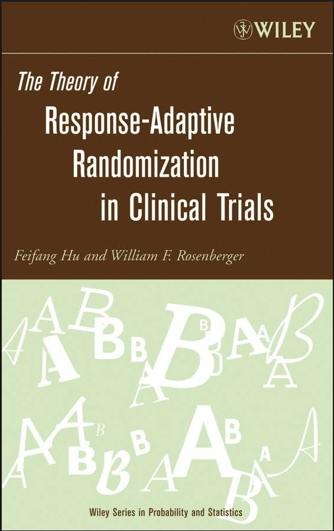
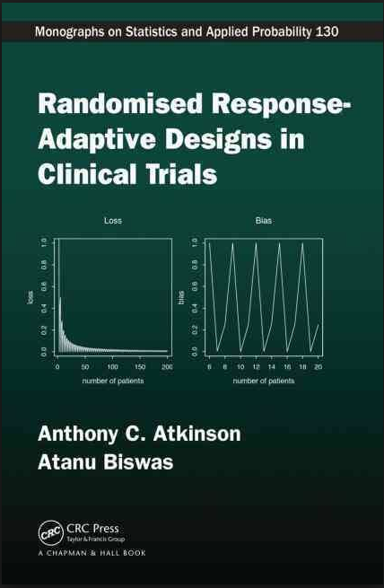
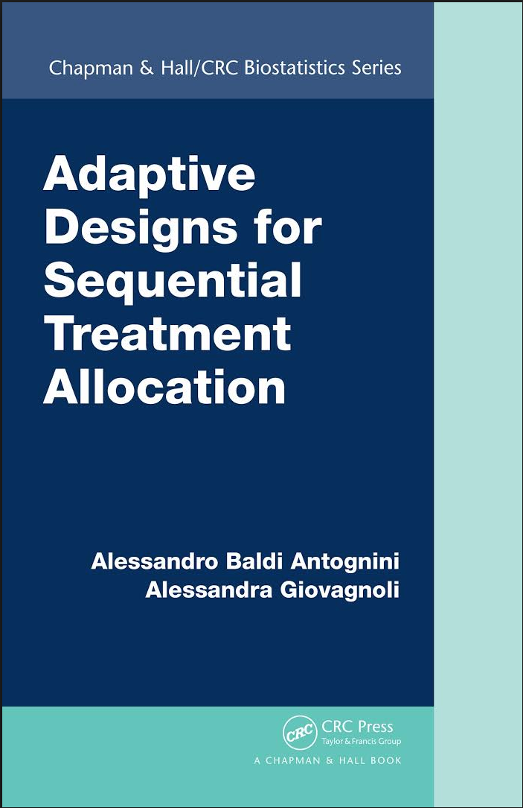
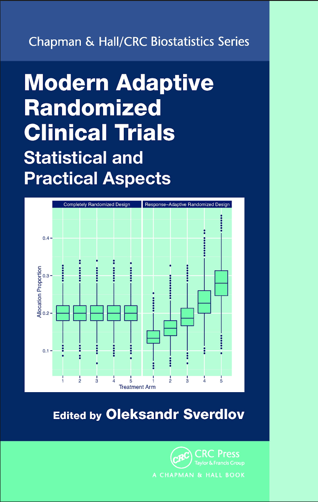
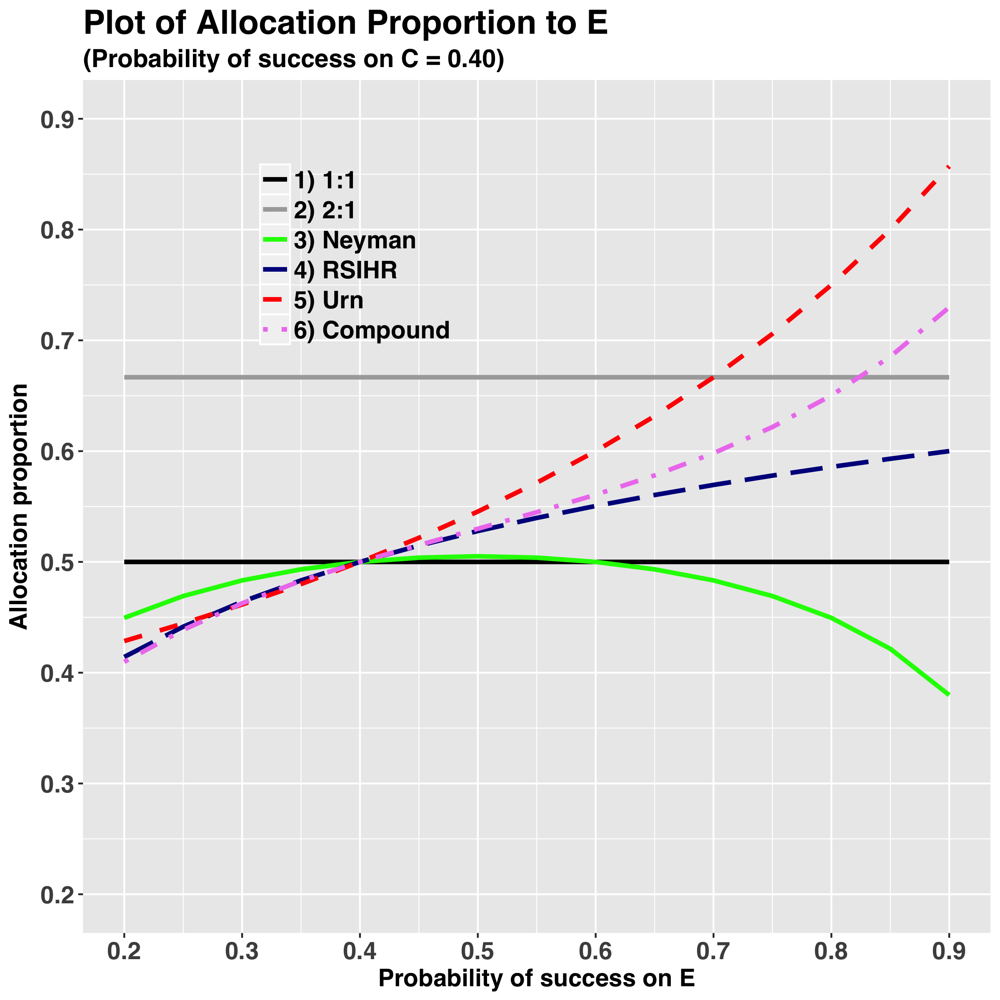
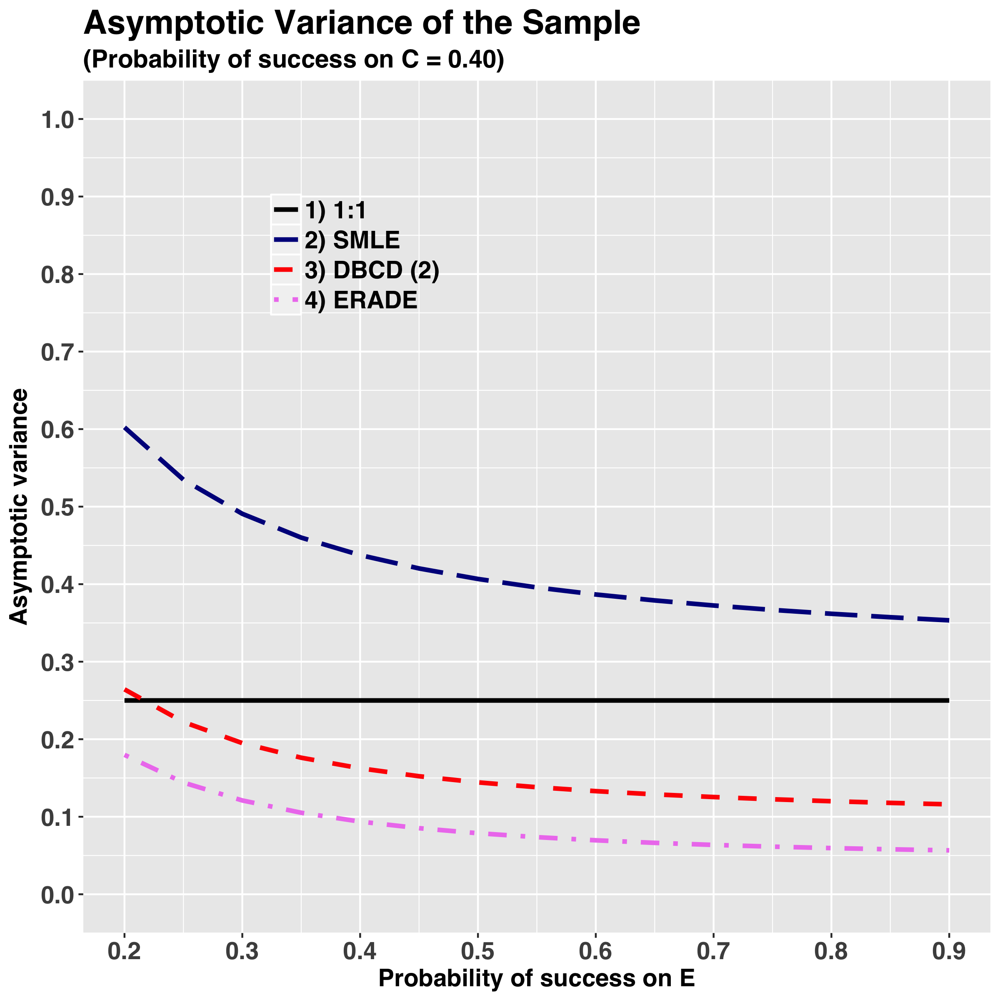
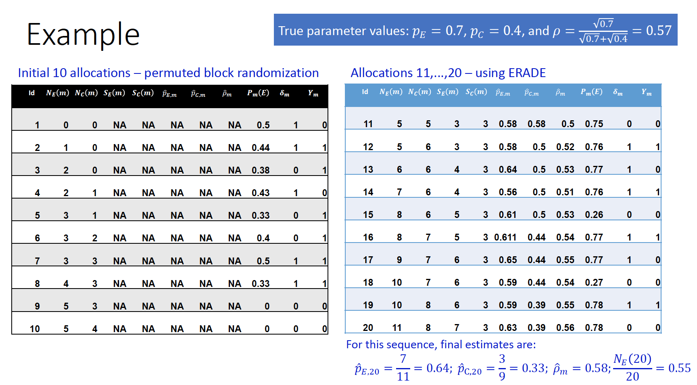
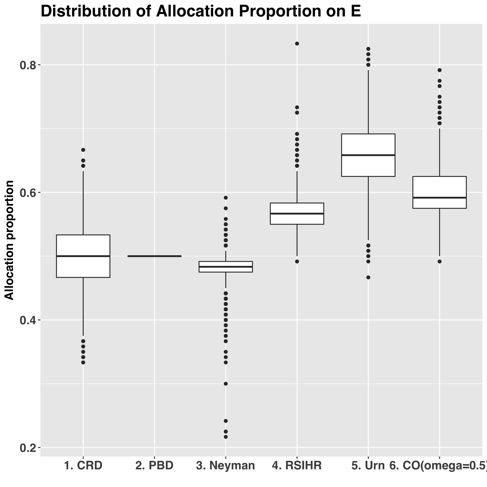

```{r setup, include=FALSE}
library(shiny)
library(tidyverse)
library(kableExtra)

source("./code/lecture06-code.R")
knitr::opts_chunk$set(
  echo = FALSE, 
  fig.width = 8, 
  fig.height = 6, 
  fig.align = "center"
)
```


## Motivation

- Equal allocation ($1:1$) is frequently used in clinical trials for two reasons:

    1. It can maximize statistical efficiency (power and estimation precision)
    2. It reflects the view of _**clinical equipoise**_ (there is not one "better" intervention among the control or experimental at the trial design stage)
    
- However, there are situations when these arguments can be challenged:

    1. If variance of the primary outcome is different across treatment groups, unequal allocation (e.g. Neyman allocation) can maximize statistical efficiency.
    2. As clinical trial data accrue, there may be evolving evidence (albeit not conclusive) that one of the treatments is performing better $\Rightarrow$ equipoise is no longer present

- _**Response-adaptive randomization (RAR)**_ can be used to increase allocation frequency to an empirically better treatment and achieve possibly other experimental goals

## What is RAR?$^*$

- With RAR, treatment allocation probabilities are sequentially modified according to the _**history of treatment assignments and responses**_ to achieve some pre-determined experimental objective(s) while maintaining validity and integrity of the study results

- Mathematically, a _**general RAR procedure**_ for a 2-arm comparative trial can be formulated as follows:

    + Let $\boldsymbol{\delta}_m = (\delta_1, \ldots, \delta_m)$, where $\delta_j = 1(0)$ for $E$ ($C$) -- treatment assignments
    + Let $\boldsymbol{Y}_m = (Y_1, \ldots, Y_m)$ -- responses from the $m$ patients in the trial $Y_j = \delta_jY_{Ej} + (1-\delta_j)Y_{Cj}$, (here $Y_{kj}$ is the response of the $j$<sup>th</sup> patient, if the patient is assigned to treatment $k = E, C$)
    + The $(m+1)$<sup>st</sup> patient is randomized to $E$ with probability 
    $$
      \text{Pr}\left(\delta_{m+1} = 1|\boldsymbol{\delta}_m, \boldsymbol{Y}_m\right)
    $$  
- Unlike with restricted randomization, a _**randomization sequence for RAR cannot be pre-generated before the trial starts**_ (because responses are unavailable)

<sup>$*$</sup> Hu F, Rosenberger WF (2006) _The Theory of Response-Adaptive Randomization in Clinical Trials_, Wiley

## What Are Potential Benefits of RAR?

- RAR addresses _**ethical concerns**_ (most importantly, in trials where outcomes are grave, such as deaths)

    + With RAR, more trial patients are likely to receive clinically better treatment
    
- RAR _**can increase study recruitment**_$^*$

    + A patient may be more willing to participate in the study if they know that they will have a higher chance to receive a better treatment
    
- We expect scientifically valid results, because randomization is present (in contrast to deterministic rules that are subject to biases)

- RAR presents a middle ground between the community benefit and individual patient benefit

    + RAR is a compromise between a _**randomized clinical trial**_ (which may unnecessarily harm some patients) and _**no trial at all**_ (no benefit to future patientsdue to lack of scientific advances)
    
    
<sup>$*$</sup> Tehranisa JS, Meuer WJ (2014) _Can response-adaptive randomization increase participation in acute stroke trials?_, _Stroke_, **45**, 2131-2133

## What Are Subtleties of RAR?

- RAR may be subject to _**experimental biases**_ (e.g. if time trends in the data are present)

- _**Potential loss in power**_ due to unequal sample sizes induced by RAR

- If accumulated experimental data provides evidence that Experimental is more effective than Control $\Rightarrow$ the physician should assign the next patient to Experimental with probability 1 (deterministically), according to the principle of _**personal case**_


## RAR: Main Assumptions

1. Responses from study patients should be observed _**relatively quickly after randomization**_

    + In our discussion we will assume that each patient's response is available _**immediately (without delay)**_ after randomization

2. Data must be of excellent quality to enable accurate estimation and adaptation throughout the trial

3. The disease is stable over time (there is no drift in patient characteristics)

4. The trial must be carefully planned with extensive simulations under different experimental scenarios


## Some History of RAR (1 of 6)

- _**Zelen (1969)**_$^*$ proposed the _**Play-the-Winner Rule**_

    + Binary outcome trial to compare $E$ vs. $C$; $p_k = \text{Pr}\left(Y_{kj} = 1\right)$ -- success probability, $k = E, C$
    + $1$<sup>st</sup> patient is randomized with probability $\frac{1}{2}$ between $E$ and $C$
    + For the $j$<sup>th</sup> patient ($j\geq 2$):
    
        * if $Y_{j-1} = 1$ (success), the $j$<sup>th</sup> patient is assigned to the same treatment $\delta_j = \delta_{j-1}$
        * if $Y_{j-1} = 0$ (failure), the $j$<sup>th</sup> patient is assigned to the opposite treatment $\delta_j = 1-\delta_{j-1}$
        
    + The limiting allocation proportion for treatment $E$ of the PW rule is
    $$
      \frac{q_C}{q_E+q_C}\text{ where }q_k = 1-p_k
    $$

- _**Major drawbacks of the Play-the-Winner Rule:**_:

    + Only one previous response (success or failure) determine the next patient’s treatment assignment
    + Treatment assignments are non-randomized (deterministic) $\Rightarrow$ potential for selection bias

<sup>$*$</sup> Zelen M (1969) _Play-the-winner rule and the controlled clinical trial._, _JASA_, **64**, 131-146


## Some History of RAR (2 of 6)

- _**Wei and Durham (1978)**_$^*$ extended PW Rule to _**Randomized Play-the-Winner Rule (RPWR)**_

    + An urn initially contains $\alpha$ balls of each type $E$ and $C$
    + $1$<sup>st</sup> patient is randomized with probability $\frac{1}{2}$ between $E$ and $C$
    + For the $j$<sup>th</sup> patient ($j \geq 2$), a ball is drawn with replacement; the treatment is assigned ($\delta_j$) and the response is observed $(Y_j)$:
    
        * if $Y_{j-1} = 1$ (success), add 1 ball of the same type as the current treatment ($\delta_j$)
        * if $Y_{j-1} = 0$ (failure), add 1 ball of the opposite type to the current treatment $1-\delta_{j}$
        
    + The idea is to skew the urn composition in favor of the treatment that is performing better
    + Conditional probability of assigning $(j+1)$<sup>st</sup> patient ot $E$:
    $$
      P_{j+1} = \frac{\alpha+\beta\sum_{j=1}^m\left(Y_j\delta_j+(1-Y_j)(1-\delta_j)\right)}{2\alpha+j\beta},\text{ }j \geq 1
    $$
    
- The limiting allocation proportion for the treatment $E$ of the RPWR is 
$$
  \frac{q_C}{q_E+q_C}\text{ where }q_k = 1-p_k \text{ (same as for the PW rule)}
$$

- _**Major drawback of the RPWR**_: High variability of allocation proportions, and dependence on the initial composition of balls in the urn

<sup>$*$</sup> Wei LJ, Durham S (1978) _The randomized play-the-winner rule in medical trials._, _JASA_, **73**, 840-843


## Some History of RAR (3 of 6)

- A clinical trial of extracorporeal membrane oxygenation (_**ECMO**_) in neonatal respiratory failure of newborns (_**Bartlett et al. 1985**_$^*$)

    + Historical success rate for conventional therapy was $\sim 20\%$. Early trials on efficacy and safety indicated that _**ECMO**_ techinique had an overall success rate in the range $56\%-70\%$
    + A randomized trial to compare ECMO vs. conventional used _**Randomized Play-the-Winner Rule**_ as a reasonable approach to scientific/ethical dilemma
    + A total of 12 newborns were enrolled, after which the study was stopped. The data were:
```{r}
tribble(
  ~"Patient", ~"1", ~"2",~"3",~"4",~"5",~"6",~"7",~"8",~"9",~"10",~"11",~"12",
  "ECMO", "S", "", "S", "S", "S", "S", "S", "S", "S", "S", "S", "S", 
  "Conventional", "", "F", "", "", "", "", "", "", "", "", "", ""
) %>% 
  knitr::kable("html") %>%
  kable_styling(bootstrap_options = "striped", full_width = F) %>%
  #add_header_above(c(" " = 1, "Male" = 2, "Female" = 2)) %>% 
  row_spec(0, bold = T, color = "white", background = "#6666ff") %>% 
  row_spec(1, background = "#99cfe0") %>% 
  row_spec(2, background = "#c1e1ec")

```
    
    + Results were inconclusive and led to criticism of response-adaptive randomization.
    + _**What went wrong?**_ RPWR is not the best RAR design to use! Better designs are now available

<sup>$*$</sup> Bartlett et al. (1985) _Extracorporeal circulation in neonatal respiratory failure: a prospective randomized study._, _Pediatrics_, **76**, 479-487


## Some History of RAR (4 of 6)

- _**Fluoxetine trial**_ in patients with depressive disorder (_**Tamura et al. 1994**_$^*$)

    + _**Endpoint**_: $\geq 50\%$ reduction on the Hamilton Depression Scale from baseline to final visit (Yes/No) $\Rightarrow$ binary outcome
    + _**Randomized Play-the-Winner Rule**_ was applied separately in 2 strata, based on rapid eye movement latency (REML): _**Stratum 1**_=Shortened REML; _**Stratum 2**_=Normal REML
    + The trial randomized a total of 89 patients. The data (proportion of responders) were:
```{r}
tribble(
  ~" ", ~"Shortened REML", ~"Normal REML", ~"Total",
  "Fluoxetine", "12/20", "13/21", "41",
  "Placebo", "7/21", "10/21", "42",
  "Fluoxetine vs. Placebo", "P = 0.046 (stat. signif)", "P = 0.187 \\n (nonsignificant)", "83$^1$"
) %>% 
  knitr::kable("html") %>%
  kable_styling(bootstrap_options = "striped", full_width = F) %>%
  footnote(number = c("At the time of analysis, 6 patients (out of 89 randomized) did not have a final outcome status")) %>% 
  #add_header_above(c(" " = 1, "Male" = 2, "Female" = 2)) %>% 
  row_spec(0, bold = T, color = "white", background = "#6666ff") %>% 
  row_spec(c(1, 3), background = "#99cfe0") %>% 
  row_spec(c(2), background = "#c1e1ec")
```
    + There was a significant treatment difference in the Shortened REML subgroup, but not in the Normal REML subgroup
    
        * However, actual allocation in the Shortened REML ($20:21$) was not in favor of Fluoxetine arm
        * The authors found that the actual allocation sequence had $\sim 22\%$ probability of occurrence
        
    + The trial showed feasibility of implementing RAR in practice.
    
<sup>$*$</sup> Tamura R et al. (1994) _A case study of an adaptive clinical trial in the treatment of out-patients with depressive disorder._, _JASA_, **89**, 768-776


## Some History of RAR (5 of 6)

- _**Modern research on RAR**_ (late 1990's -- present) has focused on:

    + Studying properties of existing designs
    + Development of optimal RAR designs that maintain or increase power over traditional balanced designs and minimize expected treatment failures
    
        * Trials with $K\geq 2$ treatment arms
        * Binary, continuous, and time-to-event outcomes
        * Covariate-adjusted response-adaptive (CARA) randomization
        
    + Development of Bayesian RAR designs and platform trials (_**most recently**_)
    + Comparison of designs by simulation and finding “best ones” for use in practice
    
## Some History of RAR (6 of 6)

Proliferation of papers, PhD dissertations (and even books) on this topic:

<div style="float:left;width:25%;text-align:left;">

_**2006**_
    
{width=100%}

</div>

<div style="float:left;width:25%;text-align:left;">

_**2014**_

{width=100%}

</div>

<div style="float:left;width:25%;text-align:left;">

_**2015**_

{width=100%}

</div>

<div style="float:left;width:25%;text-align:left;">

_**2016**_

{width=100%}

</div>


## Agenda for This Lecture

1. Optimal allocation for 2-arm binary outcome trials

2. RAR to implement optimal allocation

    + Different RAR procedures
    + Template for a theoretical comparison of RAR procedures
    
3. Simulation of RAR procedures

4. Examples: Redesigning a clinical trial


## Three-Step Approach to Develop Optimal RAR Designs$^*$

1. Derive an optimal allocation to satisfy selected experimental objectives (e.g. minimize total expected number of treatment failures subject to appropriate constraints on power of the test)

2. Construct a RAR procedure with minimal variability and high speed of convergence to the chosen optimal allocation

3. Analyze clinical trial data following the chosen RAR procedure

<sup>$*$</sup> Hu F, Rosenberger WF (2003) _Optimality, variability, power: evaluating response-adaptive randomization procedures for treatment comparisons._, _JASA_, **98**, 671-678


## 1. Optimal Allocation

- $K = 2$ treatments ($E$ and $C$), binary outcomes, fixed sample size ($n$)

    $\rho\in (0, 1)$ -- allocation proportion ($n_E = n\rho$, $n_C = n(1-\rho)$)
    
- We want _**to minimize**_ $\{n\rho w_E + n(1-\rho)w_C\}$ (where $w_E > 0$, $w_C > 0$ are user-defined weights reflecting study goals) _**while maintaining power of $Z$-test**_

- Constrained optimization problem (_**Jennison and Turnbull 2000**_$^*$):

$$
\left\{
\begin{array}{c}
    \min\limits_{\rho\in (0, 1)}n\left\{\rho w_E+(1-\rho_C)w_C\right\} \\
    \text{s. t. }\frac{p_Eq_E}{n\rho}+\frac{p_Cq_C}{n(1-\rho)} = C
\end{array}
\right.
$$

($C > 0$ is some constant; optimal solution does not depend on $C$)
    
- Optimal solution: $\rho^*:(1-\rho^*) = \sqrt{\frac{p_Eq_E}{w_E}}:\sqrt{\frac{p_Cq_C}{w_C}}$

    + If $w_E = 1$, $w_C = 1 \Rightarrow$ we have _**Neymann**_ allocation: $\sqrt{p_Eq_E}:\sqrt{p_Cq_C}$
    + If $w_E = q_E$, $w_C = q_C \Rightarrow$ we have _**RSIHR**_ allocation (_**Rosenberger et al. 2001**_$^{**}$): $\sqrt{p_E}:\sqrt{p_C}$


<sup>$*$</sup> Jenninson C, Turnbull BW (2000) _Group Sequential Methods with Applications to Clinical Trials._, _Chapman and Hall/CRC, Boca Raton_

<sup>$**$</sup> Rosenberger WF, Stallard N, Ivanova A, Harper CN, Ricks ML (2003) _Optimal adaptive designs for binary response trials._, _Biometrics_, **57**, 909-913


## Compound Optimal Allocation

- _**Baldi Antogniniand Giovagnoli (2010)**_ considered a _**compound optimality criterion**_ combining ethical and inferential objectives:
$$
  \Phi_{\omega}\left(\rho\right) = \omega\left\{\frac{\Psi_E(\rho)}{\Psi^*_E}\right\}+(1-\omega)\left\{\frac{\Psi_I(\rho)}{\Psi^*_I}\right\}
$$

    + $\omega \in (0, 1)$ -- user-defined weight that determines tradeoff between ethics and inference
    + $\Psi_E(\rho) = q_E\rho+q_C(1-\rho)$ -- expected proportion of treatment failures
    + $\Psi^*_E = \min(q_E, q_C)$ -- minimum value of $\Psi_E(\rho)$ for $\rho\in (0, 1)$
    + $\Psi_I(\rho) = \frac{p_Eq_E}{\rho}+\frac{p_Cq_C}{(1-\rho)}$ -- scaled variance of the estimated treatment difference $p_E-p_C$
    + $\Psi^*_I = \left(\sqrt{p_Eq_E}+\sqrt{p_Cq_C}\right)^2$ -- minimum value of $\Psi_I(\rho)$ for $\rho\in (0, 1)$
    
- The optimal allocation $\rho^*_{\omega}$ minimizing $\Phi_\omega(\rho)$ is the unique solution in $(0, 1)$ of the equation:

$$
  \frac{\omega}{1-\omega}\times\frac{p_E-p_C}{\min(q_E, q_C)}\times\left\{\sqrt{\frac{p_Cq_C}{p_Eq_E}}+1\right\}^2=\frac{\left\{\frac{p_Cq_C}{p_Eq_E}-1\right\}(\rho^*_\omega)^2+2\rho^*_\omega-1}{\left\{\rho^*_\omega(1-\rho^*_\omega)\right\}^2}
$$
    
- In our presentation, we set $\omega = \frac{1}{2}$ (equal interest in ethics and inference)

<sup>$*$</sup> Baldi Antognini A, Giovagnoli A (2010) _Compound optimal allocation for individual and collective ethics in binary clinical trials._, _Biometrika_, **97**(4), 935-946


## Comparison of Different Allocation Rules

We shall compare 6 target allocations in terms of power and expected number of failures (ENF):

<div class="column-left">

```{r}
tribble(
  ~" ", ~"Design", ~"Allocation ratio",
  "i", "Equal", "$1:1$",
  "ii", "Simple unequal", "$2:1$",
  "iii", "Neymann", "$\\sqrt{p_Eq_E}:\\sqrt{p_Cq_C}$",
  "iv", "RSIHR", "$\\sqrt{p_E}:\\sqrt{p_C}$",
  "v", "Urn", "$q_E:q_C$",
  "vi", "Compound optimal ($\\omega=\\frac{1}{2}$)", "$\\rho^*_{\\omega}:(1-\\rho^*_{\\omega})$"
) %>% 
  knitr::kable("html") %>%
  kable_styling(bootstrap_options = "striped", full_width = F) %>%
  #add_header_above(c(" " = 1, "Male" = 2, "Female" = 2)) %>% 
  row_spec(0, bold = T, color = "white", background = "#6666ff") %>% 
  row_spec(c(1, 3, 5), background = "#99cfe0") %>% 
  row_spec(c(2, 4, 6), background = "#c1e1ec")
```

</div>

<div class="column-right">

{width=100%}

</div>


## Power [ENF] for 6 target allocations, assuming a trial with n=100 patients

```{r}
pE <- c(0.2, 0.5, 0.6, 0.7, 0.8)
pC <- rep(0.4, length(pE))

tibble::tibble(
  `$p_E$` = pE, 
  `$p_C$` = pC,
  `1:1` = paste0(
    map2_dbl(pE, pC, ~ round(Power(.x, .y, 0.5, 100), 2)),
    " [",
    map2_dbl(pE, pC, ~ round(ENF(.x, .y, 0.5, 100))),
    "]"
  ), 
  `2:1` = paste0(
    map2_dbl(pE, pC, ~ round(Power(.x, .y, 2/3, 100), 2)),
    " [",
    map2_dbl(pE, pC, ~ round(ENF(.x, .y, 2/3, 100))),
    "]"
  ),
  Neyman = paste0(
    map2_dbl(pE, pC, ~ round(Power(.x, .y, Neyman(.x, .y), 100), 2)),
    " [",
    map2_dbl(pE, pC, ~ round(ENF(.x, .y, Neyman(.x, .y), 100))),
    "]"
  ),
  RSIHR = paste0(
    map2_dbl(pE, pC, ~ round(Power(.x, .y, RSIHR(.x, .y), 100), 2)),
    " [",
    map2_dbl(pE, pC, ~ round(ENF(.x, .y, RSIHR(.x, .y), 100))),
    "]"
  ),
  Urn = paste0(
    map2_dbl(pE, pC, ~ round(Power(.x, .y, urn(.x, .y), 100), 2)),
    " [",
    map2_dbl(pE, pC, ~ round(ENF(.x, .y, urn(.x, .y), 100))),
    "]"
  ),
  `CO ($\\omega$ = 0.5)` = paste0(
    map2_dbl(pE, pC, ~ round(Power(.x, .y, compound(.x, .y, 0.5), 100), 2)),
    " [",
    map2_dbl(pE, pC, ~ round(ENF(.x, .y, compound(.x, .y, 0.5), 100))),
    "]"
  )
) %>% 
  knitr::kable("html") %>%
  kable_styling(bootstrap_options = "striped", full_width = F) %>%
  #add_header_above(c(" " = 1, "Male" = 2, "Female" = 2)) %>% 
  row_spec(0, bold = T, color = "white", background = "#6666ff") %>% 
  row_spec(c(1, 3, 5), background = "#99cfe0") %>% 
  row_spec(c(2, 4), background = "#c1e1ec")

```

- _**In terms of Power**_:

    + Neyman, RSIHR, and CO ($\omega = 0.5$) are overall similar to $1:1$
    + Urn allocation can be 1\% - 5\% less powerful than $1:1$
    + $2:1$ allocation can be 1\% - 8\% less powerful than $1:1$
  
- _**In terms of ENF**_:

    + $2:1$ and Neyman allocation may have higher ENF than $1:1$
    + RSIHR has modest reduction (1-3 fewer failures) compared to $1:1$
    + CO ($\omega = 0.5$) may have 1-6 fewer failures, and Urn allocation 1-10 fewer failures


## II. RAR to Implement Optimal Allocation

- Suppose we want to implement RSIHR allocation ($\sqrt{p_E}:\sqrt{p_C}$) for a binary outcome study with $n$ eligible patients

- An _**"idealized" approach**_: all $n$ patients are available at once; the sample is split into groups of sizes $n_E$ and $n_C$, where

$$
  n_E = \frac{n\sqrt{p_E}}{\sqrt{p_E}+\sqrt{p_C}}\text{ and }\frac{n\sqrt{p_C}}{\sqrt{p_E}+\sqrt{p_C}}\text{ (integer-rounded if necessary)}
$$

- _**What are potential issues here?**_

    + A clinical trial enrolls eligible patients over time $\Rightarrow$ it is _**impossible to have all $n$ patients at once**_
    + _**$p_E$ and $p_C$ are unknown!**_ The trial is conducted to obtain information about $p_E$ and $p_C$
    + The patients cannot be just "split"" into two groups -- _**an investigator may be subjective**_ when deciding on treatment assignments
    
- _**This motivates introduction of RAR**_:

    + Use accumulating data to update estimates of $p_E$ and $p_C$, and modify treatment randomization probabilities to direct the design to the desired allocation
    

## Implementing Optimal Allocation (1 of 5)

- At the beginning of the trial there is no data $\Rightarrow$ initial $2m_0$ patients ($m_0$ is a small positive integer) are randomized equally between $E$ and $C$

- We assume: _**Each patient's outcome is ascertained immediately after randomization**_

- After $m$ allocations ($m \geq 2m_0$), the data are: $\boldsymbol{\delta}_m = (\delta_1, \ldots, \delta_m)$ -- treatment assignments; $\boldsymbol{Y}_m = (Y_1, \ldots, Y_m)$ -- responses. We can compute:

    + $N_E(m) = \sum_{j=1}^m{\delta_j}$ and $N_C(m) = \sum_{j=1}^m{(1-\delta_j)}$ -- current treatment numbers
    + $S_E(m) = \sum_{j=1}^m{\delta_jY_j}$ and $S_C(m) = \sum_{j=1}^m{(1-\delta_j)Y_j}$ -- current numbers of successes on $E$ and $C$
    + $\widehat{p}_{Em} = \frac{S_E(m)}{N_E(m)}$ and $\widehat{p}_{Cm} = \frac{S_C(m)}{N_C(m)}$ -- current estimates of $p_E$ and $p_C$
    + $\widehat{\rho}_m = \frac{\sqrt{\widehat{p}_{Em}}}{\sqrt{\widehat{p}_{Em}}+\sqrt{\widehat{p}_{Cm}}}$ -- updated estimate of the target allocation
    
- The $(m+1)$<sup>st</sup> patient is randomized to treatment $E$ with probability

$$
  P_{m+1} = \text{Pr}\left(\delta_{m+1}=1|\boldsymbol{\delta}_m, \boldsymbol{Y}_m\right)=\phi(\widehat{\rho}_m, N_E(m), N_C(m))
$$

(where function $\phi(\cdot)$ must be chosen judiciously)


## Implementing Optimal Allocation (2 of 5)

- We shall discuss _**3 different RAR procedures**_ that can be used to target the desired optimal allocation $(\rho)$

- These procedures have the following important properties:

    1. _**The maximum likelihood estimators**_ $(\widehat{p}_{Em}, \widehat{p}_{Cm})$ are strongly consistent (converge almost surely to the true values $(p_{Em}, p_{Cm})$), asymptotically uncorrelated, and have bivariate asymptotically normal distribution
    2. _**The sample treatment allocation proportion**_ $\frac{N_E(m)}{m}$ is strongly consistent for $\rho$ and has asymptotically normal distribution with known asymptotic variance
    
- Therefore, under widely satisfied conditions, the RAR designs we shall describe _**work as expected**_, and standard asymptotic estimators and tests can be used for statistical inference


## Implementing Optimal Allocation (3 of 5)

- _**Sequential Maximum Likelihood Estimation**_ design (_**Melfi et al. 2001**_$^*$):

    + Randomization probabilities are set equal to the current estimates of the target allocation proportions. E.g. for the RSIHR target we have:
    $$
      P_{m+1} = \widehat{\rho}_m = \frac{\sqrt{\widehat{p}_{Em}}}{\sqrt{\widehat{p}_{Em}}+\sqrt{\widehat{p}_{Cm}}}
    $$
(can be thought of as an analogue of complete randomization in the case of RAR)
    + _**Rosenberger et al. (2001)**_ showed that his procedure results in modest reduction in treatment failures with no loss in power compared to an equal randomization design
    
- _**Some limitations of the SMLE design:**_

    + It can be quite variable which may have a negative impact on power
    + It depends only on the estimate of the target allocation, but does not take into account the current sample sizes on $E$ and $C$


<sup>$*$</sup> Melfi VF, Page C, Geraldes M (2001) _An adaptive randomized design with application to estimation._, _Canadian Journal of Statistics_, **29**(1), 107-116
    

## Implementing Optimal Allocation (4 of 5)

- _**Doubly Adaptive Biased Coin Design (Hu and Zhang 2004)$^*$**_:

    + The $(m+1)$<sup>st</sup> patient is randomized to treatment $E$ with probability
    $$
      P_{m+1} = \frac{\widehat{\rho}_m\left\{\frac{\widehat{\rho}_m}{N_E(m)/m}\right\}^\gamma}{\widehat{\rho}_m\left\{\frac{\widehat{\rho}_m}{N_E(m)/m}\right\}^\gamma + (1-\widehat{\rho}_m)\left\{\frac{1-\widehat{\rho}_m}{N_C(m)/m}\right\}^\gamma} 
    $$
    ($\widehat{\rho}_m = \frac{\sqrt{\widehat{p}_{Em}}}{\sqrt{\widehat{p}_{Em}}+\sqrt{\widehat{p}_{Cm}}}$ for RSIHR target)
    
    + $\gamma \geq 0$ is a user-defined parameter controlling the degree of randomness
    
        * $\gamma = 0 \Rightarrow$ SMLE design: $P_{m+1} = \widehat{\rho}_m$
        * $\gamma \rightarrow +\infty \Rightarrow$ almost deterministic procedure
        * $\gamma = 2$ is recommended for use in practice (_**Rosenberger and Hu 2004**_$^{**}$)
        
    + The design is _**"doubly adaptive"**_ because it depends on both $\widehat{\rho}_m$ and the current proportions $N_E(m)/m$ and $N_C(m)/m$


<sup>$*$</sup> Hu F, Zhang LX (2004) _Asymptotic properties of doubly adaptive biased coin designs for multitreatmentclinical trials._, _The Annals of Statistics_, **32**, 268-301

<sup>$**$</sup> Rosenberger WF, Hu F (2004) _Maximizing power and minimizing treatment failures in clinical trials._, _Clinical Trials_, **1**(2), 141-147


## Implementing Optimal Allocation (5 of 5)

- _**Efficient Randomized Adaptive Design (ERADE)**_ (_**Hu et al. 2009**_$^*$):

    + The $(m+1)$<sup>st</sup> patient is randomized to treatment $E$ with probability
    $$
      P_{m+1} = \left\{
        \begin{array}{cl}
          \nu\widehat{\rho}_m, & N_E(m)/m > \widehat{\rho}_m \\
          \widehat{\rho}_m, & N_E(m)/m = \widehat{\rho}_m \\
          1-\nu\widehat{\rho}_m, & N_E(m)/m < \widehat{\rho}_m 
        \end{array}
      \right.
    $$
    ($\widehat{\rho}_m = \frac{\sqrt{\widehat{p}_{Em}}}{\sqrt{\widehat{p}_{Em}}+\sqrt{\widehat{p}_{Cm}}}$ for RSIHR target)
    
    + $\nu\in [0, 1)$ is a user-defined parameter controlling the degree of randomness
    
        * $\nu \rightarrow 1 \Rightarrow$ SMLE design: $P_{m+1} = \widehat{\rho}_m$
        * $\nu \rightarrow 0 \Rightarrow$ almost deterministic procedure
        * $\nu \in (0.4, 0.7)$ is recommended for use in practice (_**Hu et al. 2009**_$^{*}$)
      
- ERADE can be thought of as an extension of Efron's BCD to the case of RAR

    + ERADE is less variable than SMLE and DBCD $\rightarrow$ potentially more powerful


<sup>$*$</sup> Hu F, Zhang LX, He X (2009) _Efficient randomized-adaptive designs._, _The Annals of Statistics_, **37**, 2543-2560


## Asymptotically Best RAR Procedures

- Consider a class of RAR procedures that target the same allocation $\rho$

- Within this class, an asymptotically best RAR procedureis one that attains the smallest possible asymptotic variance of $N_E(n)/n$

- The following Theorem (_**Hu et al. 2006**_$^*$) is important:
  
  _Consider a two-arm binary outcome trial a RAR procedure with target allocation $\rho = \rho(p_E, p_C)$. Suppose the following regularity conditions hold:_

(a) $p_E, p_C \in (0, 1)$
(b) $N_E(n)/n\rightarrow \rho \in (0, 1)$ _almost surely_;
(c) $\sqrt{n}\left(N_E(n)/n-\rho\right)\rightarrow N(0, \sigma^2)$ _in distribution, wher $\sigma^2 > 0$_
    
  _Then we have $\sigma^2\geq B(p_E, p_C) = \left(\frac{\partial\rho}{\partial p_E}\right)^2\frac{p_Eq_E}{\rho}+\left(\frac{\partial\rho}{\partial p_C}\right)^2\frac{p_Cq_C}{1-\rho}$_      
 
  _$B(p_E, p_C)$ is called **the lower bound for the variance of RAR procedures with target**_ $\rho$. _A RAR procedure which attains this lower bound is **an asymptotically best RAR procedure**_
  
<sup>$*$</sup> Hu F, Rosenberger WF, Zhang LX (2006) _Asymptotically best response-adaptive randomization procedures._, _Journal of Statistical Planning and Inference_, **136**, 1911-1922


## Example: Lower Bound for Variance of RAR Procedures with RSIHR Allocation (1 of 2)

- RSIHR target: $\rho = \frac{\sqrt{p_E}}{\sqrt{p_E}+\sqrt{p_C}}$

    + $\rho$ is twice continuosly differentiable function of $(p_E, p_C)$; $\frac{\partial\rho}{\partial p_E} = \frac{\rho(1-\rho)}{2p_E}$ and $\frac{\partial\rho}{\partial p_C} = \frac{\rho(1-\rho)}{2p_C}$
    + Therefore, we find: $B(p_E, p_C) = \frac{1}{4(\sqrt{p_E}+\sqrt{p_C})^3}\left\{\frac{p_Cq_E}{\sqrt{p_E}}+\frac{p_Ep_C}{\sqrt{p_C}}\right\}$ -- lower bound for the variance of RAR procedures targeting RSIHR
    
- _**Recall our 3 RAR procedures: SMLE, DBCD, and ERADE**_. The asymptotic variances of these procedures applied with the RSIHR target are as follows:

    + $\sigma^2_{SMLE} = \frac{\sqrt{p_Ep_C}}{(\sqrt{p_E}+\sqrt{p_C})^2}$
    + $\sigma^2_{DBCD(\gamma)} = \frac{\sqrt{p_Ep_C}}{(1+2\gamma)(\sqrt{p_E}+\sqrt{p_C})^2}+\frac{2(1+\gamma)}{1+2\gamma}B(p_E, p_C)$
    + $\sigma^2_{ERADE} = B(p_E, p_C) \Rightarrow$ ERADE attains the lower bound
    
- Importantly, $\sigma^2_{SMLE} > \sigma^2_{DBCD(\gamma)} > \sigma^2_{ERADE} \Rightarrow$ _**ERADE is an asymptotically best procedure and would be preferred in practice**_


## Example: Lower Bound for Variance of RAR Procedures with RSIHR Allocation (2 of 2)

<div class = "column-left">

{width=100%}

</div>

<div class = "column-right">

- This plot shows that:

    + $\sigma^2_{SMLE} > \sigma^2_{DBCD(\gamma=2)} > \sigma^2_{ERADE}$
    + $1:1$ complete randomization has constant variance = 0.25
    + SMLE is more variable than $1:1$ complete randomization
    + _**$DBCD(\gamma = 2)$ and ERADE are less variable than $1:1$ complete randomization!**_ (even though these two procedures are response-adaptive, whereas CRD is not)


</div>


## In Summary: How We Shall Perform RAR

1. We choose target allocation: $\rho = \rho(p_E, p_C)$ that is optimal for our experimental objectives (acknowledging that it is a function of the model parameters)

2. We randomize _**initial $2m_0$ patients**_ ($m_0$ -- small positive integer) equally between treatments $E$ and $C$ (_**using permuted block design**_) to ascertain initial data

3. We use _**ERADE**_ (as it is an asymptotically best RAR procedure) to randomize _**remaining $(n-2m_0)$ patients**_

4. The final analysis is performed using standard asymptotic statistical methods


## III. Simulation of Optimal RAR Procedures

- Simulation of a single sequence (to illustrate the concepts)

- Operating characteristics of RAR designs via Monte Carlo simulations

    + To appreciate variability of various RAR designs
    + To study the relationship between optimality, variability, power, and ENF
    

## Simulation of a single RAR sequence with 20 patients (1 of 2)

- Assume the true success rates are $p_E = 0.7$ and $p_C = 0.4$

    + RSIHR target (unknown to us): $\rho = \frac{\sqrt{0.7}}{\sqrt{0.7}+\sqrt{0.4}} = 0.57$
    
- First 10 patients are randomized using permuted block design:
$$
  P_1(E) = 0.5;\text{ }P_m(E) = \frac{5-N_E(m-1)}{10-(m-1)},\text{ }m = 1, 2, \ldots, 10
$$

- RAR starts from the $11$<sup>th</sup> patient: For $m = 11, 12, \ldots, 20$, calculate:

    + $\widehat{p}_{k,m-1} = \frac{S_k(m-1)+0.5}{N_k(m-1)+1},\text{ }k = E, C$ -- Bayesian estimates of success rates
    + $\widehat{\rho}_{m-1} = \frac{\sqrt{\widehat{p}_{E, m-1}}}{\sqrt{\widehat{p}_{E, m-1}}+\sqrt{\widehat{p}_{C, m-1}}}$ -- updated target allocation
    + $P_m(E)$ -- randomization probability for treatment $E$ using ERADE design
    + Generate a random number $U_m\sim Uniform(0, 1)$
    
        * If $U_m \leq P_m(E)\Rightarrow$ $m$<sup>th</sup> patient is assigned to treatment $E$; otherwise to treatment $C$
        

## Simulation of a single RAR sequence with 20 patients (2 of 2)

{width=100%}


## Comparison of Various RAR Designs via Simulation (1 of 4)

- Six randomization designs will be compared:

```{r}
tribble(
  ~"Design", ~"Allocation", ~"Randomization",
  "i", "Equal ($1:1$)", "Complete randomization",
  "ii", "Equal ($1:1$)", "Permuted block design with block size 4",
  "iii", "Neymann ($\\sqrt{p_Eq_E}:\\sqrt{p_Cq_C}$)", "ERADE with $\\nu = 0.5$",
  "iv", "RSIHR ($\\sqrt{p_E}:\\sqrt{p_C}$)", "ERADE with $\\nu = 0.5$",
  "v", "Urn ($q_E:q_C$)", "ERADE with $\\nu = 0.5$",
  "vi", "Compound optimal ($\\omega=\\frac{1}{2}$) ($\\rho^*_{\\omega}:(1-\\rho^*_{\\omega})$)", "ERADE with $\\nu = 0.5$"
) %>% 
  knitr::kable("html") %>%
  kable_styling(bootstrap_options = "striped", full_width = F) %>%
  #add_header_above(c(" " = 1, "Male" = 2, "Female" = 2)) %>% 
  row_spec(0, bold = T, color = "white", background = "#6666ff") %>% 
  row_spec(c(1, 3, 5), background = "#99cfe0") %>% 
  row_spec(c(2, 4, 6), background = "#c1e1ec")

```


## Comparison of Various RAR Designs via Simulation (2 of 4)

- _**True parameters values**_ were set to $p_E = 0.7$, $p_C = 0.4$

- _**Sample size**_ was set to $n = 120$ ($\sim 92\%$ power of the Wald test with 2-sided $\alpha = 0.05$)

- Responses for the $j$<sup>th</sup> subject (conditional on $\delta_j$) was generated as 
$$
  Y_j = \delta_jY_{Ej}+(1-\delta_j)Y_{Cj}
$$
    (where $Y_{kj}\sim Bernoulli(p_k)$, $k = E, C$)
    
- Responses were assumed to be available _**immediately**_ after randomization

- _**Operating characteristics**_:

    + Allocation proportion: $N_E(n)/n$
    + Total number of failures: $TNF(n)$
    + Power of the test
    
- A trial of $n = 120$ patients is simulated 10,000 times in **R**


## Comparison of Various RAR Designs via Simulation (3 of 4)

<div class="column-left">

{width=100%}
</div>

<div class="column-right">

```{r}
load(file = "./data/lecture06-rar-samary.Rda")
nsbj <- 120

rar_theor <- tibble::tibble(
  design = rar_summary$design,
  Mean1 = c(0.5, 0.5, 0.48, 0.57, 0.67, 0.60),
  nVar1 = c(0.25, 0, 0.030, 0.064, 0.272, NA) 
)
inner_join(
  rar_theor,  
  rar_summary,
  by = "design"
) %>% 
  mutate(
    nE = paste0(mean_nE, " [", min_nE, " - ",max_nE, "]" ),
    nVar2 = nsbj*var_prop
  ) %>% 
  select(design, Mean1, nVar1, Mean2 = mean_prop, nVar2, nE) %>% 
  set_names(c("Design", "Mean", "$n\\times \\mathbf{Var}(N_E/n)$", "Mean", "$n\\times \\mathbf{Var}(N_E/n)$", "$N_E [\\min - \\max]$")) %>% 
  knitr::kable("html") %>%
  kable_styling(bootstrap_options = "striped", full_width = F) %>%
  add_header_above(c(" " = 1, "$N_E/n$ -- Theoretical" = 2, "$N_E/n$ -- Simulated" = 2, " " = 1)) %>% 
  row_spec(0, bold = T, color = "white", background = "#6666ff") %>% 
  row_spec(c(1, 3, 5), background = "#99cfe0") %>% 
  row_spec(c(2, 4, 6), background = "#c1e1ec")

```

- Simulated and theoretical results _**generally agree well**_

- _**Neyman**_ places 2 more patients on $C$ (on average) than $1:1$ randomization

- _**RSIHR**_: 8 more on $E$ (on average) than $1:1$ randomization

- _**CO ($\omega=0.5$)**_: 12 more on $E$ (on average) than $1:1$ randomization

- _**Urn**_: 19 more on $E$ (on average) than $1:1$ randomization


</div>


## Comparison of Various RAR Designs via Simulation (4 of 4)

<div class="column-left">

```{r}
rar_summary %>% 
  mutate(TNF = paste0(TNF_mean, " (", TNF_sd, ")")) %>% 
  select(design, Power, TNF) %>% 
  set_names(c("Design", "Power", "Average TNF (SD)")) %>% 
  knitr::kable("html") %>%
  kable_styling(bootstrap_options = "striped", full_width = F) %>%
  #add_header_above(c(" " = 1, "$N_E/n$ -- Theoretical" = 2, "$N_E/n$ -- Simulated" = 2, " " = 1)) %>% 
  row_spec(0, bold = T, color = "white", background = "#6666ff") %>% 
  row_spec(c(1, 3, 5), background = "#99cfe0") %>% 
  row_spec(c(2, 4, 6), background = "#c1e1ec")
```

</div>

<div class="column-right">

- _**Neymann design**_ had $1\%$ (on average) less power than CRD, but 1 more failures than CRD

- _**RSIHR and CO ($\omega=0.5$)**_ had $1\%$ (on average) power less than CRD ($92\%$), but resulted on avaerage, in _**3-4 fewer failures than CRD**_

- _**Urn design**_ had $91\%$ power and had, on average, _**6 fewer failures than CRD**_

</div>


## IV. Redesigning a Real Clinical Trial

- _**Connor et al. (1994)**_$^*$ reported the results of a randomized, double-blind, placebo-controlled trial of the efficacy and safety of zidovudine (AZT) in reducing the risk of maternal-infant transmission of HIV

    + 477 pregnant women were enrolled and randomized equally between AZT ($n_e = 239$) and placebo ($n_C = 238$)
    + In the study, 409 women gave birth to 415 live-born infants
    + The estimated proportions of uninfected infants at 18 months were _**0.917**_ for the AZT group and _**0.745**_ for the placebo group
    + An optimal RAR design would assign the AZT treatment more often thereby achieving a more ethical trial design
    
<sup>$*$</sup> Connor EM et al. (1994) _Reduction of maternal-infant transmission of human immunodeficiency virus type 1 with zidovudine treatment._, _The New England Journal of Medicine_, **33**(18), 1173-1180


## Redesign of the AZT trial (1 of 2)

- The true success probabilities are assumed to be $p_E = 0.917$ (AZT) and $p_E = 0.745$ (placebo)

- Compound allocation with $\omega = \frac{1}{2}$ will be used as the target

    + With these numbers, _**the target allocation proportion for AZT is 0.607**_
    + We use the total sample size ($n = 477$) to match the real trial setup
    
- Permuted block design with block size 4 targeting $1:1$ allocation will be used as the reference

- 10,000 simulations in **R**


## Redesign of the AZT trial (2 of 2)

```{r}
load(file = "./data/lecture06-AZT.Rda")

AZT_summary %>% 
  set_names(c("Design", "Alloc. Prop. Mean (SD)", "$N_{AZT}$, Mean (SD)", "TNF, Mean (SD)", "$\\widehat{p}_E$, Mean (SD)", "$\\widehat{p}_C$, Mean (SD)")) %>% 
  knitr::kable("html") %>%
  kable_styling(bootstrap_options = "striped", full_width = F) %>%
  #add_header_above(c(" " = 1, "Male" = 2, "Female" = 2)) %>% 
  row_spec(0, bold = T, color = "white", background = "#6666ff") %>% 
  row_spec(1, background = "#99cfe0") %>% 
  row_spec(2, background = "#c1e1ec")
```

- On average, 53 more patients to the AZT treatment compared to equal randomization

- On average, 9 fewer treatment failures compared to equal randomization

- Similar estimation precision

## In Summary

- Optimal RAR designs can _**reduce number of treatment failures**_ in the trial _**while maintaining important statistical properties**_ (power and estimation efficiency)

    + Attractive in clinical trials where outcomes are grave and even a modest reduction in treatment failures is highly desirable from the ethics perspective

- _**The advantages**_ of optimal RAR designs over balanced randomization designs _**are more pronounced when the treatment difference is large**_

    + When the treatment effects are the same, RAR reduces to equal allocation randomization
    
- Optimal RAR designs have well _**established asymptotic properties**_

    + Estimators and sample allocation proportions are strongly consistent and follow asymptotically normal distributions $\Rightarrow$ standard asymptotic inference procedures can be applied for data analysis following RAR trials
    

## What Do Regulators Say About RAR?

- Unlike covariate-adaptive randomization, RAR has been more controversial:

<div class="column-left">

_**Food and Drug Administration (2010)**_

<div class="boxed">

Guidance for Industry

Adaptive Design Clinical Trials for Drugs and Biologics

</div>
$\Rightarrow$
</div>

<div class="column-left">

<div class="boxed1">

- "_...Outcome dependent adaptive randomization **is particularly valuable for exploratory studies** because it can make practical an increase in the number of tested treatment options..._"

- "_Adaptive randomization **should be used cautiously in Adequate \& Well Controlled studies**, as the analysis is not as easily interpretable as when fixed randomization probabilities are used..._"

</div>

</div>


## Homework for Lecture #6 (1 of 4)
    
_**Problem 1**_: Suppose $m = 10$ patients have been randomized into the trial: 5 to treatment $E$, and 5 to treatment $C$. There are 3 successes observed for treatment $E$, and 2 success observed for treatment $C$. COmpute the probability of assigning the 11<sup>th</sup> patient to treatment $E$ for each of the following rules:

a) Neyman allocation implemented using SMLE design

b) RSIHR allocation implemented using DBCD with $\gamma = 2$

c) Urn allocation implemented using ERADE with $\nu = 0.5$


## Homework for Lecture #6 (2 of 4)

_**Problem 2**_: _"Ethical"_ design can be quite inefficient.

Consider the odds-ratio allocation: $\rho = \frac{p_E/q_E}{p_E/q_E+p_C/q_C}$.

a) Show that $\rho$ is always skewed in favor of the more successful group

b) Run the **R** code to find Power and ENF of the odds ratio allocation for a trial with $n = 100$ patients, and compare the results with $1:1$ allocation

c) Show that the lower bound for the variance of a RAR procedure targeting odds-ratio allocation is 
$$
  B(p_E, p_C) = \left\{\rho(1-\rho)\right\}^2\left(\frac{1}{p_Eq_E\rho}+\frac{1}{p_Cq_C(1-\rho)}\right)
$$

d) Create a plot of $B(p_E, q_E)$ from part 3. for $p_C = 0.4$ and $p_E = 0.2:0.05:0.8$. How does this variance compare with the variance of complete randomization (which is 0.25)?

e) Run the **R** code to simulate operating characteristics of the _**odds-ratio allocation used with ERADE($\nu=0.5$)**_ for $p_E = 0.7$, $p_C = 0.4$, and $n = 120$. How does this design perform in terms of power and number of treatment failures compared to $1:1$ complete randomization?


## Homework for Lecture #6 (3 of 4)

_**Problem 3**_: Consider the hypothesis of euqality of treatment effects using the score test based on the log-ods ratio, $\theta = \log\left\{\frac{p_Eq_C}{p_Cq_E}\right\}$. For testing $H_0: \theta = 0$, we compute:

$$
  Z = \frac{n_CS_E-n_ES_C}{n}\text{ and }V = \frac{n_En_CSF}{n^3},
$$
where $S_E$ and $S_C$ are the number of successes on $E$ and $C$; $S = S_E+S_F$, and $F = n-S$

When $n$ is large, $Z$ is approximately normally distributed with mean $\theta V$ and variance $V$. Using the large sample approximations $S\approx np$ and $F\approx n(1-\overline{p})$, where $\overline{p} = \frac{n_Ep_E+n_Cp_C}{n}$, the variance of the score statistic is approximated as $V\approx n\rho(1-\rho)\left(\rho p_E + (1-\rho)p_C\right)\left(\rho q_E + (1-\rho)q_C\right)$ (_**Whitehead 1997**_$^*$)

Suppose we want to minimize $ENF = n\left\{\rho q_E + (1-\rho)q_C\right\}$ subject to fixed value of $V$.

a) Show that this is equivalent to minimizing the value of $\left\{\rho(1-\rho)(\rho p_E+(1-\rho)p_C)\right\}^{-1}$ for $\rho \in (0, 1)$

b) Show that the optimal solution to the problem in 1. is as follows:
$$
  \rho^* = \frac{p_e-2p_C+\sqrt{p_E^2-p_Ep_C+p_C^2}}{3(p_E-p_C)} (p_E\ne p_C) \text{ and }\rho^* = \frac{1}{2}(p_E = p_C)
$$

c) Show that for anay $p_E, p_C \in (0, 1)$, we have $1/3 \leq \rho^* \leq 2/3$

d) Show that if $p_E > p_C \Rightarrow \rho^* > 1/2$, and if $p_E < p_C \Rightarrow \rho^* < 1/2$ (which implies that greater proportion of patients are assigned to the more successful treatment)

<sup>$*$</sup> Whitehead J (1997) _The Design and Analysis of Sequential Clinical Trials._, _2<sup>nd</sup> edition_, New York, Wiley


## Homework for Lecture #6 (4 of 4)

_**Problem 4**_: Run the R code to redesign the AZT trial using the following procedures:

1. Randomized Play-the Winner Rule with ($\alpha = 2$ and $\beta = 1$)

2. Urn allocation used with ERADE with $\nu = 0.5$

What are similarities and differences of these two designs?

