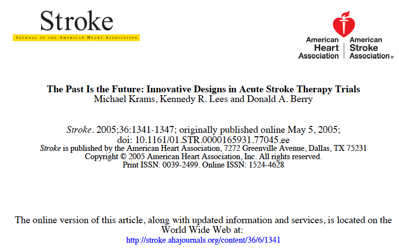

```{r setup, include=FALSE}
library(shiny)
library(tidyverse)
library(kableExtra)

#source("./code/lecture07-code.R")
knitr::opts_chunk$set(
  echo = FALSE, 
  fig.width = 8, 
  fig.height = 6, 
  fig.align = "center"
)
```


## Where Are We in This Course?

{width=100%}


## Agenda for This Lecture

1. Bayesian Refresher

2. Bayesian Adaptive Randomization (BAR) for 2-arm Trials

3. BAR for Multi-Arm Trials

4. BAR for Dose-Response Studies


## Thomas Bayes (1701-1761)

{width=100%}

- A picture is taken from:
https://scienceprog.com/simple-explanation-of-naive-bayes-classifier/

- Visit also: https://www2.isye.gatech.edu/~brani/isyebayes/index.html


## I. Bayesian Refresher (1 of 4)

- _**The classical (frequentist) approach**_ treats model parameters as fixed, but unknown quantities that can be estimated based on data

- _**Example**_: $n$ independent (Bernoulli) trials; each trial is a "success" with probability $p$ or a "failure" with probability $1-p$

    + $Y_i$, if $i$<sub>th</sub> trial is success, or $Y_i = 0$, if $i$<sub>th</sub> trial is failure
    + $X = \sum_{i=1}^n = Y_j$ -- number of sucesses
    + $X\sim Binomial(n, p)$
    + _**MLE of $p$**_: $\widehat{p} = X/n$ (e.g. if $SSFSFS \Rightarrow n = 6;\text{ }X = 4 \rightarrow \widehat{p} = 4/6 = 0.667$)
    + _**Exact (Clopper-Pearson) 95\% confidence interval (CI) for $p$**_:
$$
  \mathcal{C} = \left(F_{0.025}^{-1}(X, n-X+1), F_{0.975}^{-1}(X+1, n-X)\right)
$$
where $F_{\alpha}^{-1}(a, b)$ is the $\alpha$<sup>th</sup> quantile of $\text{Beta}(a, b)$ distribution

- In our example: $F_{0.025}^{-1}(4, 3) = 0.223$; $F_{0.975}^{-1}(5, 2) = 0.957 \Rightarrow (0.22, 0.96)$


## Bayesian Refresher (2 of 4)

- _**In a Bayesian setting**_, model parameters are assumed to be random, with some prior distribution

- _**Bayes formula**_ is used to combine prior with data to obtain posterior distributions of model parameters and perform statistical inference
$$
  f(\boldsymbol{\theta}|x) = \frac{f(x|\boldsymbol{\theta})f(\boldsymbol{\theta})}{\int\limits_\boldsymbol{\Theta}{f(x|\boldsymbol{\theta})f(\boldsymbol{\theta})d\boldsymbol{\theta}}}
$$

```{r}
tribble(
  ~"Col1", ~"Col2",
  "$f(x|\\boldsymbol{\\theta})$", "Likelihood -- distribution of data given model parameters",
  "$f(\\boldsymbol{\\theta})$", "Prior distribution of model parameters",
  "$\\int\\limits_\\boldsymbol{\\Theta}{f(x|\\boldsymbol{\\theta})f(\\boldsymbol{\\theta})d\\boldsymbol{\\theta}}$", "Marginal distribution of data (unconditional on model parameters)",
  "$f(\\boldsymbol{\\theta}|x)$", "Posterior distribution ofmodel parameters given data"
) %>% 
  knitr::kable("html") %>%
  kable_styling(bootstrap_options = "striped", full_width = F) %>%
  #add_header_above(c(" " = 1, "Male" = 2, "Female" = 2)) %>% 
  #row_spec(0, bold = T, color = "white", background = "#6666ff") %>% 
  row_spec(0, bold = T, color = "white", background = "white") %>% 
  row_spec(c(1, 3), background = "#99cfe0") %>% 
  row_spec(c(2, 4), background = "#c1e1ec")
```
    
    
## Bayesian Refresher (3 of 4)    

- $p\sim \text{Beta}(a, b)$ -- prior distribution
$$
  f(p) = \frac{1}{B(a, b)}p^{a-1}(1-p)^{b-1},\text{ }p\in (0, 1)
$$

- $X|p \sim Binomial(n, p)$ -- likelihood (data)
$$
  f(X|p) = {n\choose{X}}p^X(1-p)^{n-X},\text{ }X = 0, 1, \ldots, n-1, n
$$

- $(p, X)$ -- joint distribution
$$
  f(X, p) = f(X|p)\times f(p) = \frac{1}{B(a, b)}{n\choose{X}}p^{X+a-1}(1-p)^{n-X+b-1}
$$

- $p|X$ -- posterior distribution
$$
  f(p|X) = \frac{f(x|p)f(\boldsymbol{\theta})}{\int\limits_\boldsymbol{\Theta}{f(x|\boldsymbol{\theta})f(\boldsymbol{\theta})d\boldsymbol{\theta}}} \propto p^{X+a-1}(1-p)^{n-X+1}\text{, which is Beta}(X+a, n-X+b)
$$
    

## Bayesian Refresher (4 of 4)


## Bayesian Inference for a Two-Arm Trial

- Two treatment groups: $E$ and $C$

- $X_k|p_k \sim Binomial(n_k, p_k)$, $k = E, C$

- Prior: $p_k\sim \text{Beta}(a_k, b_k)$

    + $a_k > 0$, $b_k > 0$ -- "hyper-parameters" (commonly: $a_k = 1,\text{ }b_k = 1 \Rightarrow$ Uniform prior)
    
- Posterior: $p_k|X\sim \text{Beta}(X_k+a_k, n_k-X_k+b_k)$
    
- Treatment difference: $\Delta = p_E-p_C$

    + Distribution of $\Delta$ involves the difference of two independent Beta random variables$^*$
$$
  F_\Delta(x) = \text{Pr}\left(\Delta\leq x\right) = \left\{
  \begin{array}{cc}
    \int\limits_{-x}^1F_{p_2}(x+u)f_{p_1}(u)du, & -1\leq x\leq 0 \\
    \int\limits_0^{1-x}F_{p_2}(x+u)f_{p_1}(u)du + \int\limits_{1-x}^1f_{p_1}(u)du, & 0\leq x\leq 1
  \end{array}
  \right.
$$

<sup>$*$</sup> Sverdlov O, Ryeznik Y, Wu S (2015) _"Exact Bayesian inference comparing binomial proportions, with application to proof-of-concept clinical trials"_, _Therapeutic Innovation and Regulatory Science_, **49**(1), 163-174 
    

## Prior and Posterior Density of $\Delta = p_E-p_C$

<div class="column-left">


</div>
    
<div class="column-left">


</div>

-**Probability density of $\Delta - p_E-p_C$ may take various shapes depending on the values of hyper-parameters and observed data**_

## Bayesian Adaptive Randomization (BAR) for Two-Arm Trials

- Original idea goes back to Thompson (1933)

{width=100%}
    
- Unlike optimal RAR procedures (discussed in Lecture \#6) which drive allocation toward a pre-specified optimal target, _**BAR skews allocation toward an empirically better treatment**_ (without considering power or estimation efficiency)
    

## Thompson's (1933) BAR Procedure (1 of 2) 

1. To start, $m_0 \geq 2$ patients are randomized equally between $E$ and $C$

2. For the $(m+1)$<sup>th</sup> patient, look at the history:

    + $\boldsymbol{\delta}_m = (\delta_1, \ldots, \delta_m)$; $\delta_j = 1(0)$, if the $j$<sup>th</sup> assignment was $E$ ($C$)
    + $\boldsymbol{Y}_m = (Y_1, \ldots, Y_m)$; $Y_j = 1(0)$, if the $j$<sup>th</sup> patient's response was "success" ("failure")
    + Based on $(\boldsymbol{\delta}_m, \boldsymbol{Y}_m)$, obtain posteriors of $p_E$ and $p_C$ (beta distributions)
    + Compute $\pi_m = \text{Pr}\left(p_E > p_C|\boldsymbol{\delta}_m, \boldsymbol{Y}_m\right)$
    + _**The $(m+1)$<sup>st</sup> patient's treatment assignment is**_
$$
  \delta_{m+1} = \left\{
    \begin{array}{rl}
      1, & \text{with probability }\pi_m \\
      0, & \text{with probability }1-\pi_m \\
    \end{array}
  \right.
$$
("Empirically better" treatment has greater chance to be assigned)

3. Repeat Step 2, until the total sample size is reached


<sup>$*$</sup> Thompson WR (1933) _"On the likelihood that one unknown probability exceeds another in view of the evidence of two samples"_, _Biometrika_, **25**(3/4), 285-294 


## Thompson's (1933) BAR Procedure (2 of 2)

$$
  P_{m+1}=\text{Pr}\left((m+1)^\text{st}\text{ patient is assigned to }E\right) = \text{Pr}\left(p_E>p_C|\boldsymbol{\delta}_m, \boldsymbol{Y}_m\right)
$$

- Seemingly ethical procedure:

    + Greater chance to assign an empirically better treatment at each step
    + _**Asymptotically, assigns a superior treatment (if one exists) with probability 1**_
    
- However, it has several major drawbacks$^*$:

    + It is not based on any formal optimality criterion $\Rightarrow$ may have low power
    + It is highly variable $\Rightarrow$ may result in placing more patients to an inferior treatment (_**paradoxically, opposite to its goal!**_)
    + It is vulnerable to chronological bias
    
        * If there is a "time drift" (e.g. due to improving prognosis of patients enrolled over the course of the trial), then inference on $p_E$, $p_C$, and $\Delta = p_E-p_C$ may be biased


<sup>$*$</sup> Thall PF, Fox P, Wathen JK (2015) _"Statistical controversies in clinical research: scientific and ethical problems with adaptive randomization in comparative clinical trials"_, _Annals of Oncology_, **26**(8), 1621-1628


## Comparing Complete Randomization vs. BAR via Simulation (1 of 2)

- _**Two designs**_ will be campared:

    1. Complete randomization targeting $1:1$ allocation (CRD)
    2. Thompson's (1933) procedure (BAR), with independent Uniform priors for $p_E$ and $p_C$
    
- _**True parameter values**_: $p_E = 0.4$, $p_C = 0.2$ ($E$ is better than $C$)
    
    + Neyman allocation in this case: $\rho^*_E = 0.55$, $\rho^*_C = 0.45$
    
- _**Sample size**_: $n = 200$ (CRD with $1:1$ allocation has $\sim 87\%$ power with 2-sided $\alpha = 0.05$)

- Response for the $j$<sup>th</sup> subject (conditional on $\delta_j$):
$$
  Y_j = \delta_j Y_{Ej} + (1-\delta_j)Y_{Cj}
$$
(where $Y_{kj}\sim Bernoulli(p_k)$, $k = E, C$)

- Responses: assumed to be available _**immediately**_ after randomization

- _**Operating characteristics**_:

    + Allocation proportion: $N_E(n)/n$
    + Total number of failures: $TNF(n)$
    + Power of the test


## Comparing Complete Randomization vs. BAR via Simulation (2 of 2)

<div class="column-left">

{width=100%}

</div>

<div class="column-right">

```{r}
tribble(
  ~"$p_E = 0.4, p_C = 0.2, n = 200$", ~"CRD", ~"BAR",
  "$N_E(n)/n$: Mean (SD)", "0.5 (0.03)", "0.9 (0.11)",
  "TNF: Mean (SD)", "140 (6)", "124 (8)",
  "Power", "0.88", "0.75"
) %>% 
  knitr::kable("html") %>%
  kable_styling(bootstrap_options = "striped", full_width = F) %>%
  #add_header_above(c(" " = 1, "Male" = 2, "Female" = 2)) %>% 
  row_spec(0, bold = T, color = "white", background = "#6666ff") %>% 
  row_spec(c(1, 3), background = "#99cfe0") %>% 
  row_spec(c(2), background = "#c1e1ec")
```

- The distribution of allocation proportion is normal for CRD, and highly skewed for BAR

- BAR is 2.5 times more variable than CRD

- On average, BAR has 16 fewer failures; however it can (although unlikely) result in more failures than CRD

- On average, BAR has 13\% lower power than CRD $\Rightarrow$ need to increase sample size to reach the same power, _**which may also increase total number of failures**_

</div>

## Improvements of Thompson's Procedure

- Main problem with Thompson's procedure: _**high variability**_

- _**Thall and Wathen (2007)**_$^*$ suggested stabilizing the procedure as follows:
$$
   P_{m+1}=\text{Pr}\left((m+1)^\text{st}\text{ patient is assigned to }E\right) =  \frac{\pi^\lambda_m}{\pi^\lambda_m + (1-\pi_m)^\lambda}
$$
where $\pi_m = \text{Pr}\left(p_E>p_C|\boldsymbol{\delta}_m, \boldsymbol{Y}_m\right)$ and $\lambda\geq 0$ is a tuning parameter

    + $\lambda = 0 \Rightarrow$ complete randomization ($1:1$)
    + $\lambda = 1 \Rightarrow$ Thompson's (1933) procedure
    + $\lambda = 1/2$
    + $\lambda = m/(2N)$ (where $m$ is the current sample size and $N$ is the maximum sample size for the study) $\Rightarrow$ $\lambda\sim 0$ initially, and $\lambda\sim 1/2$ as $m\rightarrow N$
    
<sup>$*$</sup> Thall PF,Wathen JK (2007) _"Practical Bayesian adaptive randomization in clinical trials"_, _European Journal of Cancer_, **43**, 859-866


## Exploring the Impact of $\lambda$ in the Thall-Wathen Method

<div class="column-left">

{width=100%}

</div>

<div class="column-right">

```{r}
tribble(
  ~"$p_E = 0.4, p_C = 0.2, n = 200$", ~"$\\lambda=0$ (CRD)", ~"$\\lambda=1$ (Thompson)", ~"$\\lambda=1/2$", ~"$\\lambda=m/(2n)$",
  "$N_E(n)/n$: Mean (SD)", "0.5 (0.03)", "0.9 (0.11)", "0.88 (0.9)", "0.80 (0.08)",
  "TNF: Mean (SD)", "140 (6)", "124 (8)", "125 (8)", "128 (8)",
  "Power", "0.88", "0.75", "0.85", "0.88"
) %>% 
  knitr::kable("html") %>%
  kable_styling(bootstrap_options = "striped", full_width = F) %>%
  #add_header_above(c(" " = 1, "Male" = 2, "Female" = 2)) %>% 
  row_spec(0, bold = T, color = "white", background = "#6666ff") %>% 
  row_spec(c(1, 3), background = "#99cfe0") %>% 
  row_spec(c(2), background = "#c1e1ec")
```

- Decreasing $\lambda$ makes the procedure less variable (and less skewed to the better treatment) $\Rightarrow$ power is increased, but ethical gains become less pronounced

- _**BAR with $\lambda = m/(2n)$ seems to provide best tradeoff between efficiency and ethics**_: for $n = 200$, average power $~87\%$ which is similar to CRD (BAR with $\lambda = 0$), and, on average, of 12 fewer failures compared to CRD

</div>


## Bayesian Doubly-Adaptive Randomization (DBCD-BAR)$^*$

- A combination of $DBCD$ (_**Hu and Zhang 2004**_) and BAR

    1. Set the boundary for the allocation proportion to superior treatment: $\xi_0\in (1/2, 1)$ (e.g. $\xi_0 = 0.8\Rightarrow$ aim to have 80\% of study subjects assigned to $E$, if $p_E > p_C$)
    2. Set the parameter $\lambda > 0$ in the BAR allocation; compute $\rho_m = \frac{\pi_m^\lambda}{\pi_m^\lambda + (1-\pi_m)^\lambda}$ (where $\pi_m = \text{Pr}\left(p_E>p_C|\boldsymbol{\delta}_m, \boldsymbol{Y}_m\right)$)
    3. Define the _**allocation proportion function**_ to control the boundary:
$$
  \widetilde{\rho}_m = \left\{
    \begin{array}{rl}
      1-\xi_0, & \rho_m \leq 1-\xi_0 \\
      \rho_m, & 1-\xi_0 < \rho_m < \xi_0 \\
      \xi_0, & \rho_m \geq \xi_0
    \end{array}
  \right.
$$
    4. The $(m+1)$<sup>st</sup> patient is randomized to treatment $E$ using _**DBCD($\gamma$)**_:
$$
  P_{m+1}(E) = \frac{\widetilde{\rho}_m\left\{\frac{\widetilde{\rho}_m}{N_E(m)/m}\right\}^\gamma}{\widetilde{\rho}_m\left\{\frac{\widetilde{\rho}_m}{N_E(m)/m}\right\}^\gamma + (1-\widetilde{\rho}_m)\left\{\frac{1-\widetilde{\rho}_m}{N_C(m)/m}\right\}^\gamma}
$$

- Therefore, DBCD-BAR is determined by 3 parameters: $(\xi_0, \lambda, \gamma)$

<sup>$*$</sup> Xiao Y, Liu ZQ, Hu F (2007) _"Bayesian doubly adaptive randomization in clinical trials"_, _Science China Mathematics_, **60**(12), 2503-2514

## Theoretical Properties of DBCD-BAR$^*$

1. _**Under $H_0: p_E = p_C$ (where $0 < p_k < 1$), as $m\rightarrow +\infty$**_:

    + $\widetilde{\rho}_m\rightarrow 1/2$ and $N_E(m)/m\rightarrow 1/2$ almost surely (a. s.)
    + $\sqrt{m}\left(N_E(m)/m-1/2\right)\rightarrow Normal(0, \nu)$, where $\nu = 1/(4(2\gamma+1))$
    
2. _**Under $H_1: p_E \ne p_C$ (where $0 < p_k < 1$), as $m\rightarrow +\infty$**_:

    a) If $p_E > p_C$:
    
        * $\widetilde{\rho}_m\rightarrow \xi_0$ and $N_E(m)/m\rightarrow \xi_0$ a.s.
        * $\sqrt{m}\left(N_E(m)/m-\xi_0\right)\rightarrow Normal(0, \nu)$, where $\nu = \xi_0(1-\xi_0)/(2\gamma+1)$
        
    b) If $p_E < p_C$:
    
        * $\widetilde{\rho}_m\rightarrow 1-\xi_0$ and $N_E(m)/m\rightarrow 1-\xi_0$ a.s.
        * $\sqrt{m}\left(N_E(m)/m-(1-\xi_0)\right)\rightarrow Normal(0, \nu)$, where $\nu = \xi_0(1-\xi_0)/(2\gamma+1)$    

Therefore, DBCD-RAR has asymptotic properties similar to the Completely Randomized Design (CRD)


<sup>$*$</sup> Xiao Y, Liu ZQ, Hu F (2007) _"Bayesian doubly adaptive randomization in clinical trials"_, _Science China Mathematics_, **60**(12), 2503-2514


## Simulation Study to Compare CRD, BAR, and DBCD-BAR when $p_E = 0.4$ and $p_C = 0.2$

<div class="column-left">

{width=100%}

_**Red dashed line represents Neyman allocation that maximizes power**_

</div>

<div class="column-right">

```{r}
tribble(
  ~"$p_E = 0.4, p_C = 0.2, n = 200$", ~"CRD", ~"BAR ($\\lambda=1/2$)", ~"DBCD-BAR ($\\xi_0 = 0.8, \\lambda=1/2$)", ~"DBCD-BAR ($\\xi_0 = 3/4, \\lambda=1/2$)$", ~"DBCD-BAR ($\\xi_0 = 2/3, \\lambda=1/2$)",
  "$N_E(n)/n$: Mean (SD)", "0.5 (0.03)", "0.9 (0.11)", "0.78 (0.4)", "0.73 (0.04)", "0.65 (0.04)",
  "TNF: Mean (SD)", "140 (6)", "125 (8)", "129 (7)", "134 (7)", "131 (7)",
  "Power", "0.88", "0.83", "0.80", "0.82", "0.85"
) %>% 
  knitr::kable("html") %>%
  kable_styling(bootstrap_options = "striped", full_width = F) %>%
  #add_header_above(c(" " = 1, "Male" = 2, "Female" = 2)) %>% 
  row_spec(0, bold = T, color = "white", background = "#6666ff") %>% 
  row_spec(c(1, 3), background = "#99cfe0") %>% 
  row_spec(c(2), background = "#c1e1ec")
```

- DBCD-RAR results in different degrees of skewing toward better treatment, according to the user-defined value of $\xi_0$

- Large $\xi_0$ 0results in more skewed (and more variable) allocation; smaller number of treatment failures can be achieved

- Power of DBCD-BAR is at least 3% lower compared to CRD

</div>

## Simulation Study to Compare CRD, BAR, and DBCD-BAR when $p_E = 0.2$ and $p_C = 0.2$

<div class="column-left">

{width=100%}

_**Red dashed line represents Neyman allocation that maximizes power**_

</div>

<div class="column-right">

```{r}
tribble(
  ~"$p_E = 0.2, p_C = 0.2, n = 200$", ~"CRD", ~"BAR ($\\lambda=1/2$)", ~"DBCD-BAR ($\\xi_0 = 0.8, \\lambda=1/2$)", ~"DBCD-BAR ($\\xi_0 = 3/4, \\lambda=1/2$)$", ~"DBCD-BAR ($\\xi_0 = 2/3, \\lambda=1/2$)",
  "$N_E(n)/n$: Mean (SD)", "0.5 (0.035)", "0.5 (0.15)", "0.5 (0.16)", "0.5 (0.15)", "0.5 (0.11)",
  "TNF: Mean (SD)", "160 (6)", "160 (6)", "160 (6)", "160 (6)", "131 (6)",
  "Power", "0.55", "0.103", "0.098", "0.082", "0.066"
) %>% 
  knitr::kable("html") %>%
  kable_styling(bootstrap_options = "striped", full_width = F) %>%
  #add_header_above(c(" " = 1, "Male" = 2, "Female" = 2)) %>% 
  row_spec(0, bold = T, color = "white", background = "#6666ff") %>% 
  row_spec(c(1, 3), background = "#99cfe0") %>% 
  row_spec(c(2), background = "#c1e1ec")
```

- All designs reduce to equal $(1:1)$ randomization; however, variability of the allocation proportion is different

- More variable designs have greater inflation of the error rate ($1\%-5\%$ increase over nominal $5\%$)

</div>


## III. Bayesian Adaptive Randomization for Multi-Arm Trials

We shall consider BAR for multi-arm trials in two different settings:

1. Randomized phase II selection designs

    + No control group
    + Study goal is to pick the "winner" (empirically best treatment arm) for definitive testing in subsequent studies
    
2. Randomized phase II trials with a common control group

    + Comparative studies
    + Study goal is to select the "winner" among the experimental treatments and compare it vs. control
    
- See _**Rubinstein et al. (2005)**_$^*$ for more details on randomized phase II trials
  
<sup>$*$</sup> Rubinstein LV, Korn EL, Freidlin B, Hunsberger S, Ivy SP, Smith MA. (2005) _"Design issues of randomized phase II trials and a proposal for phase II screening trials."_, _Journal of Clinical Oncology_, **23**(28), 7199-7206
  

## BAR for Randomized Phase II Selection Designs (1 of 4)

- In phase II, there is a need to screen _**a very large number**_ of experimental treatments (different dose regimens, drug combinations, etc.) to identify "most promising" ones for further studies

- BAR can be used to dynamically update posterior estimates of the response rates and skew allocation to the best performing treatment arm(s)

- Early stopping rules can be incorporated into study design in order to:

    + Discontinue a given treatment arm for futility (or stop the entire trial for futility if none of the treatments are promising)
    + Stop the trial early if some treatment(s) exhibit very promising efficacy
    
- At the end of the study, empirically best treatment is selected

    + It is important that study design has high probability of correct treatment selection
    
## BAR for Randomized Phase II Selection Designs (2 of 4)

- Let $p_1, p_2, \ldots, p_K$ be success rates for $K\geq 2$ experimental treatments
  
    + Independent priors: $p_i\sim\text{Beta}(a_k, b_k)$, $k = 1, 2, \ldots, K$
    
- To start ("burn-in" period), $Km_0$ patients are randomized equally among $K$ groups ($m_0$ per group)

- At the $(m+1)$<sup>st</sup> allocation step ($m \geq Km_0$):

    + Based on $(\boldsymbol{\delta}_m, \boldsymbol{Y}_m)$, obtain posteriors of $p_k$, $k = 1, 2, \ldots, K$ (beta distributions)
    + Compute (using numerical integration or Monter-Carlo simulation):
$$
  \pi_{k, m} = \text{Pr}\left(p_k = \max\{p_1, p_2, \ldots, p_K\}|\boldsymbol{\delta}_m, \boldsymbol{Y}_m\right)\text{, }k = 1, 2, \ldots, K 
$$
    + The $(m+1)$<sup>st</sup> patient is randomized to treatments with probabilities:
    
$$
  P_{m+1}(k) = \frac{\pi_{k,m}^\lambda}{\sum_{k = 1}^K{\pi_{k,m}^\lambda}}\text{, }k = 1, 2, \ldots, K\text{ (where }\lambda \geq0 \text{  -- user-defined)}
$$

- For each treatment arm, additional decision rules are applied continuously in the trial:

    + _**FUTILITY**_: Accrual to arm $k$ is terminated due to futility, if $\pi_{k,m} < 0.01$
    + _**ENRICHMENT**_: If arm $k$ is terminated for futility, the remaining patients, up to maximum sample size are randomized among the remaining open arms
    + _**SELECTION**_: If arm $k$ is not terminated early, at the end of the study, treatment $k$ is selected if $\pi_{k,m} > a_{IJ}$ ($a_{IJ}$ is calibrated through simulation to ensure overall false-positive probability 0.05 for the trial)
    
<sup>$*$</sup> Wathen JK, Thall PF (2017) _"A simulation study of outcome adaptive randomization in multi-arm clinical trials."_, _Clinical Trials_, **14**(5), 432-440
    

## BAR for Randomized Phase II Selection Designs (3 of 4)    

- _**Wathen and Thall(2017)**_$^*$ ran simulations to compare 4 different BAR selection designs and equal randomization (ER)

- ($K = 5$)-arm trial with $N=250$ (maximum sample size), under 3 different scenarios:

    i. $p_k = 0.20$, $k = 1, 2, \ldots, 5 \Rightarrow$ "Null" scenario
    ii. $p_k = 0.20$, $k = 1, 2, 3, 4$, $p_5 = 0.4 \Rightarrow$ "Least favorable" scenario
    iii. $p_k = 0.20 + (k-1)\times 0.05$, $k = 1, 2, \ldots, 5 \Rightarrow$ "Staircase" scenario
    
- Operating characteristics:

    + Probability of correct selection of the "winner" arm
    + Probability that a given treatment arm is stopped early for futility
    + Sample size per arm and total sample size at study termination


<sup>$*$</sup> Wathen JK, Thall PF (2017) _"A simulation study of outcome adaptive randomization in multi-arm clinical trials."_, _Clinical Trials_, **14**(5), 432-440


## BAR for Randomized Phase II Selection Designs (4 of 4)

- _**Wathen and Thall(2017)**_$^*$ found that:

    + In the "Null" scenario, all designs had only 1\% probability of selecting the winner (_**which is good!**_)
    + In the "Least favorable" scenario, BAR designs had 78\% - 82\% probability of correctly selecting the "winner" (vs. 75\% for ER), and had greater average sample size in the "winner" arm than ER (_**which is good!**_)
    + In the "Staircase" scenario, all designs had low probability of correctly selecting the "winner" (21\% - 26\% for BAR, and 19\% for ER) $\Rightarrow$ selection is a difficult task when the differences between $p_k$'s are small
    
- _**Therefore, it is prudent to include a control arm in a multi-arm selection trial!**_


<sup>$*$</sup> Wathen JK, Thall PF (2017) _"A simulation study of outcome adaptive randomization in multi-arm clinical trials."_, _Clinical Trials_, **14**(5), 432-440


## BAR for Randomized Controlled Multi-Arm Trials(1 of 5)

- In practice, a majority of randomized multi-arm trials include a control group

- It is important to have sufficient number of subjects allocated to the control group to maintain study blind and have sufficient power to enable statistical comparison

    + BAR may be used to skew allocation towards most successful treatment(s) while maintaining allocation ratio to the control
    + At the end of the study, a comparison between most frequently assigned treatment vs. control can be carried out
    

## BAR for Randomized Controlled Multi-Arm Trials(2 of 5)

_**Wathen and Thall(2017)**_$^*$ proposed BAR in multi-arm controlled trials ($K+1$ arms: $0\Rightarrow$ Control; $1, 2, \ldots, K\Rightarrow$ Experimantal)

- Randomization probabilities for the $(m+1)$<sup>st</sup> patient are:
$$
  P_{m+1}(k) = \frac{\pi_{k,m}^\lambda}{\sum_{k = 0}^K{\pi_{k,m}^\lambda}}\text{, }k = 0, 1, 2, \ldots, K 
$$
(where $\pi_{k, m} = \text{Pr}\left(p_k = \max\{p_0, p_1, p_2, \ldots, p_K\}|\boldsymbol{\delta}_m, \boldsymbol{Y}_m\right)$ and $\lambda \geq 0$ -- user-defined)

- Additional decision rules are applied throughout the study:

    + _**FUTILITY**_: Experimental arm $k$ is stopped early for futility, if $$\text{Pr}\left(p_k> p_0+0.2|\text{data}\right) < 0.01$$ (it is highly unlikely that treatment $k$ is better than control by 20\%)
    + _**ENRICHMENT**_: If an arm $k$ is terminated for futility, the remaining patients, up to maximum sample size are randomized among the remaining open arms
    _**SELECTION**_: If an arm $k$ is not terminated early, at the end of the study, treatment $k$ is selected if $$\text{Pr}\left(p_k> p_0+0.2|\text{data}\right) > a_U$$ (where $a_U$ is calibrated through simulation to ensure overall false-positive probability 0.05 for the trial)
    
    
<sup>$*$</sup> Wathen JK, Thall PF (2017) _"A simulation study of outcome adaptive randomization in multi-arm clinical trials."_, _Clinical Trials_, **14**(5), 432-440


## BAR for Randomized Controlled Multi-Arm Trials(3 of 5)

Some important notes on the Wathen-ThallBAR procedure for multi-arm trials:

1. _**BAR is applied sequentially, for every eligible subject**_:

    + However, one can perform adaptations in a group sequential manner (e.g. after cohorts of patients)
    
2. _**Randomization probabilities are based on posterior estimates $\pi_{k, m}= \text{Pr}\left(p_k = \max{p_0, p_1, \ldots, p_K}|\text{data}\right)$**_

    + However, one can use other rules (e.g. _**Wason and Trippa 2014**_$^*$)
    
3. _**Allocation proportion to the control arm is data-driven (not fixed in advance)**_

    + However, one can pre-specify the allocation ratio to the control; e.g. for a 5-arm trial, 1:4 (Control : Pooled Active) can be used, in which case BAR is applied within active arms only

4. _**Different stopping criteria (for futility and early efficacy) can be used too**_


<sup>$*$</sup> Wason J, Trippa L (2014) _"A comparison of Bayesian adaptive randomization and multi-stage designs for multi-arm clinical trials."_, _Statistics in Medicine_, **33**, 2206-2221


## BAR for Randomized Controlled Multi-Arm Trials(4 of 5)

- _**Wason and Trippa (2014)**_$^*$ proposed a BAR procedure that:

    + Favors more successful experimental treatments
    + Maintains balance between most frequently assigned experimental treatment and control
    
- Randomization probabilities for the $(m+1)$<sup>st</sup> patient are:
$$
  P_{m+1}(k) \propto \left\{
  \begin{array}{cc}
    \frac{\left\{\text{Pr}\left(p_k > p_0|\text{data}\right)\right\}^{\gamma(k)}}{\sum_{k=1}^K\left\{\text{Pr}\left(p_k > p_0|\text{data}\right)\right\}^{\gamma(k)}}, & k = 1, 2, \ldots, K \\
    \frac{1}{K}\left\{\exp\left(\max\left\{n_1, n_2, \ldots, n_K\right\} - n_0\right)\right\}^{\eta(k)}, & k = 0
  \end{array}
  \right. 
$$
(where $n_0, n_1, \ldots, n_K$ are current sample sizes; $\gamma(k)$ and $\eta(k)$ are tuning parameters)

- When properly calibrated (via extensive simulation studies), this BAR procedure can balance the sample sizes for the control and best experimental treatment

    + If there is a single "best" experimental treatment, then asymptotically the design will result in approximately 50\% allocation to this treatment and 50\% to the control


<sup>$*$</sup> Wason J, Trippa L (2014) _"A comparison of Bayesian adaptive randomization and multi-stage designs for multi-arm clinical trials."_, _Statistics in Medicine_, **33**, 2206-2221


## BAR for Randomized Controlled Multi-Arm Trials(5 of 5)

- _**Meinzer et al. (2017)**_$^*$ proposed a BAR procedure that uses pre-determined allocation ratio between Control and Experimental (Pooled) groups

- After an initial "burn-in" period, randomization to the $k$<sup>th</sup> experimental group is determined by the weight
$$
  W_k = \left\{\text{Pr}\left(p_k = \max\left\{p_1, \ldots, p_K\right\}|\text{data}\right)\right\}^\gamma\times\left\{\frac{\mathbf{Var}\left(p_k\right)}{N_k+1}\right\}^\lambda
$$
(where $\gamma\geq 0$, $\lambda\geq 0$ are tuning parameters; $N_k$ -- current sample size of the $k$<sup>th</sup> group)

    + $\gamma = \lambda = 0\Rightarrow$ equal randomization among the experimental groups
    + $\gamma = 1/2, \lambda = 1/2 \Rightarrow$ reasonable choice for use in practice
    + in essence, $W_k$ combines "ethical" and "information" criteria
    

<sup>$*$</sup> Meinzer C, Martin R, Suarez JI (2017) _"Bayesian dose selection design for a binary outcome using restricted response adaptive randomization."_, _Trials_, **18**, 420


## BAR for Multi-Arm Trials: Summary

- BAR can be useful in multi-arm randomized clinical trials, both without control group (selection designs) and with control group (randomized comparative studies)

- BAR is a very flexible class of designs which, after careful calibration, can be used to:

    + Facilitate treatment selection by skewing allocation to the empirically better treatment arm(s)
    + Enable comparison between best performing (and most frequently assigned treatment arm) vs. control
    
- We have discussed BAR for binary outcomes, but it can be also used with other outcomes (e.g. normal, time-to-event, etc.)

- BAR can also incorporate important covariates in the design $\Rightarrow$ very important in the development of _**targeted agents**_ (in oncology)


## Note of Caution: Some Limitations of BAR

BAR is a subclass of response-adaptive randomization (RAR). Therefore, some limitations of RAR apply to BAR as well:

- _**Operational complexity**_ – the trial must be carefully planned with extensive simulations under a variety of standard to worst-case scenarios, and infrastructure must be in place to implement it

- Responses from study patients should be observed _**quickly after randomization**_ (not applicable in long-term survival trials)

- _**Vulnerability to experimental bias**_, in particular time drift in patient characteristics (chronological bias)


## IV. Bayesian Adaptive Randomization for Dose-Response Studies

- BAR can be useful in phase II dose-ranging studies where the objective is to increase allocation frequency at "most informative" dose levels

- _**Example**_: _**A**_cute _**S**_troke _**T**_herapy by _**I**_nhibition of _**N**_eutrophils (_**ASTIN**_) trial

    + Global, multicenter (50 centers around the world), phase II randomized, double-blind trial of a neuro-protectant in acute ischemic stroke patients
    + Ran between Nov 2000 and Nov 2001, sponsored by Pfizer
    
- _**References on ASTIN**_:

    + KramsM et al. (2003) _"Acute Stroke Therapy by Inhibition of Neutrophils (ASTIN): An adaptive dose–response study of UK-279,276 in acute ischemic stroke."_, _Stroke_, **34**, 2543-2548
    + Grieve AP, KramsM. (2005) _"ASTIN: A Bayesian adaptive dose–response trial in acute stroke."_, _Clinical Trials_, **2**, 340-351


## ASTIN Trial -- Design

- _**Primary objective**_:

    + To determine the dose that gives a clinically relevant effect in patients (ED95, the lowest dose that results in 95\% of the maximal effect compared to placebo)

- _**Primary endpoint**_:

    + Change from baseline to 90-day in the Scandinavian Stroke Scale (SSS), analyzed via a longitudinal normal dynamic linear model (NDLM)
    
- _**Bayesian response-adaptive randomization design**_:

    + 15 dose groups (range of 10 to 120mg) and placebo; maximum sample size for the trial was set at 1,300 patients
    + Centralized treatment allocation; randomization probability to any dose was set proportional to the posterior probability that a given dose is ED95; longitudinal NDLM utilized all SSS data (from days 7, 21, 90) to account for possibly delayed day-90 outcomes
    + Randomization rate to placebo was $\sim 15\%$
    + Early stopping rules for futility or efficacy were established
    

## ASTIN Trial -- Results

{width=100%}

## ASTIN Trial -- Conclusions

- Bayesian response-adaptive design in the ASTIN trial:

    + Enabled examination of a broad dose range
    + Facilitated efficient, computer-assisted, real-time learning about the dose–response
    + Reduced patient exposure to non-efficacious doses of the investigational compound
    + Enabled rapid determination of futility $\Rightarrow$ significant savings due to early discontinuation of a futile compound
    

## Read More on ASTIN trial ...

{width=100%}


## Homework for Lecture #7 (1 of 3)

_**Problem 1**_: Consider a Beta-binominal model: $X|p\sim Binomial(n, p)$, $p\sim \text{Beta}(1, 1)$

a) Using Bayes formula, show that $p|X \sim \text{Beta}(X+1, n-X+1)$

b) Show that the marginal distribution of $X$ (unconditional on $p$) is Discrete Uniform$[0, \ldots, n]$

c) Suppose we want to make a prediction for $Y$, an outcome of a new Bernoulli trial. Using posterior $p|X$, show that $\text{Pr}\left(Y=1|X\right) = \frac{X+1}{n+1}$


## Homework for Lecture #7 (2 of 3)

_**Problem 2**_: Suppose for the priors for $p_E$ and $p_C$ are independent $\text{Beta}(1, 1)$. Suppose $m = 10$ patients have been randomized into the trial: 5 to treatment $E$, and 5 to treatment $C$. There are 3 successes observed for treatment $E$, and 2 successes observed for treatment $C$.

a) What are osterior distributions for $p_E$ and $p_C$?

b) Plot the posterior density function of $\Delta = p_E-p_C$. What is the posteriro probability that $p_E > p_C$?

c) What is the probability of assigning 11<sup>th</sup> patient to treatment $E$ for each of the followng rules:

    + Thompson's (1933) rule?
    + Thalland Wathen’s(2007) procedure with $\lambda = 1/2$?
    + DBCD-BAR with $(\xi_0 = 0.8, \lambda = 1/2, \gamma = 2)$?
    

## Homework for Lecture #7 (3 of 3)

_**Problem 3**_: Run the R code to simulate the performance of the following randomization designs with $n = 120$ under two scenarios: 1) $p_E = 0.7$, $p_C = 0.4$ ($E$ is better); and 2) $p_E = p_C = 0.4$ ($E$ = $C$)

a) Complete randomization with 1:1 allocation

b) Neymanallocation implemented using DBCD with $\gamma = 2$

c) Thalland Wathen's (2007) procedure with $\lambda = 1/2$

d) Thalland Wathen’s(2007) procedure with $\lambda = m/(2n)$

e) DBCD-BAR with $(\xi_0 = 0.8, \lambda = 1/2, \gamma = 2)$

f) DBCD-BAR with $(\xi_0 = 0.7, \lambda = 1/2, \gamma = 2)$


Which design(s) provide best tradeoff between type I error/power/number of treatment failures?


