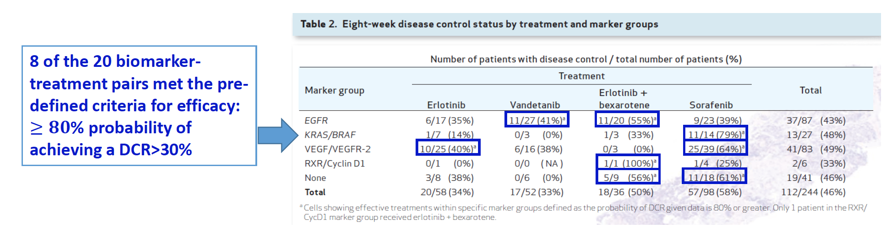

```{r setup, include=FALSE}
library(shiny)
library(tidyverse)
library(kableExtra)

knitr::opts_chunk$set(echo = FALSE, fig.width = 8, fig.height = 6, fig.align = "center")
```

## Agenda

- _**Case Study 1**_: A Random Walk Rule to determine ED90 of a local anesthetic in surgery

- _**Case Study 2**_: An application of the MCP-Mod methodology in a phase II dose–ranging clinical trial in multiple sclerosis

- _**Case Study 3**_: A platform trial for personalized medicine in lung cancer


## Case Study 1: A Random Walk Rule to determine ED90 of a local anesthetic in surgery

_**Reference**_:

Tran De QH, DuganiS, Correa JA, et al. (2011) _"Minimum effective volume of lidocaine for ultrasound-guided supraclavicular block."_,  _Regional Anesthesia and Pain Medicine_, **36**(5), 466–469.


## Study Background

- A double-injection ultrasound (US)-guided supraclavicular block (SCB) provides a reliable method for local anesthesia

- _**The study goal**_ was to estimate the volume of anesthetic (lidocaine 1.5\% with epinephrine 5 $\mu$g/mL) that would be effective in 90\% of patients (MEV90)

- _**Study subjects**_: Patients 18-70 years of age undergoing surgery of elbow, forearm, wrist or hand

    + An eligible subject would receive a double-injection US-guided SCB, with the total volume of anesthetic determined by the adaptive design

- _**Primary outcome**_: $Y=1$, if success or $Y = 0$, if filure

    + A "success" was defined as a composite score (a sum of sensory blockade scores and motor blokcade scores) or $\geq 14$ points on a scale 0 to 16, at 30 min after SCB administration $\Rightarrow$ marker for surgical anesthesia
    

## Study Design –Random Walk Rule$^*$

- Monotone increasing relationship between dose (volume of anesthetic) and probability of "success" was assumed

- 7 doses were considered in increments of 2.5: $\Omega_x = \{25, 27.5, 30, 32.5, 35, 37.5, 40\}$ mL

- The 1<sup>st</sup> subject would receive 25 mL ($X_1 = 25$), and the outcome would be recorded as $Y_1=1$ (success) or $Y_1 = 0$, if filure 

- The $j$<sup>th</sup> subject ($j = 2, 3, \ldots, n$), the dose assignment would be determined based on data from the previous subject $(X_{j-1}, Y_{j-1})$:

    + If $Y_{j-1} = 0$ (failure) and $X_{j-1} < 40$, then $X_j = X_{j-1} + 2.5$ (increase the dose)
    (if $Y_{j-1} = 0$  and $X_{j-1} = 40$ (the highest dose), then $X_j = 40$ (repeat the dose))
    + If $Y_{j-1} = 1$ (success), then:
    
        * $X_j = X_{j-1}-2.5$ (lower the dose) with probability $b = \frac{1-0.9}{0.9} = 0.11$
        * $X_j = X_{j-1}$ (stay at the current dose) with probability $1-b = 0.89$
        
    + The study would be stopped once 45 "successes" have been observed
    + The total sample size $n = 52\pm 2$ was elicited by simulation
    
<sup>$*$</sup> Durham SD, Flournoy N, Rosenberger WF (1997) _"A random walk rule for phase I clinical trials."_, _Biometrics_, **53**, 745-760
        
        
## Random Walk Rule –Statistical Properties

- The RWR-sequence of dose assignments $x_1, \ldots, x_n$ induces a Markov chain on the lattice of doses $\Omega_x$

    + Stationary allocation distribution (asymptotic proportions of dose assignments) can be calculated for a hypothetical dose–response scenario
    + The speed of convergence to a stationary distribution is very fast
    
- Under the assumption of monotonically increasing dose–response, the asymptotic distribution of dose assignments is unimodal, with the target quantile (MEV90) bounded by 2 adjacent dose levels containing the mode

    + Therefore, the empirical mode itself can be taken as an estimate of MEV90
    
- If the dose–response is a 2-parameter logistic, then the asymptotic distribution of dose assignments is a mixture of two discrete normal distributions with a known closed-form expression


<sup>$*$</sup> Durham SD, Flournoy N (1994) _"Random walks for quantile estimation."_, In _Statistical Decision Theory and Related Topics V_, Gupta SS and Berger JO, editors. Springer-Verlag


## Estimation Following RWR

- _**Stylianou and Flournoy (2002)**_$^*$ investigated five different estimators of the target quantile (e.g. MEV90)

- The _**modified isotonic estimator**_ and the _**maximum likelihood estimator (MLE)**_ from a 2-parameter logistic model were found to have best small-sample performance (smallest bias and mean squared error)

- Isotonic estimator is nonparametric and it always exists, whereas MLE may not exist (if data are too sparse)

<sup>$*$</sup> Stylianou M, Flournoy N (2002) _"Dose finding using the biased coin up-and-down design and isotonic regression."_, _Biometrics_, **58**, 171-177


## Isotonic Regression

- Let $\mathcal{P(x)}$ -- true dose–response curve, assumed to be monotone increasing on $\Omega_x$

- Suppose we have observed $n = \sum_{i = 1}^Kn_i$ patients

    + $p_i = \frac{s_i}{n_i}$ (where $s_i = \sum_{j = 1}^{n_i}Y_{ij}$ -- number of responses) -- observed response rate at dose $x_i$, $i = 1, \ldots, K$
    + $P = {p_1, \ldots, p_K}$ may not be increasing with dose $\Rightarrow$ a sensible adjustment to $P$ must be made to estimate $\mathcal{P(x)}$

- A function $f$ is _**isotonic**_ if $f(x_1)\leq f(x_2)\leq\ldots\leq f(x_k)$ for all $x_1\leq x_2 \leq \ldots \le x_K$

- An isotonic function $P^*$ on $\Omega_x$ is an _**isotonic regression**_ of $P$ with weights $\{n_i\}$, if it minimizes 
$$
  \sum_{i = 1}^K{(p_i-f_i)^2n_i}
$$
in the class of all isotonic functions $f$ on $\Omega_x$

- The _**Pooled Adjacent Violators Algorithm (PAVA)**_ can be used to obtain an isotonic regression $P^*$ (cf. _**Robertson, Wright, and Dykstra, 1988**_)

<sup>$*$</sup> Robertson T, Wright FT, Dykstra RL (1988) _"Order Restricted Statistical Inference."_, New York, Wiley


## PVA -- Example

{width=100%}


## Isotonic Estimator of the Target Quantile

- Pointestimate of $\mu = \text{MEV90}$ can be obtained as follows:

    + Calculate isotonic estimates of success probabilities: $\widehat{p}_i$
    + Calculate $\widehat{\mu} = \max\left\{x_i: \widehat{p}_i\leq 90\right\}$
    + Calculate $\widetilde{\mu} = \frac{0.90-\widehat{p}_i}{\widehat{p}_{i+1}-\widehat{p}_i}\left(x_{i+1}-\widehat{mu}\right)+\widehat{\mu}$ ($x_i$ is the dose for which $\widehat{mu} = x_i$) $\rightarrow$ _**linearly interpolated estimate of**_ $\mu$
    
- 95\% CI for $\mu$ (using bootstrap) can be obtained as follows:

    + Generate $B$ independent bootstrap samples (say, $B = 10,000$)
    + For sample $b = 1, \ldots, B$, simulate $x^*_i(b)\sim Binomial(n_i, \widehat{p}_i)\rightarrow$ calculate $\left\{\widehat{p}^*_i(b)\right\}$ -- isotonic estimates (using PAVA) $\rightarrow$ calculate $\widetilde{\mu}^*(b)$ -- linearly interpolated estimates of $\mu$
    + Let $\widetilde{\mu}^*_(1), \ldots, \widetilde{\mu}^*_(B)$ -- sorted set of bootsrtap estimates
    + Then an approximate 95\% CI for $\mu$ is $\left(\widetilde{\mu}^*_(j), \widetilde{\mu}^*_(k)\right)$, where $j = 0.025(B+1)$ and $k = 0.975(B+1)$
    

## Study Results (1 of 2)


{width=100%}


## Study Results (2 of 2)

{width=100%}

## Data Analysis

<div class="column-left">

- Data are monotone $\Rightarrow$ isotonic estimates of success probabilities are:

    + $\widehat{p}_1 = 0.5$, $\widehat{p}_2 = 0.6$, $\widehat{p}_3 = 0.765$, $\widehat{p}_4 = 0.96$, $\widehat{p}_5 = 1$

- Point estimate of MEV90:

    + $\widehat{\mu} = \max\{x_i:\widehat{p}_i\leq 0.90\}$=*Dose\#3=30mL*
    + $\widetilde{\mu} = \frac{0.90-0.765}{0.96-0.765}\left(32.5-30\right) + 30$=*31mL*
    
- 95\% CI for MEV90 using bootstrap: *(27.5-33) mL*

(In the paper the authors reported the estimate (95\% CI) as: *32 (30 - 34)ml* -- discrepancy be due to different ways we computed isotonic estimates)

</div>

<div class="column-right">

{width=100%}

</div>


## Analysis Using Logistic Regression

<div class="column-left">

{width=100%}

</div>

<div class="column-right">

- 2-parameter logistic model was fit to the data

    + MLE of MEV90 is *31.4ml*
    + 95\% CI for MEV90 is *(29.2-33.5)ml*

- Contrast with isotonic regression estimates: *31.7 (27.5 – 33)*

</div>


## Summary of Case Study 1

- Adaptive design (RWR) successfully achieved the trial objective of estimating the volume of anesthetic that would be efficacious in 90\% of the patients (MEV90)

- What made this adaptive design feasible?
    
    + Responses were observed quickly (at 30min after dose administration) $\Rightarrow$ design adaptations could be easily implemented
    + Well-established statistical methodology (RWR)


## Case Study 2: An application of the MCP-Mod Methodology in a Phase II Dose–Ranging Clinical Trial in Multiple Sclerosis

_**Main Reference**_:

Selmaj K, Li DKB, Hartung HP, et al. (2013) _"Siponimodfor patients with relapsing-remitting multiple sclerosis (BOLD): an adaptive, dose-ranging, randomised, phase 2 study."_, _Lancet Neurology_, **12**, 756-767


## Phase II Clinical Trials

- Phase II drug development is the next step after Phase I (where PK, safety and tolerability of the drug are explored)

- Main objectives of the phase II are:

    + To assess the drug's effect (_**clinical efficacy**_) in patients with the disease of interest
    + To identify dose(s) with "most promising" benefit-risk ratio for further testing in phase III confirmatory trials
    
- Phase II clinical trials are typically randomized, placebo-and/or active-controlled studies, with several doses of an investigational drug, with sample sizes up to several hundred patients

- _**Research questions**_ in phase II clinical trials$^*$:

    1. Is there any evidence of a drug effect (proof-of-concept, PoC)?
    2. Which dose(s) exhibit a response different from the control?
    3. What is the dose–response relationship?
    4. What is the “optimal” dose for taking into phase III?

<sup>$*$</sup> Bretz F, Hsu J, Pinheiro J, Liu Y (2008) _"Dose finding: a challenge in statistics."_, _Biometrical Journal_, **50**, 480-504


## Dose–Response Trials (1 of 3)

<div class="column-left">

- Let $d_1 < d_2 < \ldots < d_K$ -- dose levels of a drug and $d_0 = 0$ -- placebo

- The drug effect at a specific time point is assessed using a regression model
$$
  Y_{ij} = \mu(d_i, \boldsymbol{\theta}) + \varepsilon{ij}
$$

    + $\mu(d_i, \boldsymbol{\theta})$ -- mean response at $d_i$
    + $\boldsymbol{\theta}$ -- parameters of interest
    + $\varepsilon{ij}\sim N(0, \sigma^2)$ -- i.i.d. errors
    + $i = 1, \ldots, K$ -- doses' IDs, $j = 1, 2, \ldots, n_i$ -- subjects' IDs

_**Q: How to design a study to estimate the dose response?**_

- Choice of number of doses?

- Choice of allocation proportions?

- Choice of the sample size?

</div>


<div class="column-right">

```{r emax-model}
emax_fcn <- function(x, E0, Emax, ED50, r) {
  E0 + Emax*x^r/(ED50^r + x^r)
}

map(c(0.5, 1, 2.5, 5), ~ {
  r <- .
  tibble::tibble(
    lab = paste0("r = ", r),
    x = seq(0, 100, by = 0.5),
    y = emax_fcn(x, E0 = 0, Emax = 1, ED50 = 20, r)
  )
}) %>% 
  bind_rows() %>% 
  ggplot()+
  geom_line(aes(x, y, group = lab, color = factor(lab)), size = 1.25)+
  xlab(expression(paste("dose, ", italic(d))))+
  ylab("Effect")+
  labs(
    title = expression(paste("4-parameter ", italic(E)[max], " model: ", italic(E)[0]+over(italic(E)[max]%.%italic(d)^r, italic(ED)[50]^r + italic(d)^r))), 
    subtitle = expression(paste("(", italic(E)[0] == 0, ", ", italic(E)[max] == 1, ", ", italic(ED)[50] == 20, ")"))
  )+
  scale_color_manual(values = c("r = 0.5" = "red", "r = 1" = "darkblue", "r = 2.5" = "darkorange", "r = 5" = "darkgreen"))+
    theme(
      title = element_text(family = "Helvetica", face = "bold", size = 18),
      axis.text = element_text(family = "Helvetica", face = "bold", size = 14),
      axis.title = element_text(family = "Helvetica", face = "bold", size = 16),
      legend.title = element_blank(),
      legend.text = element_text(family = "Helvetica", face = "bold", size = 14),
      legend.background = element_rect(fill = NA),
      legend.position = c(0.7, 0.5)
    )
```
</div>


## Dose–Response Trials (2 of 3)

- In practice, the true model is unknown at the trial design stage ⇒uncertainty in the planning of the experiment

- There are several (seemingly similar) research questions which require different choice of study design; e.g.:
  
    1. Is there a dose-related effect at all?
    2. What is the smallest dose that achieve a clinically relevant effect $\Delta$ over placebo?
    3. Which dose achieves a 50\% of the maximum effect ($ED_{50}$)?
    4. Where does the dose–response curve start to plateau?
    
- Question 1. is a hypothesis testing problem, whereas questions 2.- 4. are estimation problems

- Clear understanding of study objectives is required to select an "optimal" design to achieve the study objective(s)    


## Dose–Response Trials (3 of 3)    

_**Strategies for statistical analysis of dose–response studies**_:

1. **Multiple comparison procedures**

    + Dose is regarded as a classification factor; minimal (if any) assumptions are made about the underlying dose–response relationship
    + Analysis of variance (ANOVA) test can be used to detect an overall dose related signal, and stepwise procedures can be used to identify dose(s) that are significantly different from placebo
    
2. **Modeling techniques**

    + Dose is regarded as a continuous predictor in a regression model for the mean response
    + Regression modeling allows to borrow strength across the dose levels and extrapolate the results beyond the doses actually studied

3. **A combination of multiple comparisons (MCP) with modeling (Mod) techniques (MCP-Mod)**    
    

## MCP-Mod Methodology (Bretz et al. 2005$^*$)

- MCP-Mod is implemented in two parts:

    + _**MCP part**_: simple YES/NO question-whether there is any effect due to drug
    + _**Mod part**_: modeling the dose–response curve
    
- At the beginning of the trial, a set of candidate models that describe dose–response relationship is postulated (e.g. linear, exponential, Emax, etc.)

- When experimental data are available, the significance of dose–response relationship is testedfor each model

    + If the null hypothesis of a "flat" dose-response cannot be rejected, the procedure stops; otherwise, the significant models are considered
    + Based on the chosen models, the doses of interest (e.g. $ED_{50}$, $ED_{90}$) are estimated
    

<sup>$*$</sup> BretzF, PinheiroJC, Branson M (2005) _"Combining multiple comparisons and modeling techniques in dose-response studies."_, _Biometrics_, **61**, 738-748


## Regulatory Qualification of MCP-Mod

<div class="column-left">

- In 2014, the European Medicines Agency (EMA) gave a qualification opinion on the MCP-Mod methodology

    + _"...The MCP-Mod approach is efficient in the sense that it **uses the available data better** than the commonly applied pairwise comparisons..."_
    + _"...the methodological approach will promote **better trial designs** incorporating a wider dose range and increased number of dose levels..."_
    + _"...MCP-Mod represents **one tool** in the toolbox of the well-informed drug developer... this opinion does not preclude any other statistical methodology for model-based design and analysis of exploratory dose finding from being used..."_

</div>

<div class="column-left">

{width=100%}

</div>


## BOLD Study –Background (1 of 2)

- Multiple sclerosis (MS) is an inflammatory and neurodegenerative, autoimmune CNS disorder, which in 70\% of the cases is diagnosed between the ages of 20 to 40 years

- In early stages, the MS is present in the relapsing-remitting form (RRMS), where patients suffer from short-term neurological deficits, affecting the motor, sensory and vegetative nervous system

- Immunomodulatory drugs (IMDs), introduced in the 1990’s, transformed the treatment of RRMS

    + Clinically meaningful reduction in the number of relapses and disease activity (as measured by new contrast-enhancing Magnetic Resonance Imaging (MRI) lesions)

- Next-generation drugs, e.g. oral selective S1P receptor modulators and some monoclonal antibodies, provide alternative therapeutic options for patients with RRMS

- _**BAF312 (siponimod) on MRI Lesion given once-Daily (BOLD)**_ study (_**Selmaj et al. 2013**_$^*$) was an adaptive dose-ranging, randomized, placebo-controlled phase II trial to evaluate safety, tolerability and efficacy of BAF312 in patients with RRMS

<sup>$*$</sup> SelmajK et al. (2013) _"Siponimodfor patients with relapsing-remitting multiple sclerosis (BOLD): an adaptive, dose-ranging, randomised, phase 2 study."_, _Lancet Neurology_, **12**, 756-767


## BOLD Study –Background (2 of 2)

- _**The primary objective**_ was to evaluate the dose–efficacy relationship among five doses of BAF312 and placebo during 3 months of treatment in adult patients (18-55 y.o.) with RRMS

- _**Primary endpoint**_: The number of **c**ombined **u**nique **a**ctive MRI **l**esions (CUAL) at 3 months

    + CUAL = new gadolinium [Gd]-enhanced lesions on T1-weighted, or new or enlarging lesions on T2-weighted MRI scans, without double counting
    
- _**Two-stage adaptive design**_:

    + Stage 1: $n_1 = 188$ patients randomized in a 1:1:1:1 ratio (10mg, 2mg, 0.5mg, or placebo)
    + Stage 2: additional $n_2 = 109$ patients randomized in a 4:4:1 ratio ($X1$ mg, $X2$ mg, or placebo), where doses X1 and X2 were selected adaptively, based on the results of the interim analysis
    

## BOLD Study Design -- Stage 1

<div class="column-left">

- At Stage 1, four groups to be tested: placebo, 0.5mg, 2mg, 10mg

    + $n_1 = 188$ (47 patients per arm)
    
- Primary endpoint (CUAL) modeled using negative binomial regression

- _**To calibrate the dose range at the interim analysis**_, six candidate dose–response shapes (defined in terms of \%reduction in CUAL relative to placebo) were pre-specified

    + The six shapes represented possible scenarios with different fractions of the 10mg (highest dose) effect for placebo, 0.5, and 2mg
    
</div>

<div class="column-right">

{width=100%}

</div>

    
## BOLD Study Design –Interim Analysis    
    
- **Based on interim analysis (after all patients in Stage 1 have their primary outcome data at 3 months), the following assessments/decisions would be made**:

- _**Should the trial be stopped for futility?**_

    + Stop, if for any study dose Pr(Reduction of >35\% in CUAL relative to placebo)<0.20
    + Otherwise, continue

- _**If continue, which doses should be taken into Stage 2?**_

    + Select $X1$ and $X2$ from the shape that exhibits highest correlation with the results observed from the negative binomial model fit
    
- _**If continue, should the sample size be increased?**_

    + Sample size reassessment (based on parameters not directly related to treatment effect) would be performed, and sample size could be increased, if deemed necessary    
    
    
## BOLD Study Design -- Stage 2 and Final Analysis    
    
    
<div class="column-left">

- At Stage 2, three groups to be tested: $X1$ mg, $X2$ mg, placebo

    + $n_2 = 109$ patients, 4:4:1 randomization

- MCP-Mod would be applied to the combined Stage 1 and 2 data

- _**MCP part**_: test for an efficacy signal (non-flat dose-response)

    + 5 dose–response curves reflecting the range of plausible models
    + For each model, an optimal contrast test would be used

- _**Mod part**_: among "significant" candidate models, select one that fits the data best

    + Estimate target doses (that yield desirable clinical effects) using the selected model
    
</div>

<div class="column-right">

{width=100%}

</div>    
    

## BOLD Study Results (1 of 2)

<div class="column-left">

- In Stage 1 of the trial, $n_1 = 188$ patients were randomized

- Interim analysis showed that the observed dose–response correlates best with the Emaxprofile (correlation=0.979)

- Therefore, $X1$=0.25 mg and $X2$=1.25 mg were selected for Stage 2 of the trial

</div>
    
<div class="column-right">

{width=100%}

</div>      


## BOLD Study Results (2 of 2)

<div class="column-left">

- In Stage 1 of the trial, $n_2 = 109$ patients were randomized
    
    + 16 to placebo; 51 to 0.25 mg, 42 to 1.25 mg

- _**MCP step**_ showed statistical significance of Emax ($p$=0.0001) and sigEmax1 ($p$=0.0115)

- Emax was selected as the best-fit based on AIC criterion

</div>
    
<div class="column-right">

{width=100%}

</div>      


## Summary of Case Study 2

- **This phase II study evaluated the dose–efficacy relationship of siponimod [0.25, 0.5, 1.25, 2.5, 10]mg and placebo in patients with multiple sclerosis**_

    + Efficacy was assessed using MRI lesion count (CUAL) at 3 months, which was modeled by a negative binomial regression
    + Dose effect was measured as \%-reduction in the monthly number of CUAL relative to placebo

- _**A 2-stage adaptive design successfully achieved the trial objectives**_

    + _**At the interim analysis**_, 0.25mg and 1.25mg were chosen for Stage 2 (based on the dose-response shape that was most consistent with the interim data)
    + _**At the final analysis**_, the MCP step showed that 2-parameter Emaxmodel was the best-fit $\Rightarrow$ the Mod step utilized the Emaxmodel to estimate the dose–response relationship and the clinically relevant doses


_**The study allowed further development of siponimod, with judicious selection of doses for testing in confirmatory (Phase III) trials**_


## Case Study 3: The BATTLE Trial of Personalized Medicine in Lung Cancer

_**Main Reference**_:

Kim ES, HerbstRS, WistubaII, et al. (2011) _"The BATTLE trial: personalizing therapy for lung cancer."_, _Cancer Discovery_, **1**, 44-53


## Background

- Recent breakthroughs in biotechnology, genomics and proteomics have lead to development of drugs of _**Precision Medicine**_

    + Targeting the right treatments to the right patients at the right time
    + Particularly appealing in oncology, as carcinogenesis and treatment are closely related to molecular and genetic mutations

- _**Molecularly targeted therapy**_ is one of the major treatment modalities for cancer

    + Less toxic than traditional chemotherapy (which may also harm normal cells)
    + Blocks the growth of cancer cells by interfering with specific targeted molecules needed for carcinogenesis and cancer growth

- Development of targeted therapies require special considerations in the design and analysis of clinical trials

    + Need to have a companion diagnostic test to identify patient biomarker profiles
    + Need to study multiple therapies (and their combinations)
    + Need to answer multiple research questions, efficiently and quickly: _**Which treatment-biomarker pairs exhibit most promising clinical efficacy?**_


## Master Protocols

- **A _master protocol_ is defined as an overarching protocol designed to answer multiple research questions within the same overall trial structure (_Woodcock and LaVange 2017_$^*$)**

    + One or more interventions in multiple diseases, or
    + Single disease, with multiple interventions, each targeting a particular biomarker-defined population
    
- **Three types of master protocols**:

    + Umbrella trial
    + Basket trial
    + Platform trial

- **If designed correctly, trials using master protocols can potentially be more efficient than a sequence of single-arm or two-arm studies**

<sup>$*$</sup> Woodcock J, LaVange L (2017) _"Master protocols to study multiple therapies, multiple diseases, or both."_,  _The New England Journal of Medicine_, **377**, 62-70


## Umbrella and Basket Trials

{width=100%}


## Platform Trials

- A _**platform trial**_ has multiple treatment arms: either a _**fixed**_ number (e.g. a trial with $K$ treatments from different sponsors) or an _**adaptive**_ number (possibility of adding/dropping arms)

- Multiple biomarker strata (new strata may be added once a biomarker assay and an investigational targeted drug become available to the trial)

- Can use _**response-adaptive randomization**_ to dynamically skew allocation of new patients to empirically more successful compounds within biomarker subgroups

- _**Research Q: Which successful compound/biomarker pairs should be taken further in development to small, more focused confirmatory phase trials?**_

    + Platform trials may be most appropriate in exploratory settings, based on short-term endpoints (surrogates for clinical response)


## BATTLE Trial -- Background

- **B**iomarker-Integrated **A**pproaches of **T**argeted **T**herapy for **L**ung Cancer **E**limination (BATTLE)

    + First prospective, biopsy-mandated, biomarker-based, response-adaptive randomized study in patients with non-small cell lung cancer (NSCLC)

- Upon biopsy, eligible patient tissue samples were analyzed for biomarker profiles and classified into 5 biomarker strata (groups):

    (1) _EGFR_ mutation/amplification; 
    (2) _KRAS_ and/or _BRAF_ mutation; 
    (3) _VEGF_ and/or _VEGFR_ overexpression; 
    (4) _RXR_ and/or _CyclinD1_ expression; 
    (5) No study biomarkers

- Within each biomarker group, patients were randomized among four targeted treatments:

    + (T1): Erlotinib; (T2) Vandetanib; (T3) Erlotinib+Bexarotene; (T4) Sorafenib

- _**Study objective**_: To identify groups of patients with NSCLC who are most likely to benefit from a specific agent(s)

- _**Primary endpoint**_: 8-week disease control rate (DCR) (which is a good surrogate for the overall survival in this population)

    + Historically, 8-week DCR=30\%; clinically relevant target DCR=50\%
    + The study was not formally powered to identify significant treatment-biomarker interactions


## BATTLE Trial Design (1 of 2)

- See _**Zhou et al. (2008)$^*$**_ for full details on statistical methodology

- A key design element was response-adaptive randomization

- Initial $n_0$ patients would be randomized equally among 4 study arms

- Let $\boldsymbol{\mathcal{F}}_m = \left\{(t_1, z_1, Y_1), \ldots, (t_m, z_m, Y_m)\right\}$ -- data from $m\geq n_0$ patients in the trial ($t_i$=treatment; $z_i$=biomarker stratum; $Y_i$=response, $i = 1, \ldots, m$)

- Suppose the $(m+1)$<sup>st</sup> patient enters the trial and has biomarker value $j$ ($j = 1, 2, 3, 4$).

    + Calculate $\widehat{\gamma}_{jk}(m)$=posterior mean probability of DCR in biomarker stratum $j$ for treatment $k$, calculated based on $\boldsymbol{\mathcal{F}}_m$ (using Bayesian hierarchial probit model$^*$)
    + Randomize the  $(m+1)$<sup>st</sup> patient to treatment $k$ with probability
$$
  \frac{\widehat{\gamma}_{jk}(m)}{\sum_{l=1}^4\widehat{\gamma}_{jl}(m)}, \text{ }k = 1,2,3,4
$$
(increased probability of assigning the treatment that is most efficacious given the patient’s biomarker profile)

<sup>$*$</sup> Zhou X, Liu S, Kim ES, Herbst RS, Lee JJ (2008) _"Bayesian adaptive design for targeted therapy development in lung cancer—a step toward personalized medicine."_, _Clinical Trials_, **5**, 181-193


## BATTLE Trial Design (2 of 2)

- _**Early stopping criterion**_ criterion(for discontinuing a treatment) was used:

    + The trial will be suspended for the $k$-treatment in the $j$<sup>th</sup> biomarker stratum, if $\text{Pr}\left(\widehat{\gamma}_{jk}(m)\geq 0.5| Data\right) \leq 0.1$
    + The suspension is temporary and reversible: if later data shows that the above condition does not hold, the enrollment to the treatment can be reopened
    
- At the end of the study, the $k$<sup>th</sup> treatment in the $j$<sup>th</sup> biomarker stratum will be considered as a success, if $\text{Pr}\left(\widehat{\gamma}_{jk}(m)\geq 0.3| Data\right) \geq 0.8$
(if the probability of DCR greater than 0.3 is 80\% or higher, then the treatment will be declared effective in a given treatment by biomarker subgroup)

- Extensive simulations were used to calibrate the design$^*$

<sup>$*$</sup> Zhou X, Liu S, Kim ES, Herbst RS, Lee JJ (2008) _"Bayesian adaptive design for targeted therapy development in lung cancer—a step toward personalized medicine."_, _Clinical Trials_, **5**, 181-193


## BATTLE Trial Results (1 of 4)

- Between Nov-2006 and Oct-2009, 341 patients were enrolled into the trial. 25 5patients were randomized ($n_0 = 97$ using equal randomization and $n_0 = 158$ using adaptive randomization)

    + Among randomized, 244 patients had evaluable 8-week outcomes. The data were as follows$^*$:

{width=100%}

<sup>$*$</sup> Kim ES, Herbst RS, Wistuba II, et al. (2011) _"The BATTLE trial: personalizing therapy for lung cancer."_, _Cancer Discovery_, **1**, 44-53.


## BATTLE Trial Results (2 of 4)

<div class="column-left">

- **Final group sizes (treatment allocation proportions) were unequal (due to RAR)**

    + Erlotinib: 58 (24\%);
    + Erlotinib+ Bexarotene: 36 (15\%);
    + Vandetanib: 52 (21\%);
    + Sorafenib: 98 (40\%)

- **Prevalence of biomarkers in the trial was unequal too**

    + Most prevalent: EGFR stratum (87; 36\%) and VEGF stratum (83; 34\%)
    + Least prevalent: RXR/CyclinD1 stratum (6; 2.5\%)

</div>

<div class="column-right">

{width=100%}

</div>


## BATTLE Trial Results (3 of 4)

<div class="column-left">

- **Observed DCR’s differed between across treatments and biomarker strata**

- **The "most promising" biomarker-treatment combos were:**

    + Within EGFR stratum: Erlotinib+ Bexarotene(DCR=11/20=55\%)
    + Within KRAS/BRAF stratum: Sorafenib(DCR=11/14=79\%)
    + Within VEGF stratum: Sorafenib(DCR=25/39=64\%)

- **Evidence of presence of treatment-by-biomarker interaction**

</div>

<div class="column-right">

{width=100%}

</div>


## BATTLE Trial Results (4 of 4)

- Did the BATTLE study results confirm some pre-specified hypotheses?

{width=100%}

- Due to small sample sizes, results should be interpreted with caution and the study be considered as "hypothesis-generating", not confirmatory


## Summary of Case Study 3

- The BATTLE trial was a pioneering biomarker-driven response-adaptive randomized design to study targeted therapies in lung cancer

- Innovative elements of the BATTLE trial:

    + _**Diagnostic test**_: capturing biomarker status of a patient at baseline (biopsies and real-time complex biomarker analysis) –these were shown to be feasible and safe
    + _**Response-adaptive randomization**_ to allocate more patients to the treatments that are "best" given their biomarker profiles $\Rightarrow$ epitomizing the idea of "personalized medicine"
    + Primary endpoint was 8-week DCR (good surrogate of overall survival in NSCLC), observed relatively quickly $\Rightarrow$ made response-adaptive randomization feasible

- While the BATTLE trial was exploratory, it generated some interesting findings that provided the impetus for further investigation:

    + Most interesting finding: In the KRAS or BRAF mutation-positive patients, sorafenib showed very promising activity: 8-wk DCR=79\% (vs. historical 30\%)
    + _**BATTLE-2 study**_$^*$ of targeted therapeutics with an emphasis on KRAS-mutant NSCLC patients was implemented, but this is another story ...
    

<sup>$*$</sup> Papadimitrakopolou V, Lee JJ, Wistuba II, et al. (2016) _"The BATTLE-2 study: a biomarker-integrated targeted therapy study in previously treated patients with advanced non-small-cell lung cancer."_, _Journal of Clinical Oncology_, **34**(30), 3638-3647.    


## 

{width=100%}

<center>

**Thank You!**

</center>

